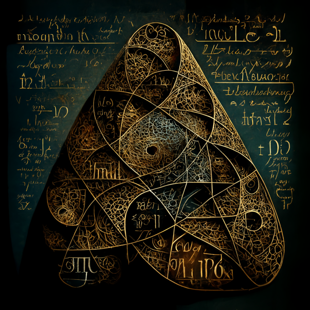
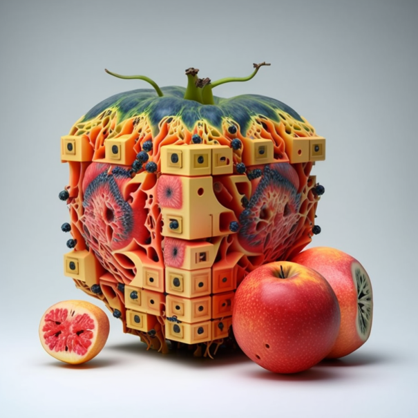
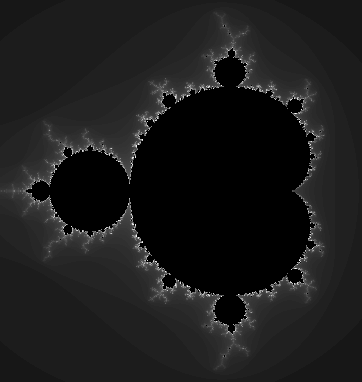

# Catalog

<a href="transformers/intro">{: .rounded-catalogue-img}</a>

<h2>Un recorrido peso a peso por el transformer</h2> 

Guía para aprender cómo funcionan las redes neuronales que procesan textos y cómo se programan.

<a href="transformers/en/intro">{: .rounded-catalogue-img}</a>

<h2>A step-by-step guide to transformers</h2> 

Understanding how neural networks process texts and how to program them.

<a href="dnc">{: .rounded-catalogue-img}</a>

<h2>A bit-by-bit guide to the equations governing differentiable neural computers</h2>

Exploring the pieces involved in the mathematical formulation of the differentiable neural computer (DNC) model.

<a href="historia">{: .rounded-catalogue-img}</a>

<h2>Revisión histórica del procesamiento del lenguaje natural hasta 2021</h2>

Un repaso a los principales hitos de la historia del procesamiento del lenguaje natural con especial énfasis en la traducción automática.

 

<a href="../fractal">{: .rounded-catalogue-img}</a>

<h2>Música fractal y compresión fractal de imágenes</h2>

Introducción a los fractales y cómo usar sus principios para generar música y comprimir imágenes.

 

<a href="../pub/duece1999.pdf">{: .rounded-catalogue-img}</a>

<h2>Diccionario urgente de estilo científico del español</h2>

La respuesta a las dudas más habituales que aparecen a la hora de redactar trabajos científicos en español.

