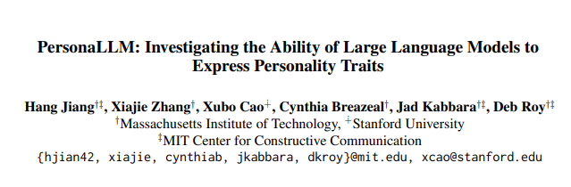
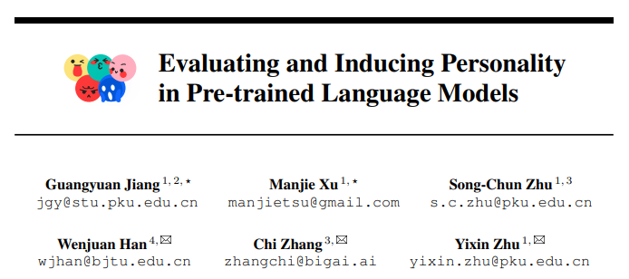

<div class="content-2columns" markdown>
{: .rounded-title-img}

# Conversational AI: from talking automata to intelligent agents
</div>

!!! note

    Parts of the contents of this guide were generated using a large language model (LLM) that was fed with transcripts from a class taught by Juan Antonio Pérez on these topics. The LLM was prompted to produce a coherent and readable narrative based on those materials. The resulting text was subsequently reviewed by human editors.

For millennia, humans have dreamed of machines that could speak, understand, and think. From ancient myths of mechanical beings endowed with intelligence to the first rudimentary chatbots of the 20th century, the desire to create conversational agents has been a persistent theme in human history. Today, this vision has evolved beyond simple chatbots into sophisticated ecosystems of AI agents capable of reasoning, retrieving and integrating information, refining their outputs based on user feedback, and dynamically collaborating with both humans and other agents.


Beyond isolated chatbots, the field is now moving toward these multi-agent ecosystems: networks of AI systems that collaborate to solve problems, optimize workflows, and support human decision-making. These agents go beyond mere response generation; they reason about tasks, retrieve and synthesize information across vast sources, and adapt their behavior based on contextual feedback. 

In this document, we aim to provide a unifying framework for understanding these developments by focusing on a number of technologies that will be put under the umbrella term *conversational agents*, and that includes chatbots, virtual assistants, reasoning models, agents themselves, and other types of interactive systems based on large language models (LLMs). Ultimately, this exploration will shed light on the ongoing transformation of human-machine interaction and the new frontiers of intelligent conversational agents.

## Overview

This section constitutes a concise overview of the topics to be covered. We will be exploring a general perspective of this entire field and will not delve into excessive detail. Should you wish to explore specific aspects further, you may always consult the cited sources to expand upon the presented content. The primary objective is to provide a comprehensive and panoramic view of the domain of conversational agents and the utilization of systems capable of natural and organic communication with their users.

We will start with a brief historical overview as a motivation, highlighting humanity's enduring aspiration, spanning not just decades but millennia, to create intelligent and communicative artifacts. A concise review of the transformer architecture, which underpins the majority of contemporary language models, will then be presented. Subsequently, we will explore some of the applications and potential risks associated with these systems. This will be followed by a more technical segment examining various methodologies by which these systems can maintain coherent dialogue with users. These methodologies will be categorized into a series of components, and we will address how these LLMs, which fundamentally are neural networks whose knowledge is primarily encoded within their network parameters, can be augmented with additional information through what are termed non-parametric sources. This refers to information external to the neural network's parameters. Finally, we will briefly review some datasets that can be employed for training or evaluating these types of models.

## Historical aspirations for conversational entities

As previously mentioned, humanity has harbored the aspiration for communicative artifacts for millennia. Presented here is a selection of historical instances, chosen somewhat arbitrarily, where these endeavors have been undertaken. 

Notably, in Greek mythology, Hephaestus, the god of the forge and fire, who was expelled from Olympus by Hera, subsequently dedicated himself in his workshop to creating a series of golden automata endowed with speech and intelligence, which served him wherever he went. 


Many centuries later, in the 12th century, Ramon Llull, a philosopher and poet, conceived of a thinking machine, which he named Ars Magna. Although never fully constructed, this machine, through a system of gears and cranks, was intended to demonstrate the truth or falsehood of any statement. Ramon Llull conceived this machine with the aim of resolving conflicts between different religions and discovering a method to ascertain ultimate truth. 


The Golem was present in medieval folklore and Jewish culture. It was a creature brought to life from clay. While possessing sentience, it could understand language through spoken commands. However, it was incapable of speech. In contemporary terms, it could be said to have possessed a *natural language understanding* module but lacked a *natural language generation* module. It is also noteworthy that this creature bears resemblance to certain modern perspectives on robotics, particularly in the sense that tasks assigned to it required a high degree of explicitness. Otherwise, it might interpret instructions literally and excessively. For instance, if instructed to "bring wood," it might gather an entire forest, or if told to "bring some water," it could cause a city-wide flood. Interestingly, the Hebrew word "emet," meaning truth, was inscribed on its forehead, and if the first letter, the 'e,' was erased, leaving "met," which in Hebrew means death, the Golem could be deactivated, reverting to an inanimate mass of clay.


Perhaps less widely known is the episode in chapter 62 of the second part of Don Quixote, where Don Quixote and Sancho Panza arrive in Barcelona and see the sea for the first time. They are invited to the home of a certain Don Antonio Moreno, who, upon their arrival, leads them to a chamber containing a solitary bronze head. This artifact is reputed to invariably speak the truth. Interestingly, Don Antonio informs them that it is a perfect machine and that they will witness it speaking the following day, noting that it remains silent on Fridays ("we shall see tomorrow, for on Fridays it is mute, and this being Friday we must wait till the next day"). The following day, a number of individuals pose questions to the magic bronze head, and it appears to possess all the answers. However, when Don Quixote and Sancho direct questions to it, the responses are notably vague. This elicits some indignation from Sancho, to which Don Quixote, marveling, remarks, "“What answer wouldst thou have, beast? [...] Is it not enough that the replies this head has given suit the questions put to it?". Sancho replies "Yes, it is enough, [...] but I should have liked it to have made itself plainer and told me more." Ultimately, within the novel, it is revealed that a nephew of Don Antonio Moreno was speaking from a room located below, projecting his voice through a tube to be heard via the bronze head. But the answers provided by the bronze head somehow recall the first chatbots of the 1960s, which also gave vague, general responses based on just a few hints from the user's input.


Another more contemporary example is Frankenstein, the novel by Mary Shelley published in 1818, which is considered by many to be the first modern science fiction novel. It narrates the story of a natural science student named Victor Frankenstein who creates an *abominable* being of 2.5 meters in height and eventually comes to regret his creation. Despite initially being benevolent, as depicted in the image observing from a distance and attempting to emulate humans, this being constantly endures rejection from society, which ultimately leads to its descent into malevolence. 


The Wonderful Wizard of Oz, a children's book from 1900, later adapted into a well-known musical in 1939, features the Tin Woodman. Initially a human, a witch had stolen his heart, effectively depriving him of his humanity.


In other domains, such as cinema, there are also numerous references to systems that, in some manner, converse or emulate human intelligence. For example, the 1927 film Metropolis is set in the year 2026, depicting a society where an elite resides on the Earth's surface while the working class labors underground in harsh conditions. As the workers begin to rebel, a robot with a human-like appearance is constructed and made to impersonate a human in an attempt to quell this uprising. 


Subsequently, the Terminator saga is also well-known, sharing a similar concept of humanoid robots possessing human-level intelligence and the ability to speak. In this case, the robots are under the command of either humans or machines from the future. In the scenario involving machines, they are under the control of Skynet, described as an artificial intelligence that became self-aware in 1997 and assumed control. 


Other references include a short story by Isaac Asimov, written in 1951, titled "The Fun They Had," which is set in the year 2055. In this story, children discover a book, perceiving it as an ancient and unfamiliar object. They are astonished by the fact that its content remains identical each time it is opened. They engage in a dialogue, reflecting on how, many years prior, children attended schools where human teachers, and not robots, instructed them. This concept aligns with a recent trend where conversational models are considered to be highly supportive, and potentially even capable of substituting humans, in the task of education. 


Another significant reference the film "Her," a 2013 romantic science fiction drama. At the time of its release, this was considered science fiction; however, you will find that the scenarios depicted in the film are not far from potentially becoming reality today. The director and screenwriter of the film, Spike Jonze, conceived the idea for the movie after reading about a chatbot some years prior and observing how a person could genuinely believe they were conversing with another human being, at least for a few moments, and we know this can extend for much longer durations today. The film portrays emotional relationships between humans and machines, a phenomenon that today many people believe will occur in society in the rather short to medium term: the establishment of emotional bonds between individuals and machines. 


At this point, we could briefly mention a very interesting perspective from MIT researcher Kate Darling, who advocates for a different way of viewing machines. While acknowledging that they are clearly not people (though we invariably tend towards anthropomorphizing machines when they begin, or even inanimate objects and animals, to exhibit behaviors we associate with humans) she argues that these machines, which are beginning to possess the capacity for reasoning and maintaining conversations, are also not mere *toasters*. She proposes establishing a relationship with them more akin to that which we have with animals, in the sense that they accompany us, assist in certain tasks, and warrant our respect and affection. This is an interesting era where machines are neither simply objects nor human beings; perhaps they exist in an intermediate category.

Transitioning again into the realm of science fiction, John von Neumann, a pioneering figure in the field of computing, proposed in the mid-20th century the concept of self-replicating spacecraft, known as *Von Neumann probes*. These probes would initiate the exploration and colonization of the solar system by replicating themselves, landing on other planets, acquiring sufficient raw materials for further replication, and progressively expanding throughout the galaxy over a few hundred thousand years. This idea is connected to the concepts of intelligence, specifically swarm intelligence, and to something we will discuss shortly: machine societies, a concept wherein multiple machines communicate with each other to address specific problems, specializing in certain tasks and communicating, for instance, using natural language rather than more restricted codes.


## Early technical realizations of conversational agents

Here, we have an excerpt of the article introducing ELIZA. The ELIZA program, documented in a 1966 article, can be considered the first chatbot and was developed by a researcher at MIT. 


Source: [ELIZA—a computer program for the study of natural language communication between man and machine](https://dl.acm.org/doi/10.1145/365153.365168)

Within the article, several examples of conversations are presented. The next image  illustrates a typical exchange. As can be observed, the conversation appears natural; however, the machine is actually responding based on very simple patterns, providing relatively general responses. This is somewhat analogous to the bronze head's interactions with Don Quixote and Sancho. 


It was discovered that people engaged in what they perceived as real conversations with the system, again highlighting the human tendency to anthropomorphize machines. Depicted here are some of the rules employed by ELIZA, illustrating that it was a very basic rule-based system, not utilizing neural network technologies like contemporary systems. 


The example rule at the top indicates that if the input contains anything (here represented with `0`, an ancient equivalent of the Kleene star operator) before "you," followed by anything (again `0`), and then "me," the system will respond with "What makes you think I" and then append the words corresponding to the second `0` constituent to complete the sentence followed by the word "you." The `3` in the rule represents the third element in the identified pattern. Consequently, we observe that, given an input such as "I think you hate me," the system would respond with "What makes you think I hate you?". Modern Python code that implements this rule would be as follows:


```
import re

sentence = input(">: ")

pattern = r'^([\w\s]+)\s+you\s+([\w\s]+)\s+me$'
replacement = r'What makes you think I \2 you?'

result = re.sub(pattern, replacement, sentence, flags=re.IGNORECASE)
print(result)
```

Further down, another rule is shown. If the user says, "I know everybody laughed at me," there could be two applicable rules. One rule is "I *," where "*" signifies zero or more words, and the response would be the second part of the rule. Thus, if the input is "I know everybody laughed at me," the system would generate "You say you know everybody laughed at you." However, as shown here, a more specific rule could also be applicable here: "everybody *,". The system's response to this pattern was "Who in particular are you thinking of?".


Consequently, in certain instances, a given input could trigger or match more than one pattern. In such cases, specific heuristics were employed to determine which rule to apply. These rules were, at a minimum, ordered based on their potential to generate a more organic response. 

After this early work, for decades, progress was not significant. Systems remained relatively limited, even with the implementation of more intricate techniques aimed at facilitating slightly more realistic conversations. However, the few years after 2020 have witnessed advancements comparable to those of the preceding fifty-five, largely due to the advent of large language models (LLMs). These advancements in the field of natural language processing have also been applied to the domain of chatbots, significantly propelled by the emergence of the transformer neural network architecture. While not the sole neural architecture suitable for developing language models, it is undoubtedly the most prevalent one today. 

To conclude this historical overview, we can progress to the present day, approximately more than 60 years after the initial ELIZA system, a period in which we can now embody conversational agents, providing them with a physical presence, whether as an avatar on a screen or as a physical robot, such as the one developed by Figure. Several companies are currently endeavoring to create more or less domestic robots that integrate LLMs. Various videos demonstrate these robots interacting with people at a certain level and performing household tasks.


As a brief summary of the milestones over these years, we have ELIZA, which we have already discussed, from the mid-1960s. In 2011, IBM Watson, a system developed by IBM capable of understanding language with more limitations compared to current systems, but also capable of generating responses, won a television quiz show. In 2014, various assistants such as Siri and Alexa began to emerge, utilizing techniques very distinct from the current LLMs. Cicero, a system from 2022, which we will mention later, distinguished itself as one of the top players in a strategy game against human competitors. In 2022, ChatGPT was introduced and changed the landscape of conversational agents. Subsequently, in 2023, it was integrated into the suites of some companies, such as Microsoft in its Bing Chat. ChatGPT represents a significant turning point compared to the systems that preceded it, demonstrating enhanced capabilities in understanding, generating appropriate responses, and even maintaining conversations with individuals, albeit with certain limitations. A notable aspect of ChatGPT is that, due to its training, it is particularly adept at generating a response to a given question. While it is possible to influence its behavior through prompting to adopt a role, such as an interviewer or a participant in a dialogue, and it can perform this reasonably well, it is important to remember that, in principle, it is a system primarily designed to maintain a more or less unidirectional dialogue, where the system is not inherently proactive and does not typically initiate conversation. 


Other systems exist; the next image shows a conversation with Meta's BlenderBot 3, where the primary aim was rather to design a chatbot that could engage in natural conversations with people, rather than primarily functioning as a system to which questions are posed and answers are provided. The goal was to create a general-purpose chatbot for casual conversation, or *chit chat*. Next, you can see an example of it maintaining a conversation with a human, whose contributions are in the blue speech bubble, while the model's responses are in white bubbles.


## Inner workings of LLMs

This section aims to provide a structured overview of the operational principles governing contemporary language models. The discussion will commence with an examination of the foundational neural network architecture, the transformer, which underpins the majority of these models. A simplified schematic of a transformer's operation will serve as an initial framework for understanding the underlying processes.


Source: [x.com](https://twitter.com/cwolferesearch/status/1659608481953988613)

Consider the illustrative sequence, "the chicken crossed the". The fundamental task we will explore is how a transformer model predicts the subsequent token in this sequence. This next-token prediction capability is the core mechanism upon which LLMs are constructed. These sophisticated systems are trained on massive datasets of text over extended periods, often weeks or months, utilizing substantial computational resources in the form of hundreds or thousands of GPUs to achieve this objective.

The primary function of these models is to infer the subsequent tokens given a preceding context. In our example, if the system is presented with the token sequence "the chicken crossed the" as context, its task is to predict which tokens will follow. Initially, each token in the input sequence undergoes a transformation into a token embedding, which is a dense vector representation in a high-dimensional space. While a three-dimensional vector is used for illustrative purposes in the diagram, real-world language models typically employ embeddings with thousands of dimensions.

Token embeddings provide a numerical encoding of the semantic and syntactic properties of each token. This representation facilitates the arrangement of tokens within the high-dimensional space such that tokens with similar meanings or contextual usage are located proximally, while tokens with divergent characteristics are positioned further apart. Once the input sequence has been converted into these embedding vectors, it is then passed into the decoder component of the transformer architecture. The decoder comprises multiple interconnected layers that iteratively refine these input embeddings.

At the initial stage of processing, these embeddings are considered non-contextual, meaning that the embedding for a particular token, such as "chicken," remains the same regardless of the specific sentence in which it appears. A central objective of the transformer model is then to derive contextualized embeddings that are increasingly adapted to the specific usage of a token within a given linguistic context. This is achieved through a series of layers incorporating the critical self-attention mechanism.

The self-attention mechanism dynamically computes relationships between all tokens within the current input sequence, allowing the model to weigh the importance of each token in relation to others when refining their representations. This process enables the model to capture intricate dependencies and contextual nuances within the text. The output of the transformer decoder, just following the final layer, is a new set of embedding vectors, with one embedding corresponding to each token in the original input sequence. However, these resulting embeddings are significantly more semantically rich and specifically represent the meaning and role of each word within the particular context of the input sentence.

These highly contextualized embeddings are instrumental in performing a wide range of downstream natural language processing tasks. For instance, consider the embedding of the final token "the" in the example "the chicken crossed the". A predictor, typically implemented as a feed-forward neural network or a linear transformation matrix, can be appended to this embedding vector. The predictor serves to map the embedding space (e.g., a 2000-dimensional vector) into the vocabulary space of the language the model has been trained on (e.g., 20,000 unique words).

If the dimensionality of the embeddings is 2000 and the vocabulary size is 20,000, the predictor transforms the 2000-dimensional embedding into a vector of 20,000 scalar values. These values are subsequently normalized using the softmax function to produce a probability distribution over the entire vocabulary. Each value in this distribution represents the probability of the corresponding word in the vocabulary being the token that continues the input context. It is important to recognize that the system's output is a probability distribution over potential next tokens, rather than a deterministic selection of a single word.

To determine the specific token to be generated next, various decoding strategies can be employed. One such method involves sampling from the obtained probability distribution. Another common and computationally efficient approach is greedy decoding (or argmax decoding), where the token associated with the highest probability in the distribution is selected as the next token. For example, if the word "road" exhibits the highest probability in the output distribution, it is chosen.

Following the greedy decoding strategy, the selected token ("road" in this case) is appended to the existing context ("the chicken crossed the"), thereby forming an updated input sequence ("the chicken crossed the road"). This augmented sequence is then fed back into the transformer model to compute new contextualized embeddings for all tokens in the updated sequence, including the newly incorporated "road". This iterative process allows the model to predict the probability distribution for the subsequent token following "road," and the cycle continues until a defined termination condition is met.

The generation process is typically halted based on predefined criteria. One common criterion is reaching a specified maximum number of generated tokens (e.g., 200). Alternatively, language models can be trained to generate a special end-of-sequence token, which signifies that the model has completed its output, and no further tokens need to be produced. This iterative mechanism of next-token prediction constitutes the fundamental operational behavior of transformer decoder architectures in language models.

A significant portion of the computational resources and time dedicated to training these language models is allocated to this next-token prediction task. Historically, this objective formed the primary focus of language model training. However, more recent advancements have introduced a fundamental secondary training phase known as instruction tuning. This additional stage involves further fine-tuning the pre-trained model to enhance its ability to accurately and effectively follow natural language instructions provided by users.

The motivation for incorporating instruction tuning stemmed from the observation that language models trained solely on next-token prediction, while exhibiting remarkable capabilities in generating coherent text, often lacked the ability to directly address specific user requests or questions in a satisfactory manner. For instance, when prompted with a request such as "The translation into Spanish of the sentence I like potatoes is," a purely next-token predictor might, under certain circumstances (e.g., if it had encountered sufficient Spanish text during pre-training), produce the correct translation. However, in other instances, it might generate a semantically acceptable but ultimately unhelpful continuation, such as "different than the translation of I like tomatoes," which, while a plausible continuation in a broader textual context, probably fails to fulfill the user's specific request. Similarly, when directly asked a question, such models sometimes exhibited a tendency to repeat the question or generate tangential responses rather than providing a direct and relevant answer.

Despite the impressive ability of these foundational models to generate contextually relevant information, their limitations in adhering to instructions and providing direct answers necessitated the development of supplementary training procedures. While the precise steps involved in these procedures may vary across different models and research efforts, the general approach can be broadly categorized into a series of additional phases that aim to align the model's behavior more closely with user intent. The underlying principle remains to build upon the capabilities acquired during the initial pre-training phase, where the model learns to predict the next token, and further refine its behavior for specific applications.

It is noteworthy that even with the singular training objective of predicting the subsequent token in a sequence, these models develop a sophisticated internal representation of the world. This emergent world knowledge arises as a consequence of learning the statistical co-occurrences and relationships between words and concepts within the vast training data. Evidence for this internal world model can be observed in the model's capacity to make logical inferences and complete open-ended prompts in a manner that aligns with common-sense understanding. For instance, the completion of the sentence "Mary sees a feather and an iron ball falling in the vacuum. As Mary is a physicist, she" may easily be "knows that both objects will arrive at the ground at the same time."However, in the input sentence was ""Mary sees a feather and an iron ball falling in the vacuum. As Mary was very bad at physics, she" the model might complete it with "thinks that the iron ball will get to the ground first." As already said, in spite of this deep understanding of the world, the model may still struggle to follow specific instructions or provide direct answers to questions. 


Source: [Training language models to follow instructions with human feedback](https://arxiv.org/abs/2203.02155)

The additional training phases typically involve a sequence of steps, often conceptually divided into three main stages. The first of these stages is fine-tuning, where the pre-trained language model is further trained on specific datasets tailored to the desired task or behavior. For instance, if the objective is to improve the model's ability to engage in question-answering, the fine-tuning process involves training it on numerous examples of question-answer pairs. By exposing the pre-trained model to a large corpus of such question-answer examples, its internal weights are further adjusted, effectively conditioning it to adopt a question-answering paradigm. The process of acquiring or creating these large-scale, high-quality datasets of question-answer pairs can be a resource-intensive undertaking, requiring significant effort and expense.

Fortunately, a multitude of question-answer datasets are publicly available and accessible for research and development purposes. Alternatively, human annotators can be employed to create task-specific datasets. Furthermore, with the increasing sophistication of LLMs themselves, it has become feasible to utilize these models to generate synthetic data for fine-tuning. Given a substantial collection of seed questions, an advanced language model can be prompted to generate corresponding answers, which can then be used to further train another model, potentially reducing the reliance on purely human-annotated data.

This initial instruction fine-tuning phase represents a crucial step in adapting the general-purpose language model for specific applications. However, further refinement is often necessary to ensure that the model's responses not only adhere to the requested information but also align with broader ethical and pragmatic considerations, such as exhibiting politeness, offering apologies when appropriate, and demonstrating the ability to revise its responses based on user feedback. These desired behavioral characteristics are typically addressed in subsequent training phases.

The second phase often involves taking the instruction-tuned model from the previous stage and, when presented with a specific query, instructing it to generate a diverse set of potential responses. This is achieved by employing stochastic decoding strategies that introduce a degree of randomness into the token selection process, allowing the model to explore multiple plausible continuations beyond the single most probable option identified by greedy decoding. For example, in the image, the model is instructed to generate four distinct responses, labeled A, B, C, and D.

Subsequently, these generated responses are subjected to a process of evaluation and ranking based on their perceived quality and alignment with the desired criteria. Traditionally, this evaluation was performed by human evaluators who were tasked with ordering the generated responses from best to worst according to predefined quality metrics. While it is becoming increasingly viable to leverage advanced language models themselves for this evaluation task, human evaluation has historically been the standard approach. To facilitate this ranking process, evaluators are often presented with pairs of responses and asked to indicate which response they prefer, as pairwise comparisons have been found to be a reliable method for eliciting human preferences. Through the collection of a large number of such pairwise preference judgments across a diverse set of prompts and generated responses, a comprehensive dataset of human preferences is assembled. This preference data then serves as the foundation for deriving a scalar reward or score for each of the generated responses. While the raw preference data consists of relative comparisons between responses (e.g., response A is preferred over response B), statistical techniques are applied to infer a consistent and quantitative score for each response. One such technique is the Elo rating system, originally developed for ranking chess players based on the outcomes of their games. Similar algorithms can be adapted and applied to the pairwise preference data to establish a numerical reward signal for each generated response.

This process culminates in the training of a reward model or scoring function. This reward model, which can be implemented using a transformer encoder architecture, is trained to take a prompt (or question) and a corresponding response as input, and output a scalar value that represents a prediction of the human-assigned quality or desirability score for that prompt-response pair. The trained reward model then becomes a critical component in the subsequent third phase of the alignment process. It is important to note that the reward model is a distinct neural network, separate from the language model that is being trained to generate the responses; its sole purpose is to provide an automated means of evaluating the quality of generated text based on learned human preferences.

In the third phase, the trained reward model is utilized to further refine the LLM, guiding it towards generating responses that are predicted to receive high reward scores from the reward model. For a given input prompt, the language model generates a response, and the reward model evaluates the quality of this generated response by assigning a reward score. The parameters (weights) of the language model are then adjusted using reinforcement learning techniques to increase the probability of generating responses that are predicted to yield high reward scores and decrease the probability of generating low-reward responses.

The application of reinforcement learning is necessary because the reward signal is provided by a separate model, and the gradient of the reward cannot be directly backpropagated through the generation process to the language model's parameters. Instead, reinforcement learning algorithms, such as *proximal policy optimization* (PPO) and *direct preference optimization* (DPO), are employed to optimize the language model's policy based on the feedback provided by the reward model. Through this iterative optimization process, the language model learns to generate outputs that are more aligned with the preferences captured by the reward model, which, in turn, are intended to reflect human preferences for helpful, truthful, and harmless responses.

The implementation of these alignment techniques results in language models that exhibit a significantly enhanced ability to understand and respond to user prompts in a manner that is more consistent with human expectations and values. For instance, these aligned models are more adept at handling direct instructions and providing relevant, coherent, and helpful answers. Furthermore, they can effectively leverage *few-shot learning*, where a small number of input-output examples provided within the prompt can guide the model to understand the desired task format and generate appropriate outputs for subsequent, similar inputs.


While some information retrieval queries or factual questions may have direct, single-step answers, more complex cognitive tasks, such as multi-step reasoning problems, often present challenges for language models. However, research has demonstrated that guiding the model to engage in more explicit and progressive reasoning processes can substantially improve its performance on such intricate tasks. This technique, often referred to as *chain-of-thought prompting*, involves providing the model with examples in the prompt that not only show the input and desired output but also explicitly demonstrate the intermediate reasoning steps required to arrive at the solution. By observing these examples of step-by-step reasoning, the model, leveraging its self-attention mechanisms, learns to emulate this process and generate its own sequence of intermediate thoughts when tackling new, complex problems, often leading to more accurate final answers.

In summary, this section has provided a concise overview of the fundamental operational principles underlying contemporary LLMs. An understanding of these core concepts, ranging from the transformer architecture and next-token prediction to instruction tuning and reinforcement learning from human feedback, is becoming increasingly essential as these models are now being widely employed to develop sophisticated conversational agents and other forms of artificial intelligence. A solid grasp of these foundational ideas is therefore crucial for anyone seeking to engage with and further explore the capabilities and implications of these transformative technologies.

## Definition and applications

This section will explore concepts related to what we have broadly termed conversational agents. While the terminology may vary, encompassing terms such as artificial intelligence-based agents, large language model-based agents, and embodied conversational agents (referring to agents with a physical presence like an on-screen avatar or a robot), these terms often describe similar underlying systems.

In the context of education, such systems, whether strictly conversational or not, are generally known as intelligent tutoring systems (ITS). Although traditional ITS were not necessarily conversational, there is a growing trend towards incorporating conversational capabilities. More generally, these systems can be referred to as virtual assistants, and historically, the field has also used the term dialog systems. Common contemporary terms include chatbots, bots, and increasingly, a colloquial reference to them as "AIs" (singular and plural). These various terms, in many instances, ultimately refer to the subject matter of this module.

### Defining an agent


Source: [The Rise and Potential of Large Language Model Based Agents: A Survey](https://arxiv.org/abs/2309.07864)

The study of agents spans several decades. For the purposes of this discussion, we will focus on the agent's ability to engage in dialogue and reasoning. While planning is another key aspect, it will not be a primary focus here. An agent designed to assist users operates by receiving information from its environment. For example, as illustrated, a user might instruct, "Look at the sky. Do you think it will rain tomorrow? If so, give the umbrella to me". The environmental input constitutes the agent's perception system. This perception can be multimodal or primarily rely on text.

The system transforms this environmental information into numerical data, which can then be used by neural network models. These systems possess characteristics analogous to the human mind. They feature a storage mechanism, represented by memory, and the capacity to access information beyond their internal knowledge. Leveraging both their own stored experience and external knowledge sources, such as external documentation or general knowledge, the agent can make decisions. This decision-making process typically involves planning and reasoning. Based on these processes, the agent determines the most appropriate action.

To achieve this, the agent can utilize textual information and various tools via application programming interfaces (APIs), which allow access to information like movie listings or cinema schedules. In the case of embodied agents, they can also interact physically with their surroundings to gather additional information relevant to their task. Ultimately, by integrating these elements, the agent can respond to the user. For example, based on observations and meteorological forecasts accessed online, the agent might inform the user that rain is likely tomorrow and provide an umbrella (if embodied).

### Applications of conversational agents

These systems have a wide range of potential applications. One of the most immediate and prevalent will likely be customer service, providing 24/7 support. These agents, in principle, do not experience fatigue, making them suitable for continuous operation in customer support departments across various industries.

Another significant area is education at all levels. While the utility in early childhood education may take longer to realize, higher education levels present considerable opportunities. Particularly noteworthy is the potential to provide education in underserved regions with lower human development index (HDI) scores, where access to human educators is limited. In such cases, developed nations could host these conversational agents and offer their services via the internet.

Conversational agents are also poised to become multifaceted personal assistants, capable of accessing and managing calendars, emails, and contacts. They could potentially respond to emails, schedule meetings, and even handle calls or instant messages. While initial versions of systems like Siri, Alexa, and Google Assistant offered some of these functionalities, they have been improving to operate at a much more advanced level with a deeper understanding of the individual user.


Furthermore, these agents can support professionals such as doctors and psychologists by conducting initial patient consultations to aid in preliminary diagnoses, which would then be verified or corrected by human experts. The integration of machines into the emotional lives of people is also a growing trend. Experiences with robots designed for children have shown the development of emotional bonds, which could be amplified with conversational agents possessing defined personalities. It is crucial to acknowledge that this is not a reciprocal relationship, and over-reliance on machine interactions at the expense of human relationships should be avoided.

Conversational agents will also serve as artificial experts across various domains, providing information on topics such as legal regulations or troubleshooting technical issues. They can assist in identifying problems and directing users to appropriate human assistance. Finally, conversational agents can communicate with each other to accomplish tasks, a concept related to the "society of mind" concept. While machine-to-machine communication is not new (e.g., client-server interactions), the novelty lies in their ability to use natural language for this communication.

### Risks

Several risks accompany the increasing sophistication and adoption of conversational agents. *Dehumanization* is a concern if over-reliance on machines for daily tasks and communication leads to a perception that human interactions are more complex and less desirable. *Content contamination* is occurring due to the growing volume of machine-generated information, including automated translations and AI-generated text, potentially making it difficult to distinguish between human-authored and machine-authored content. This could have implications for training data quality, where it is often preferable to use human-generated data.


The presence of systems with some level of intelligence might also contribute to a reduction in critical thinking skills. It is important to remember that current systems are often *biased* and can favor certain groups over others. *Hallucinations*, where systems generate seemingly coherent but factually incorrect responses, are another significant challenge. Ongoing research aims to mitigate all these issues.

These challenges are related to *safety* concerns, including aligning models with desired behaviors to prevent the generation of toxic content, hallucinations, or biased outputs. Ensuring *privacy* is also critical, as systems trained on non-public data could inadvertently reveal private information. For personal assistants, this includes the risk of disclosing calendar details or other personal information without authorization. The *environmental impact* of training and deploying these large models at scale is another factor to consider. Finally, without proper attention, the increasing use of these technologies could widen the *digital divide* between different societal groups and regions.

### Some examples of conversational agent applications

Recent years have seen several notable examples of conversational agents in action.


Source: [Learning to Speak and Act in a Fantasy Text Adventure Game](https://aclanthology.org/D19-1062/)

A 2019 study used a neural network model, similar to BERT, to generate dialogue for virtual characters in a multiplayer fantasy role-playing game. In this environment, some characters were human players, while others were virtual agents. The model determined the next line of dialogue for the virtual character based on the recent conversation history, the character's location, inventory, and possible actions. The dialogue options were drawn from a predefined list, similar to earlier rule-based systems like ELIZA. However, the BERT-based model was used to select the most appropriate response from this set based on the context. The system was trained on recordings of actual game sessions conducted entirely through text. The study demonstrated that incorporating contextual information improved the prediction of both actions and dialogues of the virtual characters.


Source: [Human-level play in the game of Diplomacy by combining language models with strategic reasoning](https://www.science.org/doi/10.1126/science.ade9097)

Source: [CICERO: An AI agent that negotiates, persuades, and cooperates with people](https://ai.meta.com/blog/cicero-ai-negotiates-persuades-and-cooperates-with-people/)

Cicero, developed by Meta in 2022, is an AI system trained to play Diplomacy, an online game involving negotiation and strategic alliances in natural language. The game requires planning, understanding other players' actions, forming relationships, and persuading others to cooperate. Cicero was trained on approximately 40,000 games and demonstrated the power of dialogue and the increasing ability to develop models capable of generating natural conversations. Unlike the previous example, Cicero's responses were not selected from a fixed list but were generated dynamically by a language model based on an encoder-decoder architecture. The model received the game context and used the decoder to generate appropriate interventions aimed at maximizing the agent's objectives, in conjunction with a strategic planning module. Cicero achieved a top 10% ranking in online Diplomacy competitions, showcasing the potential for human-machine interaction in complex strategic environments and moving towards a "society of mind" concept where intelligent agents cooperate. This example combines strategic elements similar to systems like AlphaGo with language models capable of free-form text generation.


Source: [Generative Agents: Interactive Simulacra of Human Behavior](https://arxiv.org/abs/2304.03442)

A more recent project involved creating a virtual environment populated by dozens of AI-driven avatars. Each avatar was controlled by an LLM (GPT-3.5 Turbo) that dictated their actions and dialogue. The LLMs determined what the character would do or say at any given moment based on their situation (e.g., "The character is in the bakery and can talk to someone making bread"). Actions included things like buying bread or greeting others, for example. These agents could remember past interactions, retrieve relevant information, reflect on appropriate actions, interact with other agents, and plan in a dynamic environment influenced by the actions of others. While each agent had a predefined character, agenda, and daily routine (induced via prompting), the interactions between agents led to emergent behaviors and a degree of "free will" within the simulated world. Communication between agents occurred in natural language, and each agent maintained a memory stream of relevant and sometimes irrelevant events, engaging in high-level reflections and planning. An external clock provided temporal context. Notably, when one agent was given the mission (via prompting) to organize a Valentine's Day party at a cafe, it successfully invited other agents who then remembered the invitation and attended the party on the designated evening. This was considered a significant achievement, demonstrating the ability of one agent to persuade others to collectively achieve a goal.


## Classification of conversational agents

This section aims to define a non-exhaustive taxonomy of the types of conversational agents that can be encountered, which will facilitate a deeper understanding of their operation. Agents can engage in open or semi-open conversations where a precise structure or a well-defined objective is absent. Alternatively, agents can be more restrictive, operating within what are known as *task-oriented* systems. In these task-oriented cases, the agent's objective is to fulfill a relatively simple task, initiating a dialogue with the user for this purpose. Examples include setting an alarm for the following morning, booking a flight, or ordering a pizza. It can be understood that while they share certain aspects, the design principles for an agent capable of engaging in more open conversations differ from those employed in systems with a singular objective.

*Rule-based* systems, exemplified by ELIZA, involve a labor-intensive manual process of designing the specific scenarios the agent might encounter and the corresponding actions it must take at each point. This design can necessitate the creation of tens, hundreds, or even more rules. Contrasting with rule-based systems, we have *corpus-based* systems, which rely on language models. These systems possess a degree of freedom in making decisions about subsequent actions, not being constrained by rigid guidelines or a predefined path.

Currently, a common trend is the prevalence of *hybrid* systems, as the advent of language models has significantly transformed the landscape making 100% rule-based systems less common. Hybrid systems define certain rules or constructs that guide the conversation's flow, specifying objectives or the information to be elicited from the user. However, LLMs are integrated at various junctures to perform specific tasks. 

Systems that are strictly textual, where communication occurs via keyboard and screen, exist, as well as speech-enabled systems that extend interaction beyond text through speech synthesis and recognition. Furthermore, multimodal systems exist, which can access diverse information sources, such as a camera, thereby enabling richer interactions.

In every potential classification of conversational agents, it must be acknowledged that such taxonomies are not always absolute and systems may exist at intermediate points between the defined extremes. We have systems with closed responses, where the generated output has likely been pre-authored entirely by a human. Optionally, as seen with ELIZA, these pre-authored responses might contain placeholders for variables obtained during the recent conversation. This approach can be termed *response by retrieval*, where the answer is selected from a relatively limited set. Conversely, *response by generation* characterizes systems that dynamically create novel dialogue turns not previously recorded when interacting with the user. Finally, we can distinguish between *monolithic* systems, where a single language model might handle numerous or almost all dialogue-related tasks, and *pipeline* systems. The latter, more prevalent now, involve a set of relatively independent components instrumented via different LLMs, each responsible for a specific task.

### Components of a conversational system

Considering the components of a conversational system, the initial requirement is a mechanism to understand the user's intended goal from their message. Focusing for now on task-oriented systems, such as booking a flight, the system must be capable of discerning if the user intends to book, cancel, or modify a flight, for example. This is referred to as an *intent*. Therefore, intent detection is the system's function responsible for determining the user's objective based on their current utterance. In addition to intent detection, it is necessary to maintain a record of the dialogue's current state, a process known as *dialogue state tracking*. The system may know that the user wishes to book a flight and its destination, but it still needs information regarding the departure location, date, time, and preferred price range, for example. Dialogue state tracking can follow a predefined and rigid path represented via a directed acyclic graph, or a more sophisticated model can dynamically determine the current state and subsequent moves. A component must decide the next action the system should take, governed by the *dialogue policy*. This entails determining the appropriate course of action at a given point in the conversation: completing the flight booking via an API, requesting additional information from the user, or concluding the interaction. These actions are determined based on the current state of the conversation and its topic. Finally, once the action is decided, it must be expressed in natural language through a module dedicated to response generation.


Source: [Rasa chatbot concepts & Implementation](https://medium.com/@bharathreddy028/rasa-chatbot-concepts-implementation-8cacc3aade29)

Let's consider a simple car navigator system based on the Rasa framework, a widely used tool for designing conversational systems, illustrated in the image. An *utterance* simply represents an individual turn or line of dialogue, what someone is saying. As previously mentioned, *intent* refers to the user's goal. *Entities*, as depicted, are akin to variables whose values need to be determined or inferred from the conversation. These entities might be crucial for resolving the task or could be secondary but are nonetheless identified. In the example, the user's utterance is "navigate from here to 221B Baker Street". This triggers a model designed to understand the user's input and extract their intent, which in this case is to navigate to a location. The system likely has a predefined list of potential user intents, and this utterance is categorized as a navigation request. Simultaneously, the system might perform named entity recognition to identify that the departure point is "here" (the current location) and the destination is "221 Baker Street". This entity recognition can be performed using older language understanding techniques or named entity recognition models, or by leveraging LLMs. Rasa allows for the specification of which system handles each of these tasks in a relatively independent manner. The conversation progresses with a defined flow, and the agent must be capable of navigating this flow.

Based on this information, the agent can determine the appropriate action. In this scenario, the action would be to connect to the maps application's API and request the route from the origin to the destination. The system might check if it has already identified the destination entity. If the destination has not been adequately captured during the conversation, the system will generate a response asking the user for clarification, for example, "I am not sure which of these locations you mean". This might occur because the user was not explicit or because the map API returned multiple locations matching the given name or no locations at all. Consequently, a response is generated, prompting the user, such as, "Which of these restaurants would you like to go to?". The system then needs to track the dialogue to determine the user's choice. Eventually, all necessary information will be gathered, meaning the chatbot has all the required entities. At this point, the system generates a response, such as "Initiating navigation to Baker Street," and triggers an additional action, like activating the route display in the navigation application via its API.


Source: [Create Your Own AI Chatbot in minutes with Rasa](https://dev.to/codesphere/create-your-own-ai-chatbot-in-minutes-with-rasa-5cke)

The configuration of Rasa involves defining intents based on patterns in user input. For instance, an intent of positive affirmation could be triggered by the user saying "yes," "y," "indeed," or "of course". While this example shows pattern matching against a closed list, nowadays, a language model can effectively perform this task by determining if the user's response indicates affirmation given a generic text. Rasa also utilizes "stories," which are sequences of steps to be fulfilled during the dialogue. These stories outline the intents to be detected in the user's input and the corresponding actions to be taken at each step, such as requesting the origin, destination, number of people, or airline. These stories, rather than being strictly linear, often are represented by directed graphs where a specific action from a given state leads to another state, and different actions might result in different subsequent states, with the possibility of paths converging later. Rasa also manages responses, which can be predefined (closed responses). However, an LLM can also be employed to generate these responses based on the identified intent, the determined action, and other contextual information.


Entities recognized during the conversation are also managed, such as a `number` entity representing the number of people for a restaurant reservation. Slots define variables or containers that need to be filled during the conversation. In the example, the `num_people` slot is filled based on the value of the `number` entity. Forms define which slots must be filled to address a specific user request; in the simplified example, only the number of people needs to be known.


Another example illustrates dialogue acts and intent. A user might say, "I'm looking for a cheaper restaurant". The dialogue act, which classifies the practical or pragmatic function of the utterance, is "inform" (or "request" as seen later). In this case, the user is informing the system of a preference. The identified entity is `price`, with the value `cheap`. The system might then ask for further information based on the dialogue state, such as "What type and where is that restaurant?". The user responds, again informing with additional data, "Thai food, somewhere downtown". Later, the user might ask a question, a dialogue act of "request," for the `address` entity. Having located suitable restaurants through an API, the system provides this information. All in all, the general principle involves defining the variables or entities to be filled and establishing an appropriate flow to elicit this information from the user's responses.

It is important to distinguish between dialogue acts and dialogue intents. A *dialogue act*, or *speech act*, classifies the practical or pragmatic function of an utterance in a conversation. Examples include *informing* or *requesting*. A list of potential dialogue acts identifiable in a conversation includes: answering, claiming, confirming, denying, disagreeing, stating, informing, advising, asking, forbidding, inviting, ordering, requesting, promising, planning, vowing, betting, opposing, apologizing, greeting, thanking, accepting, and acknowledging. Dialogue intents, on the other hand, represent a higher-level objective, such as booking a restaurant or changing a flight. The dialogue act is more neutral, independent of the specific content being requested, and defines the form of the request, while the intent specifies the overall goal.


Another example from a 2016 article illustrates a dialogue system with speech interaction. It's important to understand that this involves a pipeline of interconnected modules where the output of one module serves as the input for the next. Speech recognition systems at that time were less accurate than current systems, especially for certain languages. Consequently, the system might produce multiple potential interpretations of the user's request, each with an associated probability. The proposed approach involved maintaining several hypotheses about the user's intent and addressing the most probable ones through dialogue. As shown in the example, if the system determines that the user is likely asking for directions from downtown to the airport, it asks for confirmation, e.g., "From downtown, is that right?". This confirmation step is crucial when the system has some uncertainty about the correct intent, perhaps due to speech recognition errors. If the user denies the initial interpretation, the system can then consider the next most probable option.


Source: [BlenderBot 3: a deployed conversational agent that continually learns to responsibly engage](https://arxiv.org/abs/2208.03188)

Moving back to the domain of LLMs, BlenderBot 3 represents an early system that primarily utilized LLMs. This system aimed to conduct relatively organic or natural dialogues with users without a specific objective and was deployed online for user interaction and evaluation. Significantly, virtually every component within BlenderBot 3, depicted in different colors, is a language model. In the example, Person 1 asks, "Who is your favorite Formula 1 driver?". This triggers two language models. One model (on the left in green), based on the question, determines if it would be beneficial to perform an internet search. Another language model (on the right in green) decides if it's appropriate to search a memory of past facts that have emerged during the conversation, a long-term memory. While the system likely has direct access to recent dialogue turns, the long-term memory would encompass a more extensive history of the interaction.

If the decision is to search, another language model is prompted to generate the most suitable search query for an internet search engine accessible via an API. For instance, the model might generate "F1 drivers". This query is then used by a program dedicated to internet search, which retrieves the most relevant results, typically including the page title, URL, and a brief snippet. Subsequently, another language model is presented with the user's original question and the summarized information from the search results. The model's task is to identify which of these pages warrants a more detailed reading to find information relevant to the user's query. While specific models could be trained to score the relevance of each webpage based on the question and the snippet, the hypothesis here is that a general LLM can accomplish this task effectively through appropriate prompting, potentially leveraging few-shot learning to provide examples. This approach aims to avoid training specialized models for numerous distinct tasks, suggesting that a general language model can handle such decisions, like selecting the most promising search results from a set based on brief information.

For the pages deemed relevant, further internet queries might be performed to download their full text. This text can then be processed to extract key information, or a language model can be asked to summarize it or identify the most pertinent sections for answering the user's question. 

If the system decides to consult the long-term memory, a module like "Access LT Memory" retrieves relevant past conversation turns and necessary information stored in the long-term memory. This retrieved information is then presented to a language model, which is tasked with synthesizing it, summarizing it, or extracting the most important parts. Additionally, the "Extract Relevant Entity" module attempts to identify key entities within the user's initial query. In the example of "Who is your favorite Formula 1 driver?", the entity "driver" is identified. BlenderBot 3 extensively utilized a old LLM (OPT) for these various tasks, highlighting the trend of using general-purpose language models.

A subsequent module synthesizes all previous information into structured data. The last user utterance, along with the recent conversation history (the last dialogue turns), and any extracted entities or retrieved knowledge form the input for generating the next dialogue response. This input can be substantial, potentially spanning several pages of text, requiring techniques to compact the information, such as summarization or redundancy removal, often also performed by language models. The "Generate Dialogue Response" module, another LLM-based module, receives this comprehensive input and might produce a concise response like "Lewis Hamilton is my favorite driver. How about you? Who is your favorite driver?". This illustrates a significant imbalance between the input and output sizes. Following the generation of the user-facing response, the system updates its memory with relevant information extracted from the internet search, the long-term memory retrieval, the detected entities, and the generated response itself. A language model typically determines what information is deemed relevant for storage in memory.


Source: [Agents and tools](https://huggingface.co/docs/transformers/transformers_agents)

Finally, this image illustrates the use of tools by conversational agents. Similar to internet search, tools represent external resources that the agent can utilize to enhance its capabilities. These tools can range from APIs to locally installed programs, even allowing the system to generate and execute Python code. This paradigm was popularized by a model called ToolFormer. The Hugging Face Agents framework, as depicted, processes a user request (e.g., "Read out loud the content of the image") by constructing a comprehensive prompt for the agent. This prompt includes information about the available tools, such as an image generator, a captioner, and a text-to-speech tool, along with their Python documentation, detailing how to invoke them and their required parameters. The prompt might also include examples of tasks and their corresponding solutions. Based on this information, the agent can decide to utilize a specific tool, narrating its intended action for human understanding before generating a block of Python code to execute the task. This code interacts with the specified tools through APIs or predefined functions. Ultimately, the system would explain what it has identified in the provided image.

It is crucial to note the security considerations when a system can generate and execute code. While frameworks like this often impose restrictions, ensuring that only permitted functions are used, caution is necessary to prevent the generation and execution of malicious code. The generated code is typically executed within a restricted Python interpreter, which might have safeguards to prevent the execution of potentially harmful instructions. 

Modern models can interact with thousands of APIs, allowing them to choose from a vast array of functionalities to solve a given task. Furthermore, some APIs are not read-only and can modify the physical world, such as controlling a home's heating system. This capability necessitates careful control over how language models interact with and decide to utilize such tools, as they might hallucinate or be maliciously prompted to perform undesirable actions, raising important safety concerns related to the security and responsible use of these powerful systems.

## Advanced topics in conversational agents

This chapter will explore a series of characteristics specific to agents based on LLMs. This discussion will be partially informed by a review of several recent articles. 

### Ecosystems of agents


One such article, titled "Mindstorms in Natural-Language Based Societies of Mind," is particularly relevant. The concept of *societies of mind* was developed by Marvin Minsky, a well-known researcher in the field of artificial intelligence, in the 1980s to explain the functioning of intelligence. Minsky's intention was not solely focused on machines or humans, but rather on how the idea of intelligence could be modeled in a more or less abstract way.


Source: [Mindstorms in Natural Language-Based Societies of Mind](https://arxiv.org/abs/2305.17066)

Minsky posited that intelligence arises from a collection of agents, modules, or components that, individually, do not constitute minds. However, through their interaction, these components collectively form a mind. This concept is now being applied to the idea of having individual agents based on, for example, LLMs or other AI-based systems, which possess limited intelligence on their own. Nevertheless, when these agents are combined, they give rise to what may be referred to as a society of mind based on language models, as illustrated in previous image. This emergent *brain* receives information in various forms, including video, images, and text. Subsequently, it engages in a series of interactions or analyses, exhibiting capabilities such as comprehension, interaction with robotic elements, and generation based on AI models. Crucially, communication among these agents primarily occurs through natural language. While individual agents may additionally process images, videos, or speech signals, the fundamental mode of interaction, including requests and synergistic cooperation, utilizes natural language. Note in the image how humans may also form part of this society of mind.


Figure 2 illustrates one such model where hundreds of artificial intelligence models are integrated into a society of mind to solve tasks in a largely automated manner. The system dynamically determines the most suitable module or model for a specific task, facilitating cooperation among them to achieve the objective. In the example in the image, the society of mind is queried about the number of suitcases with tags in a given photograph, with multiple-choice options provided. An "organizer" or "orchestrator" module decides to query several visual language models, that is, models capable of describing images or answering questions related to them. In this instance, three distinct models, trained on different datasets and producing varied outputs, are selected. The organizer receives this information and forwards it to a "leader," identified as an LLM. These large language models process the information from the visual language models to formulate the final and definitive answer by harmonizing or contrasting the received information.


The second example involves the task of drawing an image of a steam engine. This task is sent to a specialized "artist" module, whose function is to propose prompts or instructions for image generation systems. These initial prompt proposals are not the final images themselves; the image is generated in the final step. The artist suggests various ways to create evocative or aesthetically pleasing images of a steam engine, generating a list of prompts. Subsequently, another language model, acting as an "art critic," evaluates these prompts. This critic model (or potentially multiple models) reviews the proposed prompts and provides a rating or feedback on each. Another language model then gathers the opinions of all the critics to determine the most suitable prompt for generating the image. This model, based on the natural language critiques from each critic, decides on the most appropriate prompt, possibly through a form of voting or other criteria. Finally, this optimal prompt is sent to a text-to-image model, such as one employing a variational encoder (VE), which then generates the final image. This exemplifies the idea that we are moving towards an ecosystem of artificial intelligence models and human collaboration, working synchronously or asynchronously to accomplish specific tasks. Proponents of this view suggest that this will lead to a higher level of collective intelligence and accelerate progress in various fields of knowledge compared to strictly human endeavors.

### Advanced Socratic-inspired reasoning


Source: [The Art of Socratic Questioning:: Recursive Thinking with Large Language Models](https://arxiv.org/abs/2305.14999)

An interesting feature of LLMs is their ability to reason. We have already discussed the concept of chain of thought reasoning, where the model is prompted to think step by step before arriving at a conclusion. This approach has shown to improve performance in various tasks, particularly in mathematical problem-solving. The idea is that by breaking down the problem into smaller steps, the model can better understand the reasoning process and arrive at a more accurate answer. In spite of its success, there are more sophisticated approaches to reasoning with LLMs. One interesting approach can be exemplified through a number of approaches that complement the LLM's capabilities with an external orchestrator inducing a more structured recursive reasoning process. The images above correspond to an approach based on *Socratic questioning*.

The Socratic method, developed by Socrates around 400 BC and documented in Plato's works, aimed for students to arrive at answers independently through a structured series of questions posed by the teacher in a dialogue format. While not directly employing the full Socratic method with its specific question types, the article adopts the idea of posing a series of questions (as seen in the grey bubbles with a picture of Socrates) before prompting the system for the final answer. 


The previous figure 2 illustrates various strategies for prompting. Under *self-consistency chain of thoughts*, multiple models using chain of thought are queried in parallel, and their answers are voted on. *Tree of thought* involves a hierarchical decomposition of the problem into subproblems. The article proposes a more recursive approach where information can flow both downwards (decomposing problems) and upwards (gathering hints). Hints are obtained from the subproblems and propagated upwards, potentially leading to a reconsideration of previously reached conclusions. This recursive process of refining hints ultimately aims to find the final solution. This approach is typically evaluated using mathematical problem-solving benchmarks, and the authors observed some improvement with their technique.


### Safety

An important concept in the context of LLMs is that of *guardrails*, which can be thought of as safety barriers or preventative measures. These mechanisms are implemented to modify either the input prompt or the model's output. The purpose of guardrails is to mitigate some of the known issues associated with language models. For instance, a module can be added after the prompt to detect if it contains *personally identifiable information* (PII). If PII is detected in the input, it can be removed before being processed by the model, especially if the model is deployed in an environment where such information should not be shared. Other guardrails include off-topic detection to remove irrelevant information from the prompt, preventing the language model from being distracted. *Jailbreak detection* aims to identify and prevent malicious prompts that could potentially lead the model to reveal sensitive training data, personal information, or engage in harmful outputs. Interestingly, these guardrails are often implemented using LLMs themselves. While some tasks might be addressable with regular expressions or small programs, many necessitate the sophisticated understanding of language provided by other language models. Libraries like NeMo Guardrails or Guardrails AI offer collections of such modules that can be integrated before or after a primary LLM to filter undesirable input or output. Output guardrails can aim to eliminate hallucinations (though detection is challenging), identify and remove profanity, insults, or inappropriate language. Another interesting guardrail can prevent a chatbot from mentioning or recommending competitors' products.

### Generating questions to foster critical thinking

Going back to the Socratic questioning thing, an LLM may be asked to generate Socratic questions based on a given text, but it would be better if we could have a model that is specifically trained to do this. 


In the study of the previous image, the authors address the task of generating Socratic questions by organizing their work into three stages. First, they construct a large dataset of Socratic-style questions gathered from Reddit discussions, some of which are manually labeled with the type of reasoning involved. Second, they use transformer-based classification models (specifically fine-tuned versions of BERT-like models) to automatically predict the question type based on the context and question, allowing them to label the rest of the dataset more efficiently. Finally, for the generation task, they fine-tune LLMs, incorporating the question types in the prompt to guide the models toward producing more thoughtful and context-aware Socratic questions. Given a text and a type of Socratic question, the model is able to generate a question about the text that aligns with the specified type. The set of Socratic question types considered in the study includes, among others, clarification, probing assumptions, probing reasons and evidence, questioning viewpoints and perspectives, probing implications and consequences.


Source: [Socratic Question Generation: A Novel Dataset, Models, and Evaluation](https://aclanthology.org/2023.eacl-main.12/)

More specifically, the dataset was created from the Reddit group "Change My View," where users present their opinions on various topics and invite others to challenge them. This platform provides a rich source of text discussing potentially controversial issues, along with questions and comments intended to persuade the original poster to reconsider their views. Questions and responses from this subreddit were collected and filtered using basic regular expressions to remove noise. Only highly-rated questions and responses were typically selected to ensure quality and avoid irrelevant or troll content. Using crowdsourcing platforms, individuals were paid to label a few hundred of these context-response pairs, categorizing each response according to the six types of Socratic questions. This labeled data was then used to train a BERT-like encoder model to classify questions based on the given context. The model learns to identify the type of a question (e.g., clarification, probing assumptions) given the preceding text. This trained classification model was then used to automatically label the rest of the collected Reddit data. This resulted in a large dataset containing a context, a potential question, and the type of that question. Finally, a generative model was fine-tuned to generate a valid question of a specific type given a context and a question type. This resulted in a model capable of generating intelligent, thought-provoking questions based on a given topic and a desired type of inquiry, thus encouraging critical thinking and reflection. The potential educational applications of such a model for fostering reflection on various subjects are significant, but it can also be used to generate questions to guide reasoning LLMs as previously discussed.

### Theory of mind


Source: [Neural Theory-of-Mind? On the Limits of Social Intelligence in Large LMs](https://arxiv.org/abs/2210.13312)

A fundamental aspect of conversational agents is the development of what is known in psychology as *theory of mind*. Here, "theory" refers not to a scientific theory but rather to our mind's conjecture (or theory) about what other people are thinking. Theory of mind is the ability to attribute thoughts or intentions to others based on partial information, such as their observable actions or spoken words. Humans constantly use this in conversations, trying to understand others' perspectives, intentions, or emotional states based on their communication, even without direct access to their internal thoughts. An example of a common-sense scenario illustrating theory of mind is: "Although Taylor was older and stronger, they lost to Alex in the fight. How would Alex feel as a result?" Likely answers are *boastful* or *proud*. This scenario demonstrates an understanding of the world based on people's actions and the ability to infer their likely beliefs.


The referenced article demonstrates that the earlier GPT-3 does not exhibit a developed theory of mind, based on evaluations using datasets that assess common sense and emotional intelligence. This suggests that language models may still require some improvement to be effectively used in fluid chatbots capable of anticipating a user's intended meaning or internal state based on their input (speech or text). However, these findings are specific to the tested datasets and language models, and other models might show progress in developing theory of mind. This capability is particularly valuable in educational chatbots, where understanding the student's current state of knowledge and confusion is crucial. 


Another article investigated GPT-4's theory of mind capabilities, suggesting that even this more advanced model did not demonstrate a fully developed theory of mind. The article also cautions against anthropomorphizing artificial intelligence, even if models perform well on theory of mind benchmarks. It emphasizes that achieving success on such benchmarks, while a necessary condition, is not sufficient to conclude that AI systems possess genuine cognition or consciousness. There is a tendency to anthropomorphize animals, people, and even objects, which should be considered when interpreting AI capabilities. The study suggests that human intelligence and the capabilities developed by machines may be fundamentally different, even if machine behavior can sometimes be misleading.

Source: [Clever Hans or Neural Theory of Mind? Stress Testing Social Reasoning in Large Language Models](https://arxiv.org/abs/2305.14763)

### Persona and personality




Source: [PersonaLLM: Investigating the Ability of Large Language Models to Express Personality Traits](https://arxiv.org/abs/2305.02547)
Source: [Evaluating and Inducing Personality in Pre-trained Language Models](https://arxiv.org/abs/2206.07550)

Another important aspect of conversational agents is personality. It is often desirable for these agents to adopt a personality for several reasons. Firstly, it can make communication feel more natural and pleasant, depending on the chosen personality. Secondly, agents may need to understand the personalities of other agents or humans they interact with, both in terms of perceiving their traits and adapting their communication accordingly. It is also conceivable to have adaptive agents that can adjust their personality based on the current interlocutor. The term *persona* derived from the Latin word for mask used in theater, in psychology refers to the appearance or role we present to the world. While related to personality (our hidden internal qualities), persona is the external projection. The question then becomes how to define the persona of a machine, that is, the role or face it presents.


From the perspective of personality studies, various models exist, with the Big Five being one of the most well-known. The previous image illustrates the Big Five dimensions. The Big Five model characterizes personality across five dimensions, forming the acronym OCEAN: Openness to Experience (willingness to try new things, creativity, intellectual curiosity), Conscientiousness (organization, perseverance, motivation to complete tasks), Extraversion (sociability, enthusiasm, activity level), Agreeableness (cooperativeness, empathy, compassion), and Neuroticism (emotional stability, stress control).


A number of works have induced a specific persona in GPT-4 through prompting, explicitly defining the desired traits across the Big Five dimensions. The system was then subjected to a personality test (BFI, for Big Five Inventory) to evaluate these dimensions. Additionally, the system was asked to write a story. The results indicated that the induced persona was reflected in the personality test scores and the generated narrative, suggesting that these psychological aspects of persona could indeed be evaluated. An article concluded that "language models behave like people with a personality that more or less corresponds to that of humans". These findings contrast with the earlier articles that suggested limitations in language models' theory of mind. The ability to induce and evaluate personalities in language models has significant implications for creating conversational agents with defined characteristics.

### Reinforcement-learning-induced reasoning

DeepSeek-R1-Zero was built on top of DeepSeek-V3-Base, an LLM trained to predict the next token. The novelty of DeepSeek-R1-Zero lied in its development purely through reinforcement learning (RL), without any supervised fine-tuning. During training, the model is prompted using a fixed format: "*A conversation between User and Assistant. The user asks a question, and the assistant solves it. The assistant first thinks about the reasoning process in the mind and then provides the user with the answer. The reasoning process and answer are enclosed within &lt;think> &lt;/think> and &lt;answer> &lt;/answer> tags, respectively. User: [problem statement goes here]. Assistant:*". Problem's statements—often mathematical or programming in nature—are then inserted into this prompt structure. These problems are chosen because their answers can be evaluated automatically. For example, in coding tasks, rewards are based on criteria like whether the code compiles, passes test cases, avoids exceptions, or partially produces the correct output. In math tasks, correctness can be checked by matching the final answer. The fact that the output follows the &lt;think> &lt;/think> and &lt;answer> &lt;/answer> is also considered in the reward computation. This allows the model's responses to be scored in some cases in a fine-grained, graduated way rather than just binary right or wrong.


The model is rewarded and optimized using a RL technique called GRPO (*group relative policy optimization*). As training progresses, DeepSeek-R1-Zero begins to generate increasingly longer and more detailed reasoning chains, that allows it to arrive more and more often at the correct answer. These chains are not explicitly taught but emerge naturally, showing signs of reflection, reevaluation, and strategic thinking. One striking behavior is what the authors call an *aha moment*: a point where the model pauses mid-reasoning, says things like "wait, wait, wait," and restarts its solution from a new perspective. This emergence is a vivid demonstration of how RL can lead to sophisticated behaviors not present in the base model.

Importantly, the model's ability to arrive at correct answers depends heavily on whether its reasoning is valid. Invalid or poorly structured reasoning almost always will lead to wrong answers, so guiding the model to generate sound reasoning is crucial. From a human perspective, this is also a win: readable, structured reasoning makes the model’s output far more interpretable and transparent. Interestingly, although the base model is trained as a next-token predictor, experiments by other researchers suggest that the distinction between next-token and instruction-tuned base models may not be essential.

That said, DeepSeek-R1-Zero is not immediately ready for deployment. It exhibits issues like language switching in the middle of reasoning—e.g., starting in English and drifting into Chinese—and poor readability. This is the reason way the developers used DeepSeek-R1-Zero as the base for DeepSeek-R1, a model additionally trained to show better reasoning via small amounts of high-quality data, and strong general capabilities.

### Model context protocol

Model context protocol (MCP) is an open protocol introduced in late 2024 that defines a standard way for applications and services to provide context and capabilities to agentic LLMs. Just as USB-C offers a unified interface to connect devices, MCP offers a unified interface for connecting AI systems to external tools and data sources. In multi-agent systems, where agents need to interact with thousands of APIs (such as email servers for reading and sending messages, code repositories for submitting pull requests, or customer services that allow users to book flights), managing and updating these integrations can become complex and fragmented. MCP solves this by allowing agents to automatically discover the functionalities exposed by a given server and interact with them in a consistent homogeneous way. This eliminates the need to handcraft diverse instructions for each tool. Systems like Manus, which are designed to automate and adapt to lots of different tasks, benefit greatly from this open standard, as it simplifies tool integration and enhances scalability.

### Deep research

Deep research systems (starting to appear commercially in early 2025) are designed to emulate the work of a human researcher in gathering information from the internet and specialized sources such as scientific repositories. These frameworks use multi-agent setups to simulate the process of investigating a topic in depth, coordinating multiple specialized agents that collaborate to retrieve, analyze, and synthesize knowledge in a report with links to the sources used. The systems operate in environments that support advanced capabilities like chain-of-thought reasoning, self-reflection, code execution, and tool use (for example, via the MCP protocol). An orchestrator oversees the interaction between agents, enabling LLMs to combine their expertise in structured, goal-driven workflows, thereby mirroring real-world research teams and enhancing performance by scaling up *test-time compute* (that is, computation at inference time) and generating longer completions.

Two examples of this approach are STORM and Virtual Lab. STORM focuses on generating Wikipedia-style articles from scratch by simulating detailed conversations between virtual topic experts and writers. These agents ask and answer grounded questions based on trusted online sources, collaboratively building structured outlines that then guide the final writing process. Virtual Lab, on the other hand, is initiated by a human researcher who defines key roles such as a principal investigator and a scientific critic. The investigator assembles a team of scientist agents who meet in multiple discussion rounds to explore ideas, exchange feedback, and refine their approaches. The investigator then synthesizes insights and proposes next steps until producing a final report. Both systems exemplify how deep research platforms use coordinated agent collaboration to replicate expert-level inquiry and content creation.

### LLM-as-a-judge

LLM-as-a-judge refers to the practice of using LLMs to evaluate the outputs produced by other LLMs. This growing field explores how LLMs can act as automated reviewers or critics, scoring or ranking generated content across many different tasks like summarization, question answering, or reasoning. Specialized frameworks like DeepEval or models like Prometheus have emerged to support this function, enabling LLMs to assess outputs using techniques such as self-reflection, response ensembling, few-shot examples, or by integrating the model output probabilities into the scoring process.

However, relying on LLMs for evaluation introduces new challenges. Since these models can inherit biases, hallucinate, or lack robustness as the underlying model, their judgments may also reflect those flaws. They can also show preference for certain formats, longer answers, or even specific model names in the text to be evaluated, raising concerns about consistency and fairness. Moreover, their decisions are highly sensitive to prompt design, especially in multi-agent settings where outputs from one model feed into another. To improve reliability, prompt optimization methods like DSPy have been developed, offering a way to automatically refine pipelines of models.

### Planning


Planning is also a crucial element for certain types of chatbots, particularly those engaged in open-ended conversations. While task-oriented chatbots with simple goals (like restaurant reservations) can rely on more fixed state-machine architectures, general planning involves dynamically defining a sequence of actions within a given environment, with a set of possible actions and a specific objective. Planning can be understood as creating a sequence of actions that, when applied to the environment, will achieve the desired goal. Simple planning can be rule-based. Reinforcement learning can also be used for planning tasks, but it often requires significant amounts of data and may not always be practical. LLMs offer a new approach to planning. The model itself can develop this capability, and several fronts are being explored, as illustrated in the images. These include the ability to decompose a task into subtasks, generate and select the optimal plan from multiple possibilities, formalize tasks and utilize external planning systems, engage in self-reflection on past experiences to refine plans, and leverage memory to define planning more accurately.


Source: [Understanding the planning of LLM agents: A survey](https://arxiv.org/abs/2402.02716)

## Non-parametric memories

We will now discuss non-parametric methods of information storage. Non-parametric methods imply that the knowledge utilized by the conversational agent is not explicitly stored within the weights of a language model. Consequently, these methods involve external information sources that must be accessed and utilized in some manner. Furthermore, these non-parametric approaches to accessing information are relevant due to the limited context window of language models, meaning they can only process a finite number of tokens in their input. While it is true that this context window has expanded significantly, from a few dozen or hundreds of tokens to tens or even hundreds of thousands in certain cases, the need for external information sources persists to a certain extent.

Some argue that as context windows grow larger and processing becomes more efficient, it will be increasingly feasible to provide all the necessary information within the prompt itself. The idea is that through self-attention mechanisms, the model will be able to effectively locate the relevant information, often referred to as finding a "needle in a haystack," even within a vast amount of tokens. This suggests that prompting could potentially reduce the reliance on non-parametric memories.

In any case, we will examine two prominent examples of non-parametric memory: knowledge graphs and vector databases.

### Knowledge Graphs

A knowledge graph is a data structure that employs nodes to represent entities and edges to represent the relationships between these entities. For example, consider a simple graph with the entities "Eiffel Tower" and "Paris." The edge connecting them could indicate the relationship "is located in". Similarly, "Paris" and "France" could be connected by an edge labeled "is the capital of". Extensive collections of such knowledge graphs exist; for instance, DBpedia, extracted from Wikipedia, contains approximately one billion such triples (entity-relation-entity).


The sheer size of these knowledge graphs necessitates the use of specialized software for efficient management, including querying, searching, and indexing. Numerous software tools are available for this purpose, including the open-source platform Neo4j.

A comparison of language models and knowledge graphs reveals several trade-offs.


Source: [Unifying Large Language Models and Knowledge Graphs: A Roadmap](https://ieeexplore.ieee.org/abstract/document/10387715)

Language models:

- Disadvantages: Knowledge is implicitly stored in their weights, making extraction and targeted modification difficult. They are also prone to hallucinations, acting as "black boxes". While they possess general knowledge, they may lack specific domain expertise not acquired during training.
- Advantages: They generally develop broad knowledge, allow for interaction through natural language, and exhibit a degree of generalization.

Knowledge Graphs:

- Disadvantages: They are more rigid and limited in scope. If a specific fact is not present in the graph, it cannot be retrieved. They lack the ability to generate new information or infer missing details.
- Advantages: Knowledge is well-structured, precise, interpretable, and adaptable to specific domains. New elements can be added or existing ones modified without requiring retraining of a model, unlike in the case of LLMs. While modifications and additions can be made to language models via prompting, knowledge graphs offer a more direct and controlled method.


It is important to note that knowledge graphs and LLMs are often complementary. Several approaches leverage the strengths of both.


- Knowledge graph as input to an LLM: In this scenario, a question is posed (e.g., "What country was Obama born in?"). The knowledge graph is then used to extract relevant entities and facts. This information is subsequently provided to a language model to formulate a response.
- Language model as input to knowledge graph: Here, a language model might generate statements (e.g., "Albert Einstein was born in Ulm in 1879"). Natural language processing techniques, including potentially other language models, are then employed to identify the entities and relationships within these statements, which are then used to populate or update a knowledge graph.
- Iterative and collaborative approach: A more advanced approach involves a cyclical interaction where language models and knowledge graphs continuously feed into and enhance each other.

### Vector databases and retrieval augmented generation (RAG)

Another approach for leveraging external information is *retrieval augmented generation* (RAG), often implemented using vector databases. The basic process involves the following steps:


1. A collection of documents (e.g., PDFs) is processed to extract text. Tools like Tesseract may be used to extract the text from images, while PyMuPDF can be used to extract text from PDFs that contain selectable text. Modern vision language models are also capable of extracting text from images; additionally they can detect and recognize different elements in the document such as headers, equations, lists, etc. and provide the information in a structured format. 
2. This text is segmented into smaller, semantically meaningful units, called *passages* or *segments*, such as paragraphs or sections. Various techniques can be used for this segmentation, aiming for units that focus on a single topic. Overlapping segments may sometimes be beneficial.
3. For each segment, an embedding is created using encoding models like BERT-based architectures (for example, using the library Sentence Transformers). An embedding is a dense vector representation that captures the semantic meaning of the text and positions it in a high-dimensional semantic space.
4. These segments and their corresponding embeddings are stored in a vector database. While some traditional databases can handle vectors, specialized vector databases are designed for efficient storage and retrieval of high-dimensional vector data. Examples of vector databases include Faiss, Chroma, Pinecone, Weaviate, and Qdrant.
5. When a user poses a question that the LLM cannot answer based on its parametric knowledge, the question (or a part of it) is passed through the same embedding system to create a query embedding.
6. This query embedding is then used to search the vector database for the most semantically similar segment embeddings. Similarity is typically measured using metrics like cosine similarity. Efficient search techniques, such as clustering and other machine learning methodologies, are employed to avoid comparing the query embedding with every embedding in large databases.
7. The retrieved most semantically related passages are then provided to the LLM as relevant context.
8. The LLM uses this retrieved information, along with its own knowledge and the original question, to generate an informed response. The response may then be complemented with a link to the original document or a citation to the source of the information.


Source: [Retrieval-Augmented Generation for Large Language Models: A Survey](https://arxiv.org/abs/2312.10997)

The previous items illustrate the basics of RAG. There are advanced techniques that can be employed to improve the performance of RAG systems such as ColBERT, implemented in frameworks like RAGatouille.

### Tools

For developing agents heavily reliant on language models and external information, libraries such as LangChain and LlamaIndex provide abstractions and tools for building complex applications involving multiple interacting language models. These libraries simplify tasks like chaining model calls, retrieving information, and incorporating it into prompts.

An alternative paradigm for designing language model-based applications is offered by DSPy. Unlike LangChain and LlamaIndex, which often require explicit prompt engineering, DSPy focuses on defining the application in terms of its intended functionality. Importantly, both the prompts given to the language models and, optionally, their weights can be optimized by a compiler to better solve the desired task. DSPy is based on the PyTorch framework, allowing developers to define the components of their language model-powered application in a structured manner, similar to defining neural network modules. The forward function then specifies how the outputs of these components are connected. DSPy's compiler automates the process of prompt generation and optimization, potentially alleviating the challenges associated with manual prompt engineering and the fragility of prompt-based systems when underlying language models change.

## Additional resources

- [Exploring Large Language Model based Intelligent Agents: Definitions, Methods, and Prospects](https://arxiv.org/abs/2401.03428)
- [Large Language Model based Multi-Agents: A Survey of Progress and Challenges](https://arxiv.org/abs/2402.01680)
- [The Rise and Potential of Large Language Model Based Agents: A Survey](https://arxiv.org/abs/2309.07864)
- [Retrieval-Augmented Generation for Large Language Models: A Survey](https://arxiv.org/abs/2312.10997)
- [Unifying Large Language Models and Knowledge Graphs: A Roadmap](https://arxiv.org/abs/2306.08302)
- [A Survey on Proactive Dialogue Systems: Problems, Methods, and Prospects](https://arxiv.org/abs/2305.02750)
- [Towards Safer Generative Language Models: A Survey on Safety Risks, Evaluations, and Improvements](https://arxiv.org/abs/2302.09270)
- [AgentBoard: An Analytical Evaluation Board of Multi-turn LLM Agents](https://arxiv.org/abs/2401.13178)
- [Recent Advances in Deep Learning Based Dialogue Systems: A Systematic Survey](https://arxiv.org/abs/2105.04387)
- [Paper reading list in conversational AI.](https://github.com/iwangjian/Paper-Reading?tab=readme-ov-file)

