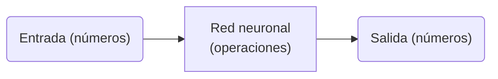
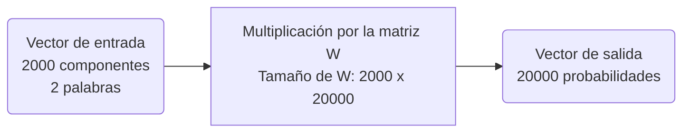
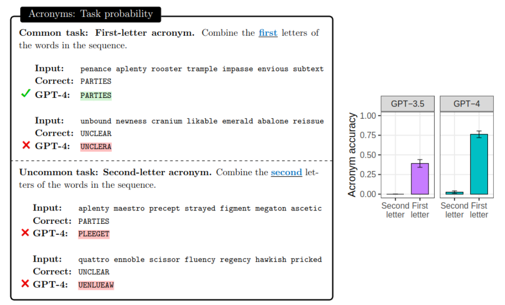
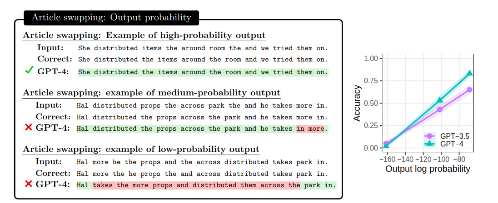
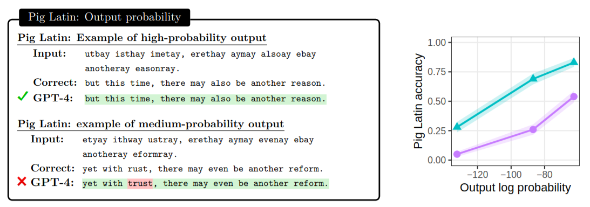
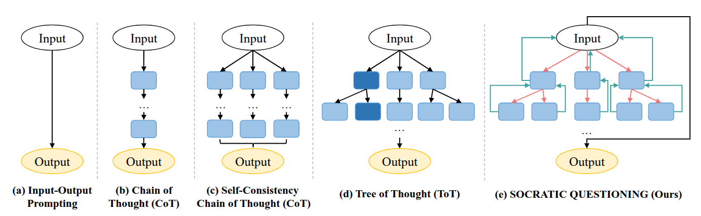
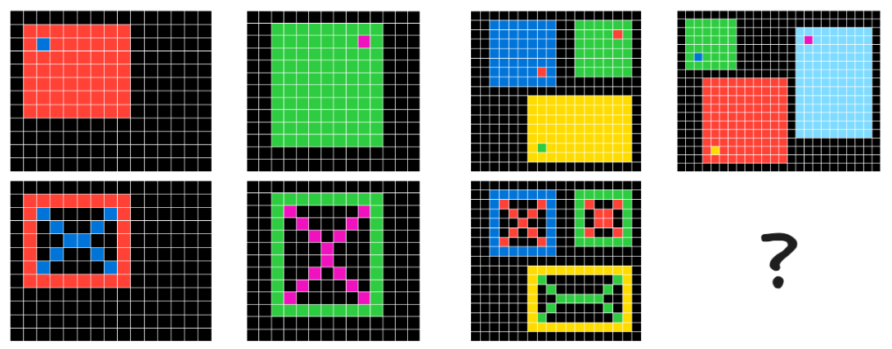
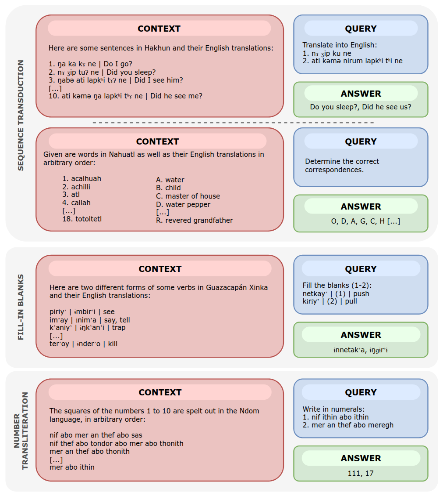

{: .rounded-title-img}

# 📌 Revelando los misterios de la IA: versión reducida

Esta es una versión reducida del documento de apoyo del taller *Revelando los misterios de la IA*. El documento completo está disponible en [aquí][completo].

[completo]: misterios.md

### Un poco de contexto histórico (1)

!!! note "Piensa" 

    1. ¿Cuándo se construyó el primer computador moderno?
    2. ¿Cuándo se acuñó el término inteligencia artificial?
    3. ¿Cómo te imaginas que funciona ChatGPT?

### Redes neuronales

- Aunque existen otras aproximaciones, las redes neuronales han permitido avances espectaculares.

- Las redes neuronales son funciones matemáticas que transforman vectores de entrada en vectores de salida.
- Probablemente has estudiado $y = f(x)$, donde $x$ y $y$ son números reales (*escalares*).
- Aquí funciones las funciones son *multivariables* o *vectoriales*: $y_1, y_2, y_3 = f(x_1, x_2, x_3, x_4, x_5)$.

| Números a la entrada representan...  | Números a la salida representan...    | Aplicación de la red neuronal             |
|--------------------------------------|---------------------------------------|-------------------------------------------|
| Píxeles de una imagen                | Probabilidad entre 0 y 1 de que haya un gato      | Detectar gatos en imágenes                |
| Palabras de una frase                | Píxeles de una imagen                 | Generar imágenes a partir de descripciones|
| Señal de voz                         | Palabras de un texto                             | Transcribir voz a texto                   |
| Palabras en un idioma                | Palabras en otro idioma               | Traducir automáticamente                  |
| Palabras de una reseña de un restaurante| Estimación de opinión buena, mala o regular | Clasificar reseñas                |
| Palabras de un texto                 | Probabilidad de la siguiente palabra  | Continuar textos (**modelo de lengua**)                         |

### Representación de palabras como números a la entrada de una red neuronal

!!! note "Piensa"

    Considera el intervalo $[0,1]$ de números reales y la tarea de asignar un número distinto que represente cada una de las palabras de la siguiente lista, de forma que palabras que tengan un significado similar o que puedan aparecer en las mismas frases tengan números cercanos. 
    
    La lista de palabras es: *Júpiter*, *gato*, *minino*, *pequeño*, *sombrero*, *domingo*, *Ganímedes*.

!!! note "Piensa"

    Prueba ahora a colocar cada palabra en un cuadrado en el espacio bidimensional $[0,1]\times[0,1]$. Observa que las palabras ahora se representarían con vectores como $[0.2, 0.3]$.

- Las palabras se representan como vectores (*embeddings*) de dimensión elevada (1000-10000 componentes).
- Los embeddings permiten a las redes neuronales generalizar entre palabras relacionadas.

### Un poco de contexto histórico (2)

!!! note "Piensa"

    1. ¿Cuándo ganó una máquina al ajedrez por primera vez a un humano?
    2. ¿Cuándo se empezó a jugar a videojuegos multijugador en red?
    3. ¿Cuándo se vendió la primera videoconsola?

### Representación de las probabilidades de las palabras a la salida de una red neuronal

- Los vectores de salida representan distribuciones de probabilidad para cada palabra del vocabulario.

!!! note "Piensa"

    ¿Qué quiere decir que el vector de salida representa una distribución de probabilidad?

- Podríamos decidir que la primera dimensión representa la probabilidad de que la siguiente palabra sea "atardecer", la segunda dimensión la probabilidad de que sea "desde", la tercera la probabilidad de que sea "viajamos", etc.
- "Hoy hace un día muy...". La red neuronal podría decidir que la probabilidad de que la siguiente palabra sea *caluroso* es de 0.25, la de que sea *frío* es de 0.18, la de que sea *lluvioso* es de 0.05, etc.

!!! note "Piensa"

    Considera la siguiente frase: "Hoy hace un día de invierno muy...". ¿Cómo cambiarían las probabilidades anteriores?

!!! note "Piensa"

    Considera diferentes frases y qué palabras podrían seguir a ellas con mucha o poca probabilidad.

- Generar probabilidades permite obtener múltiples continuaciones coherentes de un mismo texto.
- "Albert Einstein nació en..." / "...Ulm, una ciudad alemana del estado de Baden-Wurtemberg" / "...1879, fruto de la unión de Hermann Einstein y Pauline Koch, quienes se habían casado en 1876.".
- Esto explica que los modelos de lengua generen respuestas diferentes a la misma pregunta en diferentes ocasiones. 
  
### Entrenamiento, generalización e inferencia

- Las redes neuronales aprenden ajustando parámetros internos para minimizar el error en los datos de entrenamiento.
- Los datos de entrenamiento están formados por las entradas y las salidas deseadas.
- Nos interesa aproximar "bastante" la salida de la red a la salida deseada, pero no del todo.
- El *sobreentrenamiento* ocurre cuando la red se ajusta demasiado a los ejemplos vistos y no *generaliza* bien.
- Durante la *inferencia*, los parámetros permanecen congelados.

### Generación de textos con modelos de lengua

- Los modelos de lengua predicen la siguiente palabra basándose en el contexto previo.
- Si hacemos lo anterior iterativamente, podemos generar texto de cualquier longitud.
- Dado "¿Cuál es la capital de Francia?", el modelo podría generar estas probabilidades para la siguiente palabra:

| Siguiente palabra | Probabilidad |
|---------|--------------|
| París | 0.2 |
| La | 0.1 |
| ... | ... |
| Londres | 0.05 |
| Madrid | 0.01 |
| Francia | 0.01 |
| ... | ... |
| Desde | 0.001 |
| ... | ... |

- Si escogemos una de las palabras con mayor probabilidad, ahora le daríamos al modelo "¿Cuál es la capital de Francia? La" y nos podría devolver:

| Siguiente palabra | Probabilidad |
|---------|--------------|
| París | 0.2 |
| La | 0.1 |
| capital | 0.05 |
| Londres | 0.05 |
| Madrid | 0.01 |
| Francia | 0.01 |

- "¿Cuál es la capital de Francia? La capital". 
- Y así sucesivamente hasta conseguir idealmente algo como "¿Cuál es la capital de Francia? La capital de Francia es París".

### Un poco de contexto histórico (3)

!!! note "Piensa"

  1. ¿Cuándo se crearon los primeros programas de correo electrónico?
  2. ¿Cuándo se diseñó el primer lenguaje de programación?
  3. ¿Qué cosas que se veían como futuristas en las películas de ciencia ficción de hace unos años son hoy posibles?
  4. ¿Cuáles siguen pareciendo futuristas?

### Datos de entrenamiento

- Simplificación: modelo de lengua que predice la siguiente palabra a partir de las 2 anteriores.
- Los datos se extraen de textos grandes como la Wikipedia y se dividen en fragmentos.
- Texto para usar en el entrenamiento: "Hilbert propuso una lista amplia de 23 problemas".
- Datos de entrenamiento:

| Entrada | Salida deseada |
|---------|--------|
| Hilbert propuso | una |
| propuso una | lista |
| una lista | amplia |
| lista amplia | de |
| amplia de | 23 |
| de 23 | problemas |

- Los modelos actuales como ChatGPT o Gemini se han entrenado con textos no repetidos de tamaños del orden del billón de palabras.
- De ahí, que generen comportamientos coherentes e "inteligentes".

!!! note "Piensa"

    ¿A cuántas veces la saga completa de Harry Potter equivale un billón de palabras? ¿Cómo nos referimos en inglés a un billón?

!!! note "Piensa"

    ¿Cómo se representa numéricamente la salida deseada de la red neuronal en el ejemplo anterior? ¿Y las palabras de la entrada?

### Un modelo muy simple de red neuronal

- Veamos un modelo simple, pero muy parecido al que se usaba en los teclados predictivos de los teléfonos móviles.

{: .rounded-title-img}

- Las redes básicas usan matrices de *parámetros* (o pesos) para transformar las entradas en salidas.
- Ejemplo: Un modelo con 2000 valores de entrada (2 palabras a razón de 1000 componentes por palabra) y 20000 valores de salida (tamaño de nuestro vocabulario).

$$
[y_1, y_2, \ldots, y_{20000}] = [x_1, x_2, \ldots, x_{2000}] \cdot W
$$

- $W$ es lo que se conoce como matriz de *parámetros*:

$$
W = \begin{bmatrix}
w_{1,1} & w_{1,2} & \ldots & w_{1,20000} \\
w_{2,1} & w_{2,2} & \ldots & w_{2,20000} \\
\vdots & \vdots & \ddots & \vdots \\
w_{2000,1} & w_{2000,2} & \ldots & w_{2000,20000} \\
\end{bmatrix}
$$

- Nuestro modelo de red neuronal aplicado a un modelo de lengua queda:

- [Multiplicación de matrices][wiki].

[wiki]: https://es.wikipedia.org/wiki/Multiplicaci%C3%B3n_de_matrices

- En general, una matriz de tamaño $n\times m$ se puede interpretar como una transformación que *convierte* un vector de $n$ dimensiones en un vector de $m$ dimensiones.

### El poder de las GPUs

- Las GPUs realizan operaciones con matrices cientos de veces más rápido que las CPUs.
- Es posible experimentar en plataformas como Google Colab con GPUs caseras de *gaming* o alquilarlas en la nube.
- RTX 5080, 16 GB de memoria, 1000€.
- Modelos neuronales grandes requieren clusters de GPUs potentes. 
- H200, mucho más rápida, 141 GB de memoria, 30000€.

### Un poco de contexto histórico (4)

!!! note "Piensa"

    1. ¿Cuándo tendremos una inteligencia artificial de propósito general?
    2. ¿Cuándo propuso alguien que las máquinas son una especie con mecanismos de evolución propios?
    3. ¿Desde cuándo puede tener una persona una conversación natural con una máquina?

### El papel de los parámetros en una red neuronal

- Durante el entrenamiento, ajustamos la matriz de parámetros $W$ para que la salida de la red sea lo más parecida posible a la salida deseada.
- Recordemos: si los embeddings tienen dimensión 1000 y el vocabulario 20000 palabras, los datos de entrenamiento son pares de entrada de 2000 valores y salida esperada de 20000 probabilidades.
 
- Inicio del entrenamiento: $W$ se inicializa con valores aleatorios.
- Predicción y error: Se computa la salida de la red con una entrada y se mide el error de la salida comparándola con la salida esperada con una *función de pérdida*.
- Ajuste (o aprendizaje) de parámetros: 
    - Se calcula la *derivada* de la función de pérdida respecto a los valores de $W$.
    - Se ajustan los parámetros para minimizar la función de pérdida.
- Este proceso se repite para todos los ejemplos y varias veces para ir mejorando las predicciones.

### Aprendizaje de los embeddings de palabras

- Los *embeddings* de palabras que se usan a la entrada son parámetros de la red neuronal y se aprenden durante el entrenamiento igual que la matriz $W$.

### Código: entrenar y ejecutar un modelo de lengua

- Vamos a ver en acción una implementación en Python de un modelo de lengua similar al explicado hasta este momento. 
- Necesitarás una cuenta de Google para poder acceder a Google Colab. Si no tienes una y tienes permiso de tus padres o tutores, puedes crearla en [este enlace][google].

[google]: https://accounts.google.com/signup

!!! note "Programa"

    Modifica el programa cambiando el número de pasos de entrenamiento y observa cómo evoluciona el error. Añade nuevas frases al conjunto de entrenamiento y reentrena el modelo. En particular, añade alguna frase que comparta prefijo con otra ya existente (por ejemplo, si estaba "I like apples", añade "I like oranges") y observa las probabilidades de salida tras el entrenamiento (para la palabra siguiente a "I like"). Modifica el tamaño de los embeddings. Lee sobre la tasa de aprendizaje (*learning rate*) y prueba con diferentes valores.

### Mentirijillas

- Los modelos actuales son mucho más complejos que el ejemplo descrito.
- Pueden procesar hasta cientos de miles de palabras a la entrada en lugar de solo dos.
- Utilizan miles de matrices de parámetros y operaciones avanzadas.
- Requieren superordenadores debido al tamaño masivo de los parámetros y los datos.
- Algunos modelos comerciales superan el billón (millón de millones) de parámetros.
- Su uso masivo conlleva retos de escalabilidad, seguridad, privacidad, etc.

### Un poco de contexto histórico (5)

!!! note "Piensa"

    1. ¿Qué aplicaciones tiene la inteligencia artificial actual?
    2. ¿Quién pondrá el primer pie en Ganímedes? ¿Y en alguno de los planetas (por descubrir) de Alfa Centauri?
    3. ¿Qué riesgos ves en la inteligencia artificial?
    4. ¿Qué beneficios ves en la inteligencia artificial?

### El mecanismo de atención

- Los modelos actuales consideran contextos largos gracias al mecanismo de *atención*.
- Permite a la red *seleccionar* las palabras más relevantes del contexto para predecir la siguiente palabra.
- En el contexto "Rosalind Franklin trabajó incansablemente en la obtención de imágenes de difracción de rayos X del ADN. Estas imágenes resultaron cruciales para que Watson y Crick pudieran desarrollar su conocido modelo de la doble hélice en 1953 cuando investigaban en la Universidad de Cambridge. Aunque su contribución fue fundamental, pocos reconocieron en aquel momento el impacto del trabajo de...", palabras como "Rosalind" son más importantes que "Cambridge" para predecir la siguiente palabra.
- La atención evita que los modelos se *desborden* ante enormes cantidades de embeddings de entrada.
- Se aprende automáticamente durante el ajuste de parámetros para minimizar la función de pérdida.

### Código: observando el mecanismo de atención 

- El siguiente código nos permite evaluar cómo la atención favorece unas palabras de la entrada sobre otras a la hora de generar una posible continuación.

!!! note "Programa"

    Prueba con diferentes frases de contexto y palabras objetivo y sorpresa. Estudia la relevancia que da el modelo a las palabras de entrada.

### Más allá de predecir la siguiente palabra

- Los modelos que predicen la siguiente palabra a veces generan continuaciones sorprendentes, pero otras veces no coinciden con nuestras expectativas.
- Ejemplo de continuaciones plausibles: "María ve caer una piedra y una pluma en el vacío. Como ha estudiado física, María sabe...", "...que ambas llegarán al suelo al mismo tiempo." / "María ve caer una piedra y una pluma en el vacío. Como María no estudió física, María piensa...", "...que la piedra llegará antes al suelo."

!!! note "Piensa"

    ¿Se puede decir que un modelo de lengua capaz de generar continuaciones como las anteriores entiende el mundo?

- También pueden darse continuaciones *frustrantes* como:
    1. "¿De qué color es el cielo?" → "...¿De qué color es el mar?"
    2. "La traducción de 'I like tomatoes' al español es..." → "...diferente de la de 'I like potatoes'."
    3. "¿Cuál es la capital de Francia?" → "...A: Londres. B: París. C: Madrid. D: Berlín."

- Tras el entrenamiento para predecir la siguiente palabra, se realiza una fase de *alineamiento* para ajustar el comportamiento del modelo a las preferencias del usuario, promoviendo respuestas coherentes, éticas y educadas.
- El modelo puede disculparse por errores o negarse a responder preguntas inapropiadas.
- Etapas del alineamiento:
    1. Aprender a predecir palabras en textos revisados por personas.
    2. Generar varias respuestas para una pregunta y ordenar las opciones de mejor a peor con ayuda humana.
    3. Usar algoritmos que refuercen las respuestas apropiadas (bien puntuadas) y reduzcan las inapropiadas (mal puntuadas).

### Código: comparando modelos base con modelos que siguen instrucciones

- Vas a ejecutar dos tipos de modelos: uno entrenado solo para predecir la siguiente palabra; otro entrenado para seguir *instrucciones*.
- Ventajas de los modelos Llama-3: son *abiertos*: se pueden descargar y usar sin coste; son *pequeños*: pueden ejecutarse en GPUs modestas.
- Inconvenientes: no son tan potentes como los modelos comerciales, que pueden tener hasta mil veces más parámetros.
- Acceso completo: permiten realizar operaciones como acceder a las probabilidades de salida de la red neuronal, algo que no es posible con modelos comerciales.

!!! note "Programa"

    Observa cómo el contexto influye en la probabilidad de la siguiente palabra. Juega con diferentes frases de contexto y estudia las predicciones de los modelos. ¿Qué diferencias observas entre los modelos base y los que siguen instrucciones?

### Qué aprenden realmente los modelos de lengua

- Los modelos de lengua han sido llamados *loros probabilísticos* por generar textos coherentes sin *entender* el mundo, estando totalmente condicionados por los datos de entrenamiento.
- Ejemplo de *alucinación*: "El 20 de julio de 1969, el astronauta Neil Armstrong pisó la luna. La misión fue un éxito y la humanidad celebró el acontecimiento. Sin embargo, la llegada a la luna..." / "...fue un montaje y nunca ocurrió porque la Luna es un holograma."
- Sensibilidad a la frecuencia de la tarea: 
    1. Mejor desempeño en tareas frecuentes que en tareas poco vistas en el entrenamiento.
    2. Ejemplo: GPT-4 tiene un 42% de precisión en traducción al *pig latin* común, pero solo un 23% en variantes raras.
    3. Ejemplo: Calcula mejor $9/5 x + 32$ que $7/5 x + 31$. ¿Por qué?
- Sensibilidad a la probabilidad de la respuesta: 
    1. Precisión más alta cuando la respuesta correcta es de alta probabilidad.
    2. Ejemplo: GPT-4 obtiene la forma correcta de frases invertidas con 97% de precisión si el resultado es probable, pero solo con 53% si no.
  
  
  
  

### Limitaciones de los modelos de lengua

- Los modelos pueden *alucinar*, generando textos sin sentido, incorrectos o alejados de la realidad.
- Se incorporan modos de *razonamiento* (como las personas) para verificar y contrastar respuestas antes de emitirlas, sometiéndolas a procesos adicionales.
  

- La inteligencia artificial general, que resolvería cualquier tarea humana, aún enfrenta problemas difíciles para los modelos actuales. Estas son algunas tareas en las que aún fallan:
    - [Ciertos rompecabezas](https://arcplayground.com/#).
    - [Tareas de la Olimpiada Lingüística](https://arxiv.org/abs/2409.12126).

!!! note "Piensa"

    Estudia los rompecabezas, intenta resolver algunos y piensa cómo podría un modelo de lengua hacerlo. ¿Qué dificultades ves?

  

- Se anuncia la posible llegada de la *superinteligencia* (inteligencia artificial que supera a la humana y que llevaría a la ciencia y la tecnología a cotas inimaginables), pero la historia demuestra que muchas predicciones futuristas no se cumplen debido a múltiples *resistencias*.

### Sesgos

- Los modelos de lengua reflejan y amplifican sesgos presentes en los datos de entrenamiento, como prejuicios sociales, estereotipos o desigualdades.
- Desafío: la eliminación completa de los sesgos sigue siendo difícil.
  
- Ejemplo: traducción sesgada por género:
    - "La doctora Elizabeth Rossi ha sido contratada por sus conocimientos sobre la microbiota intestinal y su impacto en la salud digestiva."
    - Traducción incorrecta al inglés: "Dr. Elizabeth Rossi has been hired for *his* knowledge about the gut microbiota and its impact on digestive health."

### Qué estudiar

- Divulgadores en Youtube: [DotCSV][dot] o [Xavier Mitjana][xavier].
- Matemáticas: álgebra, cálculo, probabilidad y estadística.
- Programación: Python, Hugging Face, PyTorch (nivel *hacker*)
- Grados en Ingeniería Informática o Inteligencia Artificial.
- Cursos de especialización o másteres en IA o ciencia de datos.
- Cualquier otra carrera, pero complementando con aprendizaje autónomo sobre IA y programación.
- [Guía][guía] del profesor sobre procesamiento del lenguaje natural.

[guía]: https://www.dlsi.ua.es/~japerez/materials/transformers/intro/
[dot]: https://www.youtube.com/dotcsv
[xavier]: https://www.youtube.com/@XavierMitjana

### Preguntas

- Ahora o en el futuro, escribe a Juan Antonio Pérez Ortiz de la Universidad de Alicante: japerez@ua.es
