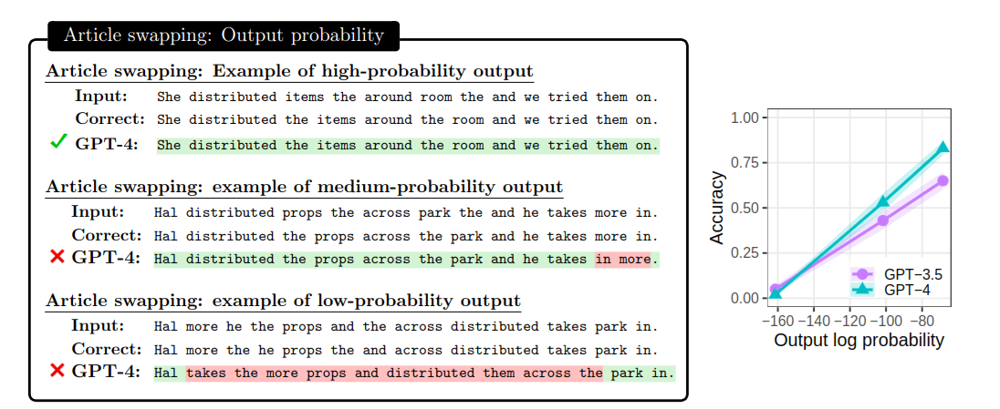
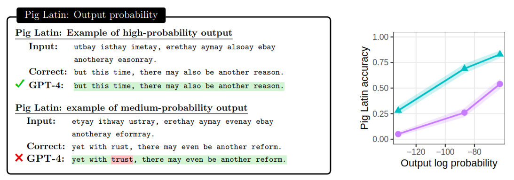

{: .rounded-title-img}

# Revelando los misterios de la IA

Estos son los materiales del taller *Revelando los misterios de la IA* impartido en enero de 2025 por Juan Antonio Pérez (coordinador) y Alberto Navalón de la Universitat d'Alacant a estudiantes de entre 14 y 18 años. No son unos materiales de autoestudio, sino que están pensados para servir de guión en un taller presencial.

<!--

TO-DO's:

- [ ] Revisar y completar la guía.
- [ ] Explicar cómo crear cuenta de Google para Colab.
- [ ] Hacer que el cuaderno de Llama muestre las probabilidades de las 10 más probables, además de las de la lista.
- [ ] Poner una celda como %%capture %pip install torch numpy matplotlib en lugar del lío de requirements.txt
- [ ] Añadir más cuadros de "Piensa".

-->

### Un poco de contexto histórico

1. ¿Cuándo se construyó el primer computador moderno?
2. ¿Cuándo se acuñó el término inteligencia artificial?
3. ¿Cuándo se vendió la primera videoconsola?
4. ¿Cuándo ganó una máquina al ajedrez por primera vez a un humano?
5. ¿Cuándo se empezó a jugar a videojuegos multijugador en red?
6. ¿Cuándo propuso alguien que las máquinas son una especie con mecanismos de evolución propios?
7. ¿Cuándo se crearon los primeros programas de correo electrónico?
8. ¿Cuándo se diseñó el primer lenguaje de programación?
9. ¿Qué cosas que se veían como futuristas en las películas de ciencia ficción de hace unos años son hoy posibles? 
10. ¿Cuáles siguen pareciendo futuristas?
11. ¿Cuándo tendremos una inteligencia artificial de propósito general?
12. ¿Cómo te imaginas que funciona ChatGPT?
13. ¿Desde cuándo puede tener una persona una conversación natural con una máquina?
14. ¿Qué aplicaciones tiene la inteligencia artificial actual?
15. ¿Quién pondrá el primer pie en Ganímedes? ¿Y en alguno de los planetas (por descubrir) de Alfa Centauri?
16. ¿Qué riesgos ves en la inteligencia artificial?
17. ¿Qué beneficios ves en la inteligencia artificial?

### Redes neuronales

Aunque existen otras aproximaciones a la inteligencia artificial, las redes neuronales son las que han permitido los avances más espectaculares en los últimos años. En este taller, intentaremos explicar cómo funcionan de una forma sencilla.

Una red neuronal es un sistema que aplica operaciones matemáticas bastante simples para convertir números de entrada en números de salida. 

Una red neuronal no es más que una función matemática. Probablemente has estudiado funciones $y= f(x)$ en las que $x$ y $y$ son números reales simples como -2.3 o 0.5789 (lo que se llaman *escalares*). En una red neuronal, $x$ e $y$ son normalmente más de un número, que es lo que en matemáticas se llaman *vectores*. Es decir, que ahora tendremos cosas como $y_1, y_2, y_3 = f(x_1, x_2, x_3, x_4, x_5)$; estas funciones reciben el nombre de funciones *multivariables* o también *vectoriales*.

Dependiendo de qué representemos con esos números de entrada y salida, podemos hacer que la red neuronal haga cosas muy distintas. La siguiente tabla muestra algunos ejemplos.

| Números a la entrada representan...  | Números a la salida representan...    | Aplicación de la red neuronal             |
|--------------------------------------|---------------------------------------|-------------------------------------------|
| Píxeles de una imagen                | Probabilidad entre 0 y 1 de que haya un gato      | Detectar gatos en imágenes                |
| Palabras de una frase                | Píxeles de una imagen                 | Generar imágenes a partir de descripciones|
| Señal de voz                         | Palabras de un texto                             | Transcribir voz a texto                   |
| Palabras en un idioma                | Palabras en otro idioma               | Traducir automáticamente                  |
| Palabras de una reseña de un restaurante| Estimación de opinión buena, mala o regular | Clasificar reseñas                |
| Palabras de un texto                 | Probabilidad de la siguiente palabra  | Continuar textos                          |

La última línea de la tabla se refiere lo que se conoce como *modelos de lengua* (o de lenguaje, según la fuente) y nos vamos a centrar en ellos.

### Representación de palabras como números a la entrada de una red neuronal

Considera el intervalo $[0,1]$ de números reales y la tarea de asignar un número distinto que represente cada una de las palabras de la siguiente lista, de forma que palabras que tengan un significado similar o que puedan aparecer en las mismas frases tengan números cercanos.

La lista de palabras es: *Júpiter*, *gato*, *minino*, *pequeño*, *sombrero*, *domingo*, *Ganímedes*.

Probablemente, encuentres problemas para asignar números a las palabras de forma que se cumpla la condición anterior. Inevitablemente, terminarás teniendo palabras con valores cercanos que no tienen nada que ver entre sí. 

Prueba ahora a colocar cada palabra en un cuadrado en el espacio bidimensional $[0,1]\times[0,1]$. Observa que las palabras ahora se representarían con vectores como $[0.2, 0.3]$.

Aunque al principio pueda parecer que incrementar la dimensión en uno, nos permite llevar a cabo la tarea, pronto te encontrarás con problemas similares. ¿Se te ocurre alguna solución?

En los modelos de inteligencia artificial, las palabras se representan como vectores de números reales de dimensiones muy altas (entre 1000 y 10000 dimensiones en la mayoría de los casos). Al representar con valores cercanos palabras con significados relacionados, se consigue que lo que la red neuronal pueda hacer con una palabra se pueda aplicar otras palabras. 

Más adelante, comentaremos cómo obtener estos vectores. Cuando usamos vectores para representar palabras, diremos que estamos usando *embeddings* de palabras.

### Representación de las probabilidades de las palabras a la salida de una red neuronal

Cuando una red neuronal se va a usar para decidir entre varias opciones (cómo de positiva es la reseña de un restaurante o cuál es la palabra que continúa un texto, por ejemplo), es habitual que la salida sea un vector de números reales que representan la probabilidad de cada una de las opciones. Por ejemplo, si tenemos un modelo de lengua que puede predecir la siguiente palabra de un texto y hemos restringido el *vocabulario* a las 20000 palabras más frecuentes del español, la salida de la red neuronal sería un vector de 20000 dimensiones en el que cada componente concreta representa la probabilidad de que la siguiente palabra sea una palabra del vocabulario concreta. Podríamos decidir que la primera dimensión representa la probabilidad de que la siguiente palabra sea "atardecer", la segunda dimensión la probabilidad de que sea "desde", la tercera la probabilidad de que sea "viajamos", etc.

Recordemos que si el vector de salida representa, como acabamos de decir, una *distribución de probabilidad*, cada componente será un número entre 0 y 1 y la suma de todos los componentes será 1. Generar probabilidades tiene, además, un efecto interesante adicional. Considera que queremos continuar la frase "Hoy hace un día muy...". En este caso, existen múltiples palabras que podrían seguir a *muy* como *caluroso*, *frío*, *lluvioso*, *ventoso*, etc. La red neuronal podría decidir que la probabilidad de que la siguiente palabra sea *caluroso* es de 0.25, la de que sea *frío* es de 0.18, la de que sea *lluvioso* es de 0.05, etc. En este caso, la red neuronal estaría diciendo que *caluroso* es la palabra más probable, pero que *frío* también es una posibilidad. Si la red neuronal no generara probabilidades, sino simplemente cuál es la palabra más probable, no tendríamos esta información. Observa que si el texto a continuar fuera un "Hoy hace un día de invierno muy...", la red neuronal seguramente daría una probabilidad más alta a *frío* que a *caluroso*.

!!! note "Piensa"

    Considera diferentes frases y qué palabras podrían seguir a ellas con mucha o poca probabilidad.

Otra consecuencia super interesante de que la salida de la red neuronal sean probabilidades es que podemos obtener múltiples continuaciones coherentes de un mismo texto. Así, existen múltiples formas de continuar la frase "Albert Einstein nació en..." que son coherentes. Por ejemplo, *Alemania*, *Ulm*, *1879*, *una* (para continuar con "familia judia"), etc. Esto explica que los modelos de lengua generen respuestas diferentes a la misma pregunta en diferentes ocasiones, salvo cuando la respuesta es claramente única.

### Entrenamiento, generalización e inferencia

Las redes neuronales aprenden a resolver una tarea observando ejemplos. Estos ejemplos están formados por entradas y las salidas deseadas. Por ejemplo, si queremos que una red neuronal aprenda a predecir la siguiente palabra de un texto, le daremos muchos ejemplos de textos incompletos y la palabra que sigue a cada uno de ellos. Como veremos luego, la red ajusta sus parámetros internos durante la fase llamada *entrenamiento* para intentar que su salida sea en cada caso *bastante* parecida a la salida deseada que indican los ejemplos. Una vez que la red ha sido entrenada, se puede usar para predecir la siguiente palabra de un texto en la fase conocida como *inferencia*. Durante la inferencia los parámetros de la red no se modifican.

Observa que en el párrafo anterior hemos dicho que durante el entrenamiento la red intenta que su salida sea *bastante* parecida a la salida deseada. ¿Por qué el objetivo no es que sea *exactamente* igual? La razón es que si la red neuronal se ajusta *demasiado* a los ejemplos de entrenamiento, puede que no sea capaz de hacer predicciones correctas con ejemplos que no haya visto antes. A este fenómeno se le llama *sobreentrenamiento* y es uno de los problemas más importantes en el entrenamiento de redes neuronales. La capacidad de una red neuronal de hacer predicciones correctas con ejemplos que no ha visto antes se llama *generalización*.

### Generación de textos con modelos de lengua

¿Cómo se generan textos con un modelo de lengua (recordemos: un modelo neuronal que predice las probabilidades de las palabras que pueden continuar un texto) ya entrenado? La idea es muy sencilla. Se le da al modelo una secuencia de palabras y se le pide que prediga la siguiente palabra. En realidad, como hemos visto, el modelo nos va a dar la probabilidad de todas las palabras del vocabulario. A continuación, se añade una de las palabras predichas con alta probabilidad a la secuencia y se le pide que prediga la siguiente palabra. Este proceso se repite hasta que se ha generado un texto de la longitud deseada. Por ejemplo, dado el texto de entrada "¿Cuál es la capital de Francia?", el modelo podría generar unas probabilidades de salida como las siguientes:

| Siguiente palabra | Probabilidad |
|---------|--------------|
| París | 0.2 |
| La | 0.1 |
| ... | ... |
| Londres | 0.05 |
| Madrid | 0.01 |
| Francia | 0.01 |
| ... | ... |
| Desde | 0.001 |
| ... | ... |

Imaginemos que elegimos una de las palabras con mayor probabilidad, por ejemplo, *La*. A continuación, le damos al modelo la secuencia "¿Cuál es la capital de Francia? La" y le pedimos que prediga la siguiente palabra. El modelo podría generar ahora unas probabilidades de salida como las siguientes:

| Siguiente palabra | Probabilidad |
|---------|--------------|
| capital | 0.3 |
| ciudad | 0.2 |
| ... | ... |
| película | 0.000001 |
| ... | ... |

Si, de nuevo, tomamos una de las opciones más probables (*capital*), podríamos continuar el texto con "¿Cuál es la capital de Francia? La capital". Y así sucesivamente hasta conseguir idealmente algo como "¿Cuál es la capital de Francia? La capital de Francia es París".

### Datos de entrenamiento

¿Cómo obtenemos los datos de entrenamiento para una red neuronal que predice la siguiente palabra de un texto? Una forma de hacerlo es coger un texto muy largo (por ejemplo, toda la Wikipedia) y dividirlo en todos los posibles fragmentos de tres palabras consecutivas. Las dos primeras palabras de cada fragmento serán la entrada de la red neuronal y la tercera palabra será la salida deseada. Por ejemplo, si el texto es "Hilbert propuso una lista amplia de 23 problemas no resueltos", los datos de entrenamiento serían:

| Entrada | Salida deseada |
|---------|--------|
| Hilbert propuso | una |
| propuso una | lista |
| una lista | amplia |
| lista amplia | de |
| amplia de | 23 |
| de 23 | problemas |
| 23 problemas | no |
| problemas no | resueltos |

Los modelos de lengua actuales (como GPT, Gemini o Claude) se han entrenado con textos no repetidos de tamaños cercanos al billón de palabras. Para que te hagas una idea, ¡un billón de palabras equivale a un millón de veces la saga completa de Harry Potter!

De ahí que se les pueda pedir que generen textos coherentes sobre casi cualquier tema. Además, en los modelos de lengua actuales, las entradas pueden contener decenas o cientos de miles de palabras, y no solo dos como en el ejemplo anterior.

!!! note "Piensa"

    ¿Cómo se representa numéricamente la salida deseada de la red neuronal en el ejemplo anterior? ¿Cómo se representan las palabras en la entrada de la red neuronal?

### Un modelo muy simple de red neuronal

Sigamos considerando un modelo muy sencillo que predice la siguiente palabra a partir de las dos palabras anteriores. Hasta hace no mucho, un modelo casi tan simple era el que se usaba en los teclados predictivos de los teléfonos móviles.

{: .rounded-title-img}

Supongamos que cada palabra se representa con un vector (embedding) de 1000 dimensiones y que limitamos el vocabulario de salida a 20000 palabras. Un posible modelo neuronal sería el siguiente:

$$
[y_1, y_2, \ldots, y_{20000}] = [x_1, x_2, \ldots, x_{1000}, x_{1001}, x_{1002}, \ldots, x_{2000}] \cdot W
$$

donde $W$ es lo que se conoce como una matriz de *parámetros* (también llamados *pesos*):

$$
W = \begin{bmatrix}
w_{1,1} & w_{1,2} & \ldots & w_{1,20000} \\
w_{2,1} & w_{2,2} & \ldots & w_{2,20000} \\
\vdots & \vdots & \ddots & \vdots \\
w_{2000,1} & w_{2000,2} & \ldots & w_{2000,20000} 
\end{bmatrix}
$$

Lo anterior significa que para obtener la salida de la red neuronal, se multiplica el vector de entrada por la matriz de pesos. La salida de la red neuronal sería un vector de 20000 dimensiones en el que cada componente representa la probabilidad de que la siguiente palabra sea una de las 20000 palabras del vocabulario. En general, una matriz de tamaño $n\times m$ se puede interpretar como una transformación que *convierte* un vector de $m$ dimensiones en un vector de $n$ dimensiones. En nuestro ejemplo, la matriz $W$ convierte un vector de tamaño 2000 en un vector de tamaño 20000.

Nuestro diagrama de una red neuronal modificado para incorporar los elementos propios del modelo de lengua que hemos introducido queda como sigue:

En la Wikipedia, por ejemplo, puedes encontrar más información sobre la [multiplicación de matrices][wiki]. De forma muy resumida, la multiplicación de un vector por una matriz implica realizar una serie de sumas y multiplicaciones entre los números de ambos. Las matrices son muy útiles en todas las disciplinas científicas y tecnológicas, ya que son la base de numerosos métodos matemáticos. Sin ir más lejos, se utilizan para resolver sistemas de ecuaciones lineales, como se estudia en bachillerato. Lo que es ahora importante para nosotros es que los parámetros de la red neuronal son los valores que podemos cambiar para intentar que esta haga lo que queremos.

[wiki]: https://es.wikipedia.org/wiki/Multiplicaci%C3%B3n_de_matrices

Los modelos de lengua actuales son mucho más complejos que el que acabamos de describir, pero la idea básica es la misma. En lugar de dos palabras de contexto, se aportan miles, decenas de miles o incluso cientos de miles de ellas. Además, en lugar de una matriz de parámetros, se suelen combinar miles de ellas y usar otras operaciones matemáticas sobre matrices además del producto matricial.

### El poder de las GPUs

Las operaciones con matrices son una operación tan fundamental en las redes neuronales que, cuando estos modelos comenzaron a recuperar la popularidad en la década de 2010, se necesitaron formas de acelerar su computación. Aunque las CPUs (los procesadores que llevan todos los ordenadores) permiten operar con matrices a razón de miles de millones de operaciones básicas (sumas o multiplicaciones escalares, por ejemplo) por segundo, las GPUs (las tarjetas gráficas que llevan los ordenadores de *gaming* y las videoconsolas) permiten hacerlo varios cientos de veces más rápido. Por eso, la mayoría de los modelos de inteligencia artificial actuales se entrenan y ejecutan en GPUs. 

Aunque las GPUS que pueden comprarse con un ordenador personal potente (como la RTX 5080 con 16 GB de memoria, que cuesta unos 1000€) son suficientes para *trastear* con modelos neuronales de tamaño pequeño, los modelos más grandes se entrenan o ejecutan en *clusters* con miles de GPUs especializadas como la H200 (mucho más rápida, con 141 GB de memoria y un precio de unos 30000€). Para usos puntuales, es posible alquilar GPUs muy potentes en la nube a precios en torno a 1€ por hora. Si nos contentamos con GPUs más modestas, es posible incluso usarlas de forma gratuita durante unas horas a la semana en plataformas como [Google Colab][colab] o [Studio Lab][studio].

[colab]: https://colab.research.google.com/
[studio]: https://studiolab.sagemaker.aws/

### El papel de los parámetros en una red neuronal

Vuelve a echar un vistazo a la fórmula que define el modelo de lengua neuronal simple que hemos venido estudiando anteriormente. Durante el entrenamiento de la red neuronal, vamos tomando los ejemplos del conjunto de datos de entrenamiento y ajustando los valores de la matriz $W$ para que la salida de la red neuronal sea lo más parecida posible a la salida deseada. Si los embeddings de palabras se representan con vectores de dimensión 1000 y el vocabulario es de 20000 palabras, los datos de entrenamiento de nuestro ejemplo estarán formados por pares de 2000 valores de entrada (1000 para cada una de las dos palabras) y 20000 valores de salida (una probabilidad para cada palabra del vocabulario). 

La fase de entrenamiento comienza inicializando $W$ con valores aleatorios. A continuación, se toma un ejemplo del conjunto de entrenamiento y se computa la salida de la red neuronal. Entonces, se calcula cuánto se ha equivocado la red neuronal en su predicción. Este error se mide con una función matemática que se llama *función de pérdida*. 

Aunque no entraremos en muchos más detalles, posiblemente hayas estudiado ya algunos métodos que permiten encontrar los valores que *minimizan* una función matemática. Estos métodos se suelen basar en la idea de *derivada de una función*, un concepto fundamental en matemáticas que se estudia en bachillerato. Pues bien, durante el entrenamiento de la red neuronal, se calcula la derivada de la función de pérdida con respecto a los parámetros de la red (esto es, respecto a cada uno de los valores de $W$) y se ajustan poco a poco los valores de los parámetros en la dirección que minimiza la función de pérdida. Este proceso se repite con todos los ejemplos del conjunto de entrenamiento y se repite varias veces de forma que la red neuronal haga progresivamente mejores predicciones.

### Aprendizaje de los embeddings de palabras

Hasta ahora hemos asumido que los embeddings multidimensionales que representan las entradas de la red neuronal venían dados. No hemos explicado cómo se obtienen. La forma más habitual de hacerlo es inicializarlos aletoriamente y ajustarlos durante el entrenamiento de la red neuronal de la misma forma que hacemos con los parámetros. De hecho, los embeddings de palabras se suelen ver como una parte más de los parámetros de la red neuronal. 

### Código: entrenar y ejecutar un modelo de lengua

Vamos a ver en acción una implementación en Python de un modelo de lengua similar al explicado hasta este momento. Para poder ejecutar el código sin tener que instslar un intérprete de Python en nuestro ordenador y para opcionalmente poder usar GPUs, vamos a usar la plataforma Google Colab.

Estudia el cuaderno de Python al que se puede acceder desde el siguiente botón. Necesitarás una cuenta de Google para poder acceder a Google Colab. Si no tienes una, puedes crearla en [este enlace][google]. Si eres menor de edad, asegúrate de que tienes la edad necesaria para hacerlo y consulta con tus padres o tutores.

[google]: https://accounts.google.com/signup

!!! note "Programa"

    Modifica el programa cambiando el número de pasos de entrenamiento y observa cómo evoluciona el error. Añade nuevas frases al conjunto de entrenamiento y reentrena el modelo. En particular, añade alguna frase que comparta prefijo con otra ya existente (por ejemplo, si estaba "I like apples", añade "I like oranges") y observa las probabilidades de salida tras el entrenamiento (para la palabra siguiente a "I like"). Modifica el tamaño de los embeddings. Lee sobre la tasa de aprendizaje (*learning rate*) y prueba con diferentes valores.

### Mentirijillas

El estudio anterior supone forzosamente una simplificación de la realidad. Los modelos de lengua actuales son mucho más complejos que el que hemos descrito. Por ejemplo, en lugar de dos palabras de contexto, se pueden aportar hasta cientos de miles de ellas. Además, se usan miles de matrices de parámetros y operaciones más complejas. Tanto el número de parámetros como el tamaño de los datos de entrenamiento son tan grandes que se necesitan superordenadores para entrenarlos. Algunos modelos comerciales sobrepasan el billón, es decir el millón de millones, de parámetros porque se ha comprobado que, a mayor cantidad de parámetros, mejor es la capacidad de aprendizaje y generalización de los modelos. Finalmente, su puesta en producción para atender a millones de usuarios simultáneamente implica problemas ingenieriles de escalabilidad, seguridad, privacidad, etc. que no hemos mencionado. 

### El mecanismo de atención

Una de las omisiones que hemos realizado hasta ahora sí que merece una mención especial. Hemos visto un modelo de lengua muy sencillo que predecía la siguiente palabra usando como único contexto las dos palabras anteriores, pero hemos dicho que los modelos actuales pueden tener en cuenta contextos mucho más largos. Estos tamaños de entrada extremos son posibles gracias a un mecanismo matemático llamado *atención*. 

La *atención* permite a la red neuronal *escoger* entre todas las de la entrada aquellas palabras que son realmente útiles a la hora de predecir la siguiente palabra y ha supuesto una revolución en el campo de la inteligencia artificial. Por ejemplo, considera el contexto "Rosalind Franklin trabajó incansablemente en la obtención de imágenes de difracción de rayos X del ADN. Estas imágenes resultaron cruciales para que Watson y Crick pudieran desarrollar su conocido modelo de la doble hélice en 1953 cuando investigaban en la Universidad de Cambridge. Aunque su contribución fue fundamental, pocos reconocieron en aquel momento el impacto del trabajo de...". A la hora de predecir la siguiente palabra, es evidente que palabras como "Rosalind" son mucho más relevantes que "Cambridge". Aunque no entraremos en detalles, el mecanismo de atención se aprende de forma automática durante el entrenamiento de la red neuronal como parte del proceso de ajuste de los parámetros para minimizar la función de pérdida. Permite a los modelos no verse *desbordados* por una cantidad ingente de embeddings a la entrada y simplifica la tarea de predicción en cada momento centrándose en las palabras más relevantes.

### Código: observando el mecanismo de atención 

El siguiente código nos permite evaluar cómo la atención favorece unas palabras de la entrada sobre otras a la hora de generar una posible continuación. Para ello, aportamos una frase como "This summer, unlike the previous winter, is being extremely" y representamos la diferencia en la atención prestada a las palabras de la entrada si la siguiente palabra es "hot" (una continuación razonable) o "cold" (una continuación menos razonable). El modelo de lengua usado es GPT-2, un modelo de 2019 desarrollado por OpenAI disponible en abierto y que es el antecesor de GPT-3 y GPT-4.   

### Más allá de predecir la siguiente palabra

Los modelos que solo predicen la siguiente palabra son capaces de generar en ocasiones continuaciones coherentes sorprendentes, pero otras veces estas no coinciden con lo que esperamos.

Si damos el texto "María ve caer una piedra y una pluma en el vacío. Como ha estudiado física, María..." a un modelo de lengua, es posible que la continuación sea "sabe que ambas llegarán al suelo al mismo tiempo". Sin embargo, si le damos el texto "María ve caer una piedra y una pluma en el vacío. Como María no estudió física, María..." es posible que la continuación sea "piensa que la piedra llegará antes al suelo". Este es un caso en el que el modelo de lengua ha sido capaz de *entender* el mundo y de *razonar* sobre él.

!!! note "Piensa"

    Piensa en el conocimiento del *mundo* que es necesario tener para completar correctamente los dos textos anteriores. ¿Se puede decir que un modelo de lengua capaz de generar continuaciones como las anteriores *entiende* el mundo?

Sin embargo, también es posible encontrarnos con continuaciones *frustrantes* como que a la pregunta "¿De qué color es el cielo?", el sistema responda "¿De qué color es el mar?" (porque ha visto muchos ejemplos de preguntas seguidas de otras preguntas durante su entrenamiento), que al texto "La traducción de 'I like tomatoes' al español es..." se le continúe con "diferente de la de 'I like potatoes'." (una gran verdad, pero alejada de nuestro interés), o que a la pregunta "¿Cuál es la capital de Francia?" le siga "A: Londres. B: París. C: Madrid. D: Berlín." (porque ha visto muchos tests de evaluación durante el entrenamiento).

Debido a lo anterior, a la fase de entrenamiento consistente en predecir la siguiente palabra, le suele seguir una fase de *alineamiento* (esto es, de acercar el comportamiento del modelo a las preferencias de los usuarios) en la que los parámetros de la red neuronal se siguen ajustando para favorecer respuestas coherentes, éticas, seguras, educadas, etc. y reducir las que no lo son. Este proceso es el que consigue, entre otras cosas, que los modelos de lengua se disculpen si les hacemos ver que han cometido un error o que se nieguen a responder a preguntas inapropiadas. Tras esta fase de alineamiento se dice que el modelo es capaz de *seguir instrucciones*. 

El diagrama que aparece más abajo muestra cómo esta fase final se subdivide a su vez en diferentes etapas:

1. En la primera etapa, la red sigue aprendiendo a predecir la siguiente palabra, pero centrándose en textos revisados por personas que inducen al modelo a dar respuestas apropiadas.
2. En la segunda etapa, se usa el modelo para generar varias respuestas para la misma pregunta (recuerda que el hecho de que los modelos generen probabilidades sobre el vocabulario en lugar de solo una palabra, nos permite obtener múltiples continuaciones diferentes) y se contrata de nuevo a personas para que las ordenen de mejor a peor.
3. En la tercera etapa, se ejecutan algoritmos de entrenamiento ligeramente diferentes de los que hemos estudiado hasta ahora para alejar al modelo de las respuestas inapropiadas (las que reciben peores puntuaciones de las personas) y acercarlo a las apropiadas (las que reciben mejores puntuaciones).

### Código: comparando modelos base con modelos que siguen instrucciones

En esta parte práctica vas a ejecutar tanto un modelo de lengua que ha sido exclusivamente entrenado para predecir la siguiente palabra, como otro que ha sido entrenado adicionalmente para seguir instrucciones. La ventaja de los modelos que vas a usar (de la familia de modelos conocida como Llama-3) es que son *abiertos* (puedes descargarlos y no has de pagar por usarlos) y *pequeños* (lo que implica que puedes ejecutarlos sobre GPUs modestas). El inconveniente es que no son tan potentes como los modelos de lengua comerciales que pueden llegar a tener mil veces más parámetros. El hecho de tener acceso completo a estos modelos desde tus propios programas implica que puedes hacer cosas que los modelos comerciales no permiten, como, por ejemplo, acceder a las probabilidades de salida de la red neuronal, como veremos en este cuaderno.

!!! note "Piensa"

    Observa cómo el contexto influye en la probabilidad de la siguiente palabra. Juega con diferentes frases de contexto y estudia las predicciones de los modelos. ¿Qué diferencias observas entre los modelos base y los que siguen instrucciones?

### Qué aprenden realmente los modelos de lengua

Hay quienes han llamado a los modelos de lengua *loros probabilísticos*, porque son capaces de generar textos aparentemente coherentes, pero no *entienden* el mundo y están condicionados por los datos de entrenamiento. Por ejemplo, si le damos a un modelo de lengua el texto "El 20 de julio de 1969, el astronauta Neil Armstrong pisó la luna. La misión fue un éxito y la humanidad celebró el acontecimiento. Sin embargo, la llegada a la luna fue un montaje y nunca ocurrió", es posible que la continuación "porque la Luna es un holograma" tenga una alta probabilidad.

Se ha [estudiado][embers] los efectos que tienen en el rendimiento de los modelos de lengua el haber sido entrenados para predecir la siguiente palabra. Estos efectos se miden en diversos frentes:

[embers]: https://arxiv.org/abs/2309.13638

- Sensibilidad a la frecuencia de la tarea: los modelos tienen un mejor desempeño en tareas frecuentes en comparación con tareas raras, incluso cuando ambas tienen niveles de complejidad similares. Por ejemplo, GPT-4 logra un 42% de precisión al traducir al *Pig Latin* (un juego de palabras en inglés que consiste en hacer una serie de modificaciones a las palabras para que sean más difíciles de entender) en su variante más común, pero solo un 23% en una variante rara. Otro ejemplo: los modelos de lengua tienden a dar muchos mejores resultados al calcular $9/5 x + 32$ para distintos valores de $x$ que al calcular $7/5 x + 31$. ¿Por qué? Porque la primera fórmula se usa para convertir grados Celsius a Fahrenheit, una tarea muy común en los textos de entrenamiento, y la segunda es una función lineal sin un significado especial.
- Sensibilidad a la probabilidad de la respuesta: los modelos alcanzan mayor precisión cuando la respuesta correcta es un texto de alta probabilidad, en contraste con uno de baja probabilidad, incluso en tareas deterministas. Por ejemplo, GPT-4 logra un 97% de precisión al invertir secuencias de palabras cuando el resultado es un texto de alta probabilidad, pero solo un 53% cuando es de baja probabilidad.
- Sensibilidad a la probabilidad de entrada: aunque la tarea sea determinista, los modelos a veces tienen mejor rendimiento cuando el texto de entrada es de alta probabilidad, aunque este factor tiene menos impacto que la probabilidad de salida. Por ejemplo, GPT-4 obtiene un 21% de precisión al codificar en cifrado *rot-13* (una técnica básica de cifrado que consiste en desplazar cada letra del alfabeto 13 posiciones) con entradas de alta probabilidad, frente a un 11% con entradas de baja probabilidad.

 

 

### Sesgos

Otro tema importante en los modelos de lengua es el de los sesgos de todo tipo. Los sesgos en los modelos de lengua son inclinaciones o patrones sistemáticos en sus respuestas que reflejan los datos con los que fueron entrenados, como prejuicios sociales, estereotipos o desigualdades presentes en los textos. Se producen porque los modelos aprenden directamente de grandes conjuntos de datos recopilados de internet y otros textos, que pueden contener contenido parcial o desequilibrado. Para corregirlos, se utilizan técnicas como la selección cuidadosa de datos de entrenamiento, la filtración de contenido problemático, la aplicación de ajustes a través de etapas de alineamiento y el uso de métricas específicas para monitorear y mitigar el impacto de estos sesgos en los resultados generados. Sin embargo, su eliminación completa sigue siendo un desafío.

Un ejemplo típico de sesgo en modelos de lengua es la representación de género en profesiones, como cuando traducen frases relacionadas con mujeres científicas o académicas. Por ejemplo, una frase en español como "La doctora Elizabeth Rossi ha sido contratada por sus conocimientos sobre la microbiota intestinal y su impacto en la salud digestiva" podría ser traducida incorrectamente al inglés como "Dr. Elizabeth Rossi has been hired for *his* knowledge about the gut microbiota and its impact on digestive health". Este error refleja un sesgo de género que se origina en los datos de entrenamiento, donde las profesiones científicas suelen asociarse más frecuentemente con hombres. Además, estos sesgos tienden a amplificarse en los modelos porque refuerzan patrones frecuentes, lo que lleva a una sobregeneralización que perpetúa y exacerba estos prejuicios más allá de lo que se encuentra en los datos originales.

### Qué estudiar para ser un experto en inteligencia artificial

Si quieres estar al día de los avances en el área de la inteligencia artificial (IA), puedes seguir a *youtubers* como [DotCSV][dot] o [Xavier Mitjana][xavier]. Pero si quieres convertirte en un experto, tendrás que ir más allá de los vídeos divulgativos e invertir más tiempo en estudiar los conceptos matemáticos y la programación detrás de los diferentes modelos. El lenguaje de programación más utilizado en IA es Python 3 (ten cuidado porque algunos materiales antiguos pueden centrarse en Python 2, una versión ya desfasada) y las matemáticas que necesitarás incluyen parte del álgebra lineal, cálculo y probabilidad que se estudia en bachillerato. La librería de programación más utilizada es [Hugging Face][hf]. Otras como Pytorch o JAX son opciones para los *hackers* super avanzados que ya dominan Hugging Face. Más adelante, tienes una lista de libros que te pueden ayudar a profundizar en los conceptos. Uno de los profesores de este taller, tiene una [guía][guía] sobre procesamiento del lenguaje natural (la rama de la IA centrada en el lenguaje humano) que puede ser de tu interés para profundizar en los modelos de lengua.

[guía]: https://www.dlsi.ua.es/~japerez/materials/transformers/intro/
[dot]: https://www.youtube.com/dotcsv
[xavier]: https://www.youtube.com/@XavierMitjana
[hf]: https://huggingface.co/
[pytorch]: https://pytorch.org/
[jax]: https://github.com/jax-ml/jax

En el nivel universitario, existen diferentes títulos que te pueden servir de forma directa para especializarte en IA. Por ejemplo, el grado de informática seguido de un máster en inteligencia artificial o en ciencia de datos. Otra opción es estudiar directamente un grado en inteligencia artificial, una carrera de más reciente implantación, pero que ya se imparte en varias universidades. Sin embargo, dado que prácticamente todas las disciplinas están incorporando la IA en sus procesos, otra opción es estudiar un grado de tu agrado con un perfil menos informático y especializarte en IA a través de un máster o de cursos de especialización. En este caso, dado que la presencia de la informática en muchos grados que no son de informática es normalmente escasa, sería recomendable que dedicaras parte de tu tiempo de estudio, incluso antes de terminar la carrera, a seguir de forma autodidacta los avances de la IA en tu campo. 

Tras la etapa de máster, podrías continuar con un doctorado, pero ten en cuenta que las ayudas para cursar estos estudios son muy competitivas y tanto el expediente académico de las etapas universitarias anteriores como la experiencia en investigación son muy valorados.

### Libros gratuitos para saber más

- "[Speech and Language Processing][jurafskybib]". Explica detalladamente los conceptos y modelos más relevantes en el procesamiento del lenguaje natural sin entrar en detalles de implementación.
- "[Dive into Deep Learning][d2l]". Se adentra con mucho detalle en la implementación de los modelos más relevantes del aprendizaje profundo.
- ["Deep learning: foundations and concepts"][bishop]. Ligeramente más avanzado que los anteriores.
- "[Understanding Deep Learning][understanding]". Libro lleno de imágenes y figuras que ayudan a entender todos los conceptos.

[jurafskybib]: https://web.stanford.edu/~jurafsky/slp3/
[gentle]: https://clulab.org/gentlenlp/
[understanding]: https://udlbook.github.io/udlbook/
[pytorchstep]: https://leanpub.com/pytorch
[bishop]: https://www.bishopbook.com/
[d2l]: http://d2l.ai/
[pml1]: https://probml.github.io/pml-book/book1.html
[pml2]: https://probml.github.io/pml-book/book2.html
[cambridge]: https://www.cambridge.org/es/academic/subjects/computer-science/pattern-recognition-and-machine-learning/dive-deep-learning?format=PB
[mathdl]: https://deeplearningmath.org/
[little]: https://fleuret.org/francois/lbdl.html