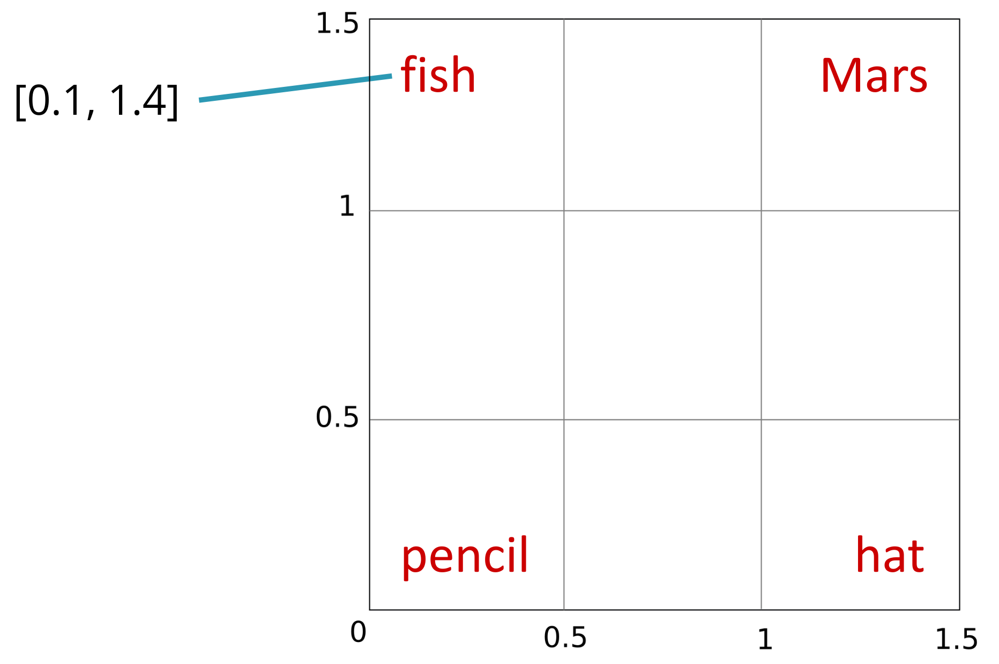
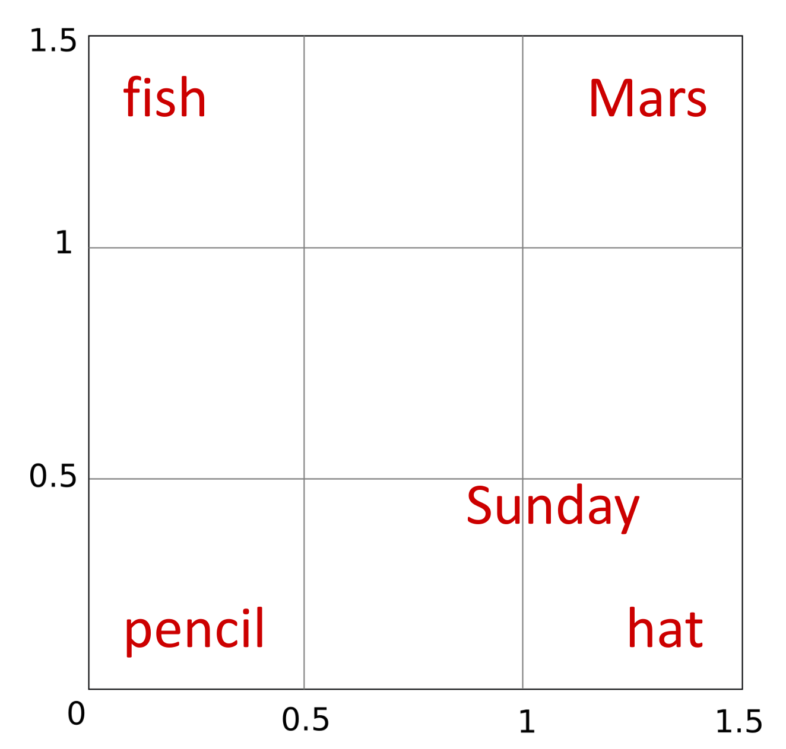
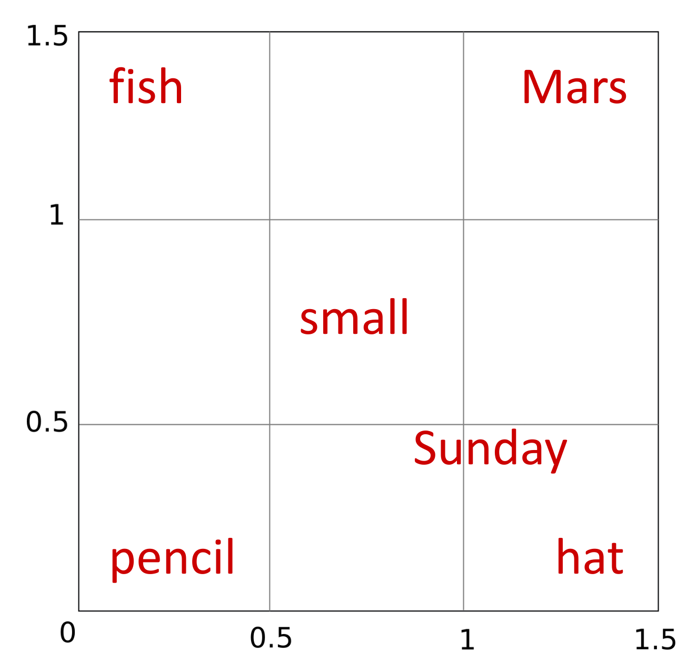
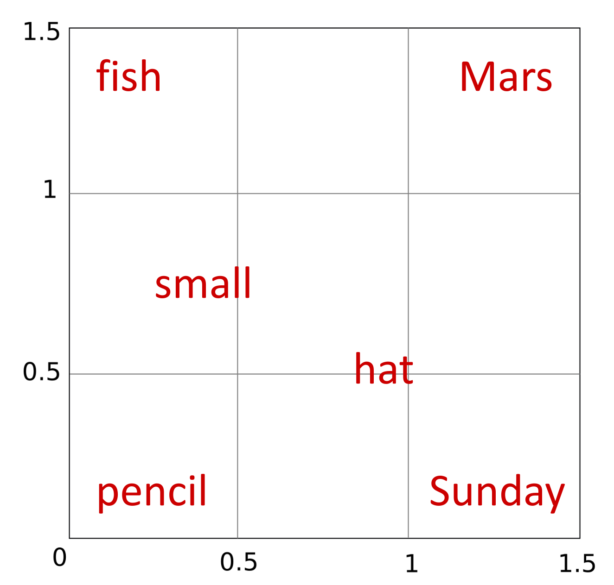
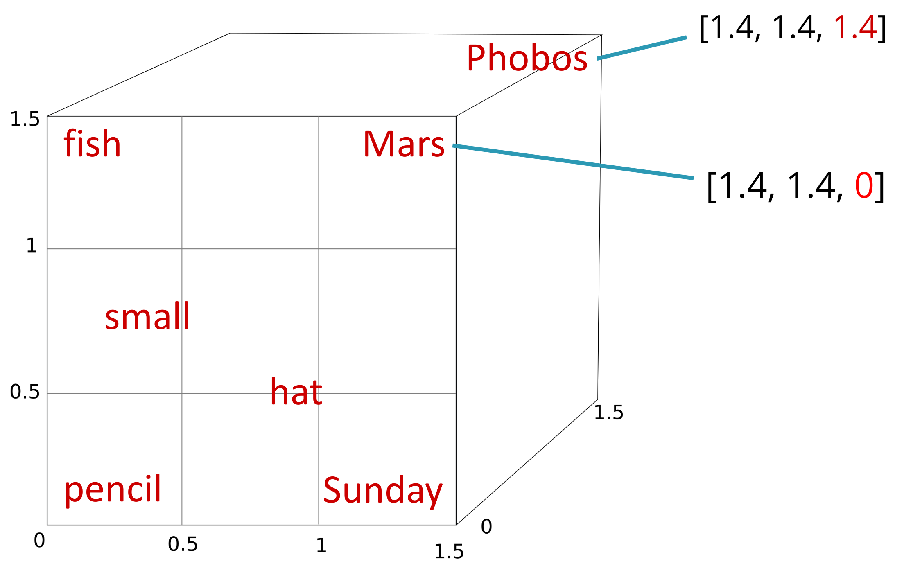

{: .rounded-title-img}

# Non-contextual Embeddings: An Algorithm to Represent Words with Numbers

Up until now, when representing words or phrases, we have used features that allowed us to mathematically work with linguistic elements. These features, however, are relatively arbitrary and require effort on our part to define them. There is, however, a more grounded way to represent words with numbers, as we will now see, which does not require human supervision.



## Embeddings

Non-contextual embeddings are explained in the chapter [:octicons-book-24:][embeddings] "[Vector Semantics and Embeddings][embeddings]." Start by reading section 6.2. Then study section 6.4 on cosine similarity. Skip sections 6.5 to 6.7 entirely. Focus primarily on section 6.8 ("Word2vec") but read sections 6.9 to 6.12 with less detail.

[embeddings]: https://web.archive.org/web/20221218211150/https://web.stanford.edu/~jurafsky/slp3/6.pdf

## Book Notes



Section 6.2
{: .section}

Embeddings allow words to be represented as numbers such that words appearing in similar contexts have similar representations. This numerical representation is essential for neural networks (or other machine learning models) to work with human language. If we can represent each word in a sentence as a vector, we can attempt to learn a classifier, for instance, to determine the sentiment of a sentence by averaging the embeddings of its words.

Although many methods to obtain embeddings have been developed over the last decades, algorithms like *word2vec*—covered in this chapter—were pioneers in enabling *deep* representations (in the sense that each word is represented with a vector of hundreds or thousands of real numbers), which significantly improved results in numerous natural language processing tasks. One drawback of these algorithms, making them less used today, is that they learn non-contextual representations, meaning a word like *light* with its multiple meanings (more than one meaning either as verb, adjective, or noun: look it up in the dictionary) is represented the same way in all contexts. As we will see later, contextual embeddings, such as those obtained with transformers, offer unique representations for each word in every sentence where it appears.

The intuition behind why larger vectors allow better proximity or separation of words in vector space based on their similarity can be understood with the following example. Suppose we only had two dimensions to represent seemingly unrelated words like *fish*, *Mars*, *pencil*, or *hat*. If we assume a square with a side length of 1.5 as our workspace, since these words are minimally related, it makes sense to place them in the corners.

{: .rounded-title-img style="width:460px"} 

If we then wanted to find a two-dimensional representation for *Sunday*, we could place it near *hat* (after all, people traditionally reserve their best hats for Sunday), which simultaneously distances it from *Mars* or *pencil*, with which it shares less context.

{: .rounded-title-img style="width:320px"} 

Now suppose we want to add the word *small*. Since this word can accompany *fish*, *hat*, or *pencil* and since Mars (considering it as a planet, ignoring that it can also be a god, a chocolate brand, or part of a famous Parisian garden’s name) is one of the smallest planets in the solar system, we can place *small* midway between these four words. However, this also brings it closer to *Sunday*, with which it shares little context.

{: .rounded-title-img style="width:320px"} 

Do you see the problem? It is as if there is not enough space to satisfy all the constraints. A temporary solution might be to swap *Sunday* and *hat*, but we can foresee that as we add more words to the small vector space, the problem will become increasingly evident.

{: .rounded-title-img style="width:320px"} 

If we then wanted to add *Phobos*, it should clearly be placed near *Mars* as it is a satellite of this planet, but this would also place it close to words like *hat*, and it is hard to find sentences discussing the uses of hats on the Phobos satellite. The key is to add a third dimension to the vector space, allowing us to separate *Phobos* from all other words except *Mars*.

{: .rounded-title-img style="width:550px"} 

It is easy to deduce that by increasing the number of dimensions in the vector space, we can represent relationships between words more accurately. When we move to hundreds or thousands of dimensions, some words will be close to others in some dimensions but not in others. However, note a problem we will not solve yet: that a word like *Mars* with multiple meanings has a single embedding. In fact, most words have different meanings in each unique sentence where they’re used. For example, the word *cat* in "The cat is asleep" and "The cat is scared" does not represent exactly the same idea of an animal, despite the discretization of the deeper concept in our minds when referring to the feline in one situation versus the other. This issue of not being able to represent semantics in a specific case will be resolved later with contextual embeddings.

Section 6.3
{: .section}

This section is optional, but you can skim through it to learn about more classical approaches to obtaining embeddings based on word co-occurrence counts in documents.

Section 6.4
{: .section}

This brief section introduces a basic idea: the *cosine similarity* (not called *distance* because it does not satisfy all necessary properties) between two vectors representing the embeddings of two words is a measure of similarity between the corresponding words. If two vectors are identical, their similarity is 1; if they are orthogonal, their similarity is 0; if they are opposite, their similarity is -1.

Moreover, the dot product is proportional to cosine similarity but involves fewer calculations, so we use it as an efficient approximation. Recall that the dot product of two vectors $\mathbf{a}$ and $\mathbf{b}$ is:

$$
\mathbf{a} \cdot \mathbf{b} = \sum_{i=1}^n a_i b_i
$$

This idea of summing pairwise products of elements of two vectors also appears in matrix multiplication, so we can think of multiplying two matrices $A \times B$ as obtaining all possible dot products between the rows of $A$ and the columns of $B$. Remember this idea when we discuss transformers, where matrix products are used to streamline the calculation of a series of dot products simultaneously.

There is a paragraph mentioning that for embeddings with positive values, cosine similarity will always range from zero to one. This statement applies to embeddings obtained through classical procedures (not covered here) like the example table in this section (with words like *cherry* or *digital*). These embeddings have positive values because they result from counting word co-occurrence frequencies in documents. However, for word embeddings we will study next, the vector values can be negative, allowing cosine similarity to fall below zero.

In any case, while cosine similarity is bounded between -1 and 1, the dot product that will usually be used as a proxy is unbounded.

Section 6.8
{: .section}

This section introduces the *skip-gram* algorithm for computing word embeddings. This algorithm can be viewed as an application of the binary logistic regressor we have already studied, so revisiting it beforehand is recommended. We will have a series of positive data (desired output = 1) and a series of negative data (desired output = 0). Positive data are pairs of words appearing in the same context, while negative data are pairs of words not appearing in the same context. The goal is to learn to predict whether two words appear in the same context or not. 

But if the regressor output is a single scalar between 0 and 1, where do the embeddings come from? The idea is that each word will be represented at the input by a different vector of weights, so the regressor’s output quantifies how likely it is for two words to appear in the same context. Since the dot product is not bounded, we apply the sigmoid function to normalize it within this range.

The main difference from the binary logistic regressor is that here, we have two learnable parameter vectors, one for each word, rather than a fixed input vector determined by the problem data. Once training is complete, each word’s vector becomes its embedding, which can be used for additional tasks. The bias term $b$ is not used in this case as it is not necessary.

One of the great advantages of this algorithm is that it uses a *self-supervised* learning technique, which does not require the costly manual labeling of data. The algorithm does require labeled data, as it needs to know when the desired output for two words is 0 and when it is 1, but these labels can be generated automatically from the input data. We only need a collection of texts (e.g., Wikipedia articles or news articles downloaded from the internet) and a context window. The context window is an integer specifying how many words to the left and right of the target word we consider as context. The algorithm extracts positive samples by iterating over each word in the text and considering the words within the context window to the left and right as context. Negative samples are generated randomly, selecting two words at random from the text and assuming they do not appear in the same context.

Section 6.8.2 states that "the noise words are chosen according to their weighted unigram frequency $p_α(w)$, where $α$ is a weight." Note that here $w$ refers to a word chosen for a negative sample and is not related to the target word also denoted by $w$. When the chapter mentions that noise words are chosen based on unigram probability, it refers to selecting them based on their frequency of occurrence in the text: more frequent words will be chosen more often than less frequent words. This prevents us from learning representations for rarely occurring words at the expense of worse representations for words of greater interest. Also note how the use of a non-linear adjustment in the form of the exponent $\alpha$ slightly smooths these frequencies to avoid overly penalizing infrequent words.

Negative and positive samples are combined into a mini-batch and trained using a loss function $L_{\mathrm{CE}}$ like in equation (6.34), but extended to the entire batch by incorporating the mean of the errors.

Finally, equations (6.35) to (6.37) show gradient formulas for the model parameters. It would be great if you tried deriving them on your own, but it is not strictly necessary to follow the rest of the course. If you compare them in detail to those of the binary logistic regressor we studied earlier, you will see they are identical. For instance, when the derivative is with respect to $c_{\mathrm{pos}}$, this variable plays the role of the weights $\mathbf{w}$ in the logistic regressor, and $\mathbf{w}$ (the embedding of the target word) is considered constant and plays the role of the input $\mathbf{x}$ in the logistic regressor derivatives.

Sections 6.9 to 6.12
{: .section}

These sections are less dense than the previous one and will help you understand other aspects related to using embeddings:

- projecting embeddings into low-dimensional spaces for visualization;
- performing arithmetic operations on embeddings to extract semantic relationships between associated words;
- identifying and addressing biases in learned embeddings;
- using evaluation datasets to compare different methods of obtaining word representations.
