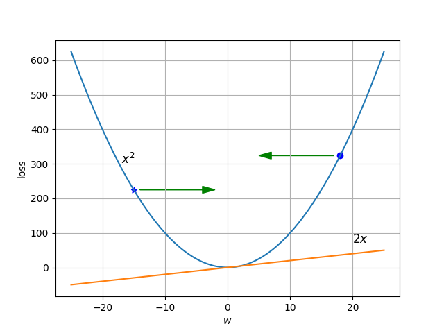

<div class="content-2columns" markdown>
{: .rounded-title-img}

# Regressors: Meeting the Little Brother of Neural Networks
</div>

Our first steps along the yellow brick road take us to the little brother of the neural network family: logistic regression, which, in general, is not even considered a neural network. Along the way, you will learn many machine learning concepts that will later apply to more complex models.



## Regressors

Study this topic using the [:octicons-book-24:][logistic] "[Logistic Regression][logistic]" chapter from Jurafsky and Martin's book, supplementing it with the discussion below.

[logistic]: https://web.archive.org/web/20221218211150/https://web.stanford.edu/~jurafsky/slp3/5.pdf

Most of the chapter is very relevant to our purposes as it is an introductory chapter. However, you can skip the following:

- The introduction before section 5.1, as it is based on elements from previous chapters (Bayesian classifier) that you haven’t seen.
- Section 5.2.2 ("Other classification tasks and features").
- Section 5.2.4 ("Choosing a classifier").
- Section 5.7 ("Regularization").
- Finally, while it’s not necessary to understand section 5.10 ("Advanced: Deriving the Gradient Equation") before moving on to later chapters, it’s highly recommended that you are eventually able to derive the loss function yourself. As models become more complex, manually deriving it will become a laborious and unnecessary task (since libraries like PyTorch will calculate it for us), but doing so now will enhance your perspective on neural network training.

This chapter might turn out to be one of the most challenging, with a steep learning curve, as it introduces many potentially new elements. Below, some of the most important concepts from each section are highlighted or clarified.

## Book Annotations

Every section you read from Jurafsky and Martin's book will be accompanied by an annotation block like the one below.



Section 5.1
{: .section}

This section introduces the concept of the dot product, which will be a cornerstone of everything to come. If you recall how matrix multiplication works (which will appear numerous times later), you’ll notice that it consists of a series of dot product calculations. The bias term is crucial in some problems because it allows decision boundaries to shift, as we will demonstrate later. Note that the non-linearity of the sigmoid function’s exponentiation *compresses* differences between the function's output values as they move further from the origin since $\sigma(2)-\sigma(0) >>> \sigma(4)-\sigma(2)$. On the other hand, while you don’t need to demonstrate it analytically, you should graphically observe that $1 - \sigma(x) = \sigma(-x)$; this property will allow us to simplify some equations. Finally, note that for now, the $\sigma$ function is applied to a scalar, but later it will be applied to a vector or even a tensor of any number of dimensions. In these cases, the function is applied element-wise, i.e., if $\mathbf{x}$ is a vector, $\sigma(\mathbf{x}) = [\sigma(x_1), \sigma(x_2), \ldots, \sigma(x_n)]$.

Remember also that the differences between an exponential function and a non-exponential one (e.g., quadratic or linear) lie in their growth rates. For an exponential function like $f(x)=2^x$, doubling the input value squares the output value: $f(2x) = 2^{2x} = {(2^x)}^2$. For a quadratic function like $g(x)=x^2$, doubling the input value multiplies the output by 4: $g(2x)=(2x)^2 = 4x^2$. For a linear function like $h(x)=x$, doubling the input value also doubles the output: $h(2x)=2x$.

Section 5.2
{: .section}

The sentiment classification example in this section is interesting because it shows the technique used until a few years ago for this task. Here, a domain expert is assumed to have defined the features they believe are important for determining whether a phrase has positive or negative connotations. These features are calculated for each phrase by another program before passing them to the regressor. This process is costly because it requires domain experts and because the criteria for relevance can be subjective. The number of features in this case was typically in the tens. Today, as we will see, neural models process *raw* data and learn the most relevant features (in hundreds or thousands), although in most cases these have no logical interpretation for experts.

Meanwhile, the idea of normalization might seem unimportant now but will play a significant role in transformer models to prevent intermediate values from becoming too large or small. Looking at the sigmoid function graph in the previous section, you’ll notice that for very large or very small $x$ values, there’s hardly any difference in $\sigma(x)$ values, making the function insensitive to small changes in $x$. Additionally, in these regions, the function is nearly flat, resulting in a very small derivative, which, as we will see, hinders training.

Lastly, the idea of processing multiple inputs simultaneously is also crucial as it reduces processing time. By stacking input vectors by rows and performing a simple matrix multiplication followed by applying the sigmoid function, you can classify all input vectors at once. GPUs are specialized in performing these matrix operations very efficiently, so we will always try to batch the data into *mini-batches* to fill the GPU memory with as much data as possible and process it in parallel.

For the bias addition operation to be consistent in size, the bias needs to be *broadcasted* to form a vector $b$ of the same size as the number of samples processed simultaneously. When we work with PyTorch, we will see that this operation is performed automatically, and thanks to *broadcasting*, it is not necessary to explicitly create a vector with the bias value repeated multiple times; we can directly add the scalar or a one-dimensional tensor of size 1.

Section 5.3
{: .section}

The softmax function is the equivalent of the sigmoid function when a sample needs to be classified into more than two classes. In this case, the function takes an unnormalized vector (i.e., without a specific range) and transforms it into a probability vector representing membership for each class. This unnormalized vector is called *logits* (logit is the inverse function of the sigmoid). Note that we could not have normalized the values between 0 and 1 by dividing each by the sum of all since there are negative values that would cancel out positive ones. We could have considered squaring each input value and dividing by the sum of all squares, but the softmax function emphasizes differences more and penalizes values further from the maximum:

```python
z = torch.tensor([0.6, 1.1, -1.5 ,1.2, 3.2, -1.1])
squared = z*z / sum(z*z)
softmax= torch.nn.functional.softmax(z, dim=-1)
print(z, squared, softmax)  
# z =       [0.6000, 1.1000, -1.5000, 1.2000, 3.2000, -1.1000]
# squared = [0.0215, 0.0724,  0.1346, 0.0862, 0.6128,  0.0724]
# softmax = [0.0548, 0.0904,  0.0067, 0.0999, 0.7382,  0.0100]
```

Notice that in this section when we compute $\hat{\mathbf{y}} = \mathrm{softmax} (\mathbf{W} \mathbf{x} + \mathbf{b})$, the vector $\mathbf{x}$ corresponds to a single sample, but unlike earlier sections, $\mathbf{W}$ is a matrix, and $\mathbf{b}$ is a vector with non-repeated values. In this case, the $K \times f$ shaped matrix $\mathbf{W}$ transforms a feature column vector of size $f$ (actually $f \times 1$) into a logits vector of size $K$, where $K$ is the number of classes. If we reshape the matrix to $f \times K$, an equivalent operation can be performed with $\hat{\mathbf{y}} = \mathrm{softmax} (\mathbf{x} \mathbf{W}  + \mathbf{b})$, where $\mathbf{x}$ and $\mathbf{b}$ are row vectors ($1 \times f$) instead of columns.

Note also that instead of applying the operation to a single sample (e.g., the features of one sentence), we can apply it to a batch of samples by *stacking* them as rows in a matrix $\mathbf{X}$ and computing $\hat{\mathbf{y}} = \mathrm{softmax} (\mathbf{X} \mathbf{W}  + \mathbf{B})$ or stacking them as columns and computing $\hat{\mathbf{y}} = \mathrm{softmax} (\mathbf{W} \mathbf{X}  + \mathbf{B})$. In both cases, the matrix $\mathbf{B}$ will contain the bias vector $\mathbf{b}$ *repeated* $m$ times. The result will be a batch of $m$ vectors of logits of size $K$, one for each sample in the batch.

From now on, whenever you see an equation involving a part of a neural model where a batch of vectors is multiplied by a matrix, you can recognize it as a linear transformation that converts each input vector into another vector, usually of a different size. Keep this in mind when we study the topic of feedforward neural networks.

This section also introduces the concept of a *one-hot* vector (a vector where all elements are zero except for one element, which equals one). This concept is frequently used to represent the vector against which we compare the output of the neural network. For instance, in an image classification problem involving digit images, the *one-hot* vector corresponding to the label for the digit 3 would be $\mathbf{y} = [0,0,0,1,0,0,0,0,0,0]$.

### Section 5.4

It is noted that the next two sections focus on cross-entropy and gradient descent in the context of binary logistic regression. Softmax regression will be revisited afterward.

### Section 5.5

The equation $p(y \vert x) = \hat{y}^y (1−\hat{y})^{1-y}$ is a compact way to mathematically express the idea that if we have a data point correctly labeled as $y$ (where $y$ is either zero or one), the likelihood assigned to this data by the model is $\hat{y}$ if the data is labeled as 1 and $1−\hat{y}$ if labeled as 0. While likelihood and probability are similar in practical terms, we use the term *likelihood* to refer to the probability of a series of data points as we vary the parameters (or weights) of the model. On the other hand, when the parameters have fixed values (and are not random variables), we refer to the *probability* of the data given the model parameters.

A fundamental aspect of training neural networks is the principle of maximum likelihood estimation. The explanation in this chapter can be complemented with this [:octicons-book-24:][tutorialmle] [brief tutorial][tutorialmle]. The basic idea is to *try out* different parameter values to find those that maximize the data likelihood. In logistic regression, this means finding the values of the weights $\mathbf{w}$ (or $\mathbf{W}$ in multinomial regression) and the bias $b$ (or biases $\mathbf{b}$) that maximize the probability of data labeled as 1 having a high likelihood of being 1 and data labeled as 0 having a low likelihood of being 1.

[tutorialmle]: https://goodboychan.github.io/python/coursera/tensorflow_probability/icl/2021/08/19/01-Maximum-likelihood-estimation.html

Although this chapter occasionally computes the specific value of the loss function $L_{CE}(\hat{y},y)$ for particular data points, our main interest lies in the analytical form of Equation (5.23), as it will be used to compute the gradient of the loss function with respect to the model parameters and update them during training. However, the average error function over a dataset (whether training or validation) as a concrete number (e.g., 0.564) is useful during training to check if the model's predictions are improving on the training set.

Counterintuitively, during training, the goal is not to make the cross-entropy on the training data reach zero. Extremely low error function values often indicate *overfitting*, which means the model performs poorly on new data. To prevent overfitting, we typically reserve part of the data to evaluate the model's performance on independent data. This subset is called the *validation set* (or *development set*). Periodically during training, the model is evaluated on the validation set to check if the cross-entropy on this set improves. If it does not, training stops, and the best-performing model on the validation set is used. Often, a *patience* term is used to allow the model to train for several steps without improvement before halting. When evaluating on the validation set, we are not restricted to using cross-entropy. For example, in image classification problems, we could use accuracy as a performance metric. In addition to training and validation sets, a *test set* is often used to evaluate the final model on completely unseen data.

The discussion on cross-entropy can be extended to explain its origin and why minimizing it is equivalent to maximizing likelihood. A [small explanation][cross] is provided below.

[cross]: regresor.md#entropia

Logarithms appear frequently when studying neural networks, so it is helpful to recall some of their properties:

- Product rule: $\log(xy) = \log(x) + \log(y)$
- Division rule: $\log(x/y) = \log(x) - \log(y)$
- Power rule: $\log(x^a) = a\log(x)$, where $a$ is a constant
- Logarithm of one: $\log(1) = 0$

Specifically, the logarithm of a value between zero and one is negative. Thus, when discussing the logarithm of a data point's probability (sometimes denoted as *logprob*), it will take values like -4.321 or -12.678. A log-probability of -4.321 is higher than -12.678 and represents a more likely event.

### Section 5.6

To easily recall how the derivative affects weight updates, consider a simple case where the error function takes the form $x^2$. The graph below illustrates that when the gradient is negative (at the star-marked point), the weight must be increased to reduce error, whereas when the gradient is positive (at the circle-marked point), the weight must be decreased to reduce error. The graph also shows the derivative of the error function, which is $2x$.

{: .rounded-title-img style="width:600px"}

The above graph was generated using the following Python code, which employs the Matplotlib library. Study what each instruction does in the program.

```python
import matplotlib.pyplot as plt
import numpy as np
squares = lambda x: x*x
derivative = lambda x: 2*x
x = np.linspace(-25, 25, 500)
y = np.array([squares(xi) for xi in x])
plt.plot(x, y)
plt.text(-17, 300, r'$x^2$', fontsize=12)
plt.scatter(-15, squares(-15), marker="*", color="blue")
plt.arrow(-14, squares(15), 10, 0, head_width=20, head_length=2, width=1, color="green")
plt.scatter(18, squares(18), marker="o", color="blue")
plt.arrow(17, squares(18), -10, 0, head_width=20, head_length=2, width=1, color="green")
y = np.array([derivative(xi) for xi in x])
plt.plot(x, y)
plt.text(20, 72, r'$2x$', fontsize=12)
plt.xlabel(r'$w$')
plt.ylabel('loss')
plt.grid()
plt.savefig("derivativex2.png")
```

### Section 5.7

You can skip this section on regularization, as it is not essential for understanding the basic workings of neural networks at this point.

Section 5.8
{: .section}

When cross-entropy is used as a loss function in multinomial regression, its form is very simple, as it equals the logarithm of the probability assigned by the model to the correct class. However, the complexity of the derivative will depend on the complexity of the entire underlying model. The cross-entropy in this case is:

$$L_{CE}(\hat{y},y) = -\log(\hat{y}_i)$$

where $\hat{y}_i$ is the probability that the input belongs to class $i$, which is the correct class. Note that the probabilities of the other classes are not ignored, as maximizing the probability of the correct class implies minimizing the probabilities of the other classes.

In the case of binary logistic regression, the loss function is the binary cross-entropy, which takes the following form:

$$L_{CE}(\hat{y},y) = -y\log(\hat{y}) - (1-y)\log(1-\hat{y})$$

Section 5.9
{: .section}

You can skip this section.

Section 5.10
{: .section}

This section calculates step by step the gradient of the binary cross-entropy with respect to each of the parameters (weights and bias) of the binary logistic regressor. These are the differentiation rules needed to derive most loss functions used in neural networks:

- Derivative with an exponent: $\frac{d}{dx}(x^a) = a x^{a-1}$, where $a$ is a constant
- Derivative of a constant multiple: $\frac{d}{dx}(cx) = c$, where $c$ is a constant
- Derivative of a constant: $\frac{d}{dx}(c) = 0$
- Derivative of a sum: $\frac{d}{dx}(x+y) = \frac{d}{dx}(x) + \frac{d}{dx}(y)$
- Derivative of a logarithm: $\frac{d}{dx}(\log(x)) = \frac{1}{x}$
- Derivative of a product: $\frac{d}{dx}(xy) = y\frac{d}{dx}(x) + x\frac{d}{dx}(y)$

Since the loss function will be a composite function of multiple functions, the chain rule will be extremely useful:

$$
\displaystyle \frac{\displaystyle d f(g(x))}{\displaystyle dx} = f'(g(x))\cdot g'(x) = \frac{\displaystyle d f}{\displaystyle dg}\cdot \frac{\displaystyle d g}{\displaystyle dx}
$$

where $f'$ and $g'$ represent the derivatives of $f$ and $g$ respectively. For example, if $f(x) = x^2$ and $g(x) = 2x$, then $f(g(x)) = (2x)^2 = 4x^2$, and applying the chain rule:

$$
\displaystyle \frac{\displaystyle d f(g(x))}{\displaystyle dx} = f'(g(x))\cdot g'(x) = \frac{\displaystyle d ((2x)^2)}{\displaystyle d 2x}\cdot \frac{\displaystyle d 2x}{\displaystyle dx} = 4x\cdot 2 = 8x
$$

It would be interesting for you to compute the derivative of the binary cross-entropy with respect to the threshold (the book shows the derivative with respect to the weights) and also to calculate the gradient for the case of multinomial logistic regression.

## Entropy

Consider the case where an event $x$ can occur with a probability $p_x$ modeled by a given probability distribution $p$. Suppose we want to calculate the amount of information $I(x)$ associated with that event or, in simpler terms, the *surprise* it would cause if this event were to occur. As a first approximation, it is easy to see that the inverse of the probability, $1/p_x$, gives a larger value when the probability is small (we are more surprised by an unlikely event) and a smaller value when the probability is higher (we are less surprised by a very likely event).

Additionally, it seems logical that the amount of information for a certain event (with probability 1) should be 0. To achieve this, since the logarithm is a monotonic increasing function, we can apply the logarithm to the previous ratio without changing the relative order of two events with different probabilities:

$$
I(x) = \log\left(\frac{1}{p_x}\right) = - \log (p_x)
$$

The amount of information is measured in bits if the logarithm is base 2 and in *nats* if it is base $e$. The entropy $H$ of the probability distribution is a measure of the average information of all possible events. To obtain it, we simply weight the information of each event by its probability and sum over all events:

$$
H(p) = - \sum_{x} p_x \log(p_x)
$$

Verify that entropy is maximized if all events are equiprobable. The cross-entropy between two probability distributions measures the surprise caused by a particular event if we use an alternative probability distribution $q$ instead of the actual probability $p$:

$$
H(p,q) = - \sum_{x} p_x \log(q_x)
$$

You can see, therefore, that equation (5.21) from the book matches the above equation: maximizing the likelihood with respect to the model parameters is equivalent to minimizing the cross-entropy $H(y,\hat{y})$.
