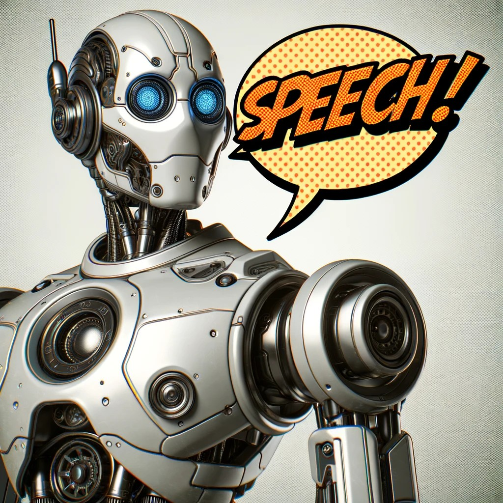
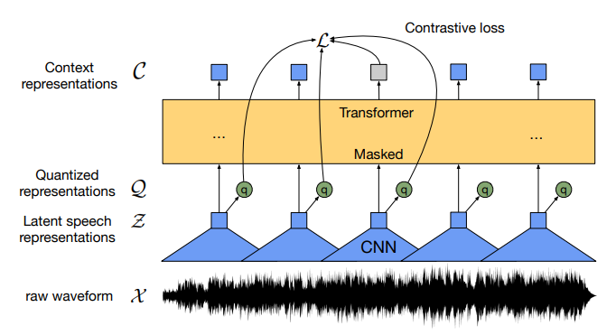
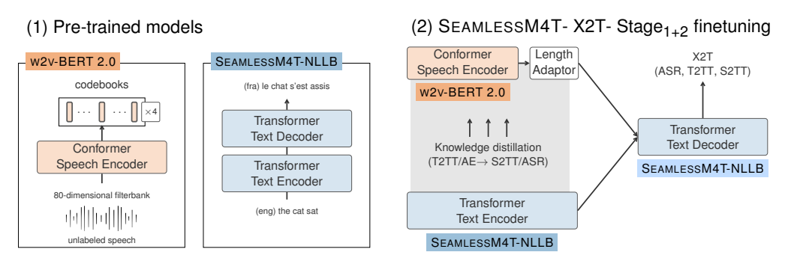

{: .rounded-title-img}

# Neural Speech Recognition Systems

Speech recognition and generation systems have a long history, but in recent years, deep learning-based systems have significantly outperformed traditional systems. Classic systems were typically composed of multiple stages, each designed separately. In contrast, neural network-based systems are often *end-to-end*, where the input is the speech signal, and the output is text, for example.



## Fundamentals of Speech Recognition Systems

We will study the basic elements of speech processing following chapter [:octicons-book-24:][automaticspeech] "[Automatic Speech Recognition and Text-to-Speech][automaticspeech]". You can read the introduction and sections 16.2, 16.3, and 16.4. Section 16.6 is optional and only needs to be read if you are interested in voice synthesis.

The book introduces very basic *end-to-end* architectures for speech recognition. Later, some more advanced architectures are briefly summarized.

[automaticspeech]: https://web.archive.org/web/20230111103255/https://web.stanford.edu/~jurafsky/slp3/16.pdf

## Book Annotations



Section 16.2
{: .section}

This section and the following two focus on speech recognition (also known as *speech-to-text*), one of the most important tasks in speech processing. The audio signal must be preprocessed to extract the most relevant features. One of the most common methods is obtaining spectrograms (or sonograms) of the different windows (*frames*) into which the digital signal resulting from analog-to-digital conversion is divided. The spectrogram shows the energy of the signal's frequency content as it changes over time. The book briefly explains how to compute the spectrogram using the discrete Fourier transform and adjust it according to the Mel scale.

Section 16.3
{: .section}

Spectrograms usually have too much temporal and frequency resolution, so they are often locally reduced using convolutional layers. The result is a lower-resolution spectrogram that retains the most relevant features of the audio signal. This output can then be used as input for a transformer, such as the LAS model shown in Figure 16.6.

Section 16.4
{: .section}

Connectionist Temporal Classification (CTC) is a crucial technique used in training and inference for automatic speech recognition systems. Its main function is to act as a loss function that aligns input speech windows with their corresponding textual outputs in scenarios where the input and output lengths typically differ greatly.

CTC introduces a special blank label that allows the model to produce no output for a given window. During training, the CTC loss function computes the probability of all possible alignments between the speech input and its textual transcription, guiding the model toward the most likely alignment. This enables the model to learn from data where each audio fragment is not aligned with specific characters, making it easier to obtain training data.

This section introduces an advanced form of CTC known as the RNN-Transducer (RNN-T or simply *transducer*).

## Modern Architectures for Speech Processing

Whisper
{: .section}

Whisper was one of the best-performing systems in 2023, despite not deviating significantly from the basic architectures presented in the book. The system is based on a transformer architecture with an encoder and decoder, similar to the LAS system shown in Figure 16.6 of the book. The speech input is processed by the encoder, which generates a deep embedding for each speech window. The decoder then generates textual output, character by character, from these embeddings. Instead of RNN-T or CTC, Whisper uses cross-entropy as the error function, which is not specifically designed for this task. The system's strong performance is attributed to a large training dataset and, to a lesser extent, training the same model for multiple tasks beyond transcription, such as detecting silence or noise. Whisper also supports multiple languages, using a special token to specify the output language. It was even trained on tasks like transcribing speech in one language to text in another.

The following figure, from the paper "[Robust Speech Recognition via Large-Scale Weak Supervision](https://arxiv.org/abs/2212.04356)", shows Whisper's architecture. Note the language and task tags in the decoder's input. The `SOT` token is the special token that marks the start of transcription.

The following text is also from the same paper. Based on what you've studied so far, you should understand most of it:

> We chose an encoder-decoder Transformer as this architecture has been well validated to scale reliably. All audio is re-sampled to 16,000 Hz, and an 80-channel log-magnitude Mel spectrogram representation is computed on 25-millisecond windows with a stride of 10 milliseconds. For feature normalization, we globally scale the input to be between -1 and 1 with approximately zero mean across the pre-training dataset. The encoder processes this input representation with a small stem consisting of two convolution layers with a filter width of 3 and the GELU activation function where the second convolution layer has a stride of two. [...] The encoder and decoder have the same width and number of transformer blocks. [...] We use the same byte-level BPE text tokenizer used in GPT2 for the English-only models and refit the vocabulary (but keep the same size) for the multilingual models to avoid excessive fragmentation on other languages since the GPT-2 BPE vocabulary is English only.

It is not necessary to fully understand the functionality of convolutional layers at this stage. For now, it is sufficient to know that these layers are commonly used for image processing and, in this case, are applied to process spectrograms. The convolutional layer highlights temporal patterns and local variations in the Mel spectrum through transformations. Convolution involves taking the dot product between a *filter* (or *kernel*) of a certain width (in our case, a parameter vector of a certain size) and its input, with the filter's parameters learned during training. This filter slides over the input, moving a certain number of positions (known as *stride*) between applications. In Whisper, the stride has a width of 1 for the first convolution, preserving data size, but is 2 in the second, halving the dimensionality.

Wav2vec2
{: .section}

Given the high cost of obtaining labeled data (audio signals and their transcriptions), particularly for certain languages, the Wav2Vec 2.0 model proposes a self-supervised scheme similar to BERT-like systems in natural language processing. It masks parts of the latent and quantized speech signal representation (explained below) and trains the model to predict the masked parts. The model is thus trained on a large dataset of unlabeled audio. Once trained, the learned representations can be fine-tuned for specific speech recognition tasks with a relatively small labeled dataset, using, for example, CTC as the loss function.

The following figure, from the paper "[wav2vec 2.0: A Framework for Self-Supervised Learning of Speech Representations](https://arxiv.org/abs/2006.11477)", illustrates the Wav2Vec 2.0 architecture:

As shown, the model processes the speech signal directly, without requiring a frequency representation. The signal is segmented, and each segment passes through an encoder with multiple convolutional layers. The output of the final convolutional layer is quantized into a set number of values, meaning each vector is classified into a set of possible classes or *codes*. These codes do not necessarily correspond to specific phonemes but help group vectors so that, ideally, after training, similar code vectors correspond to speech windows with similar features. The corresponding code is represented in the illustration as a vector $\mathbf{q}$. 

The quantized representations are passed to a transformer encoder, where they are globally combined (note that convolutional layers perform local, not global, processing) through self-attention, capturing sequence-level dependencies in an *end-to-end* manner. At its output, the transformer predicts the quantized latent representation of those parts of the speech signal that were masked during training.

Conformer
{: .section}

Conformer is the first model to integrate convolutional networks and transformer encoders in its architecture. The following figure, taken from the paper "[Conformer: Convolution-augmented Transformer for Speech Recognition](https://arxiv.org/abs/2005.08100)," illustrates how the original transformer architecture was slightly modified to include convolutional layers within each transformer block and a *macaron* arrangement (named after the traditional French cookie). In this configuration, the feedforward network is not only at the end of each block but also at the beginning. The outputs of the feedforward networks are multiplied by 1/2 before being combined with the residual layers.

UniSpeech
{: .section}

UniSpeech combines self-supervised learning, like that in Wav2Vec 2.0, with supervised learning based on the transcription of speech signals to produce more robust latent representations aligned with phonetic structure. The following figure, taken from the paper "[UniSpeech: Unified Speech Representation Learning with Labeled and Unlabeled Data](https://arxiv.org/abs/2101.07597)," shows the model's architecture:

On the right side of the above image, the quantizer selects the closest point to the latent representation $z$ from two codebook pages. Typically, multiple codebook pages are used, and their outputs are concatenated to produce the quantized latent representation.

Massively Multilingual Speech (MMS)
{: .section}

MMS represents a set of models designed for hundreds of different languages, exemplifying massively multilingual models. The project developed pretrained models based on Wav2Vec 2.0 that cover approximately 1,400 languages, a single multilingual automatic speech recognition model for around 1,100 languages, speech synthesis models for the same number of languages, and a language identification model for about 4,000 languages. Similar to UniSpeech, MMS combines self-supervised learning with supervised learning based on CTC, and uses language-specific adapters. 

This extensive multilingual support is made possible through the collection of a dataset (transcribed or not, depending on the language) derived from religious texts and other multilingual transcription datasets like FLEURS. The following graphic, taken from the paper "[Scaling Speech Technology to 1,000+ Languages](https://research.facebook.com/publications/scaling-speech-technology-to-1000-languages/)," shows the languages supported by MMS:

SeamlessM4T
{: .section}

This model can perform voice-to-text, voice-to-voice, text-to-speech, and text-to-text translations for approximately 100 languages, depending on the task. The paper "[SeamlessM4T—Massively Multilingual & Multimodal Machine Translation](https://ai.meta.com/blog/seamless-m4t/)" describes the model and its performance. The following figure, part of the paper, shows the model's architecture for scenarios where different types of inputs are translated into text:

Universal Speech Model (USM)
{: .section}

Another large-scale multilingual model is the Universal Speech Model (USM), which uses RNN-T and supports up to 300 languages. The following figure, taken from the paper "[Google USM: Scaling Automatic Speech Recognition Beyond 100 Languages](https://arxiv.org/abs/2303.01037)," illustrates the model's different training phases. Although we will not go into detail, you may recognize several familiar terms in the figure:

Other Models
{: .section}

These models deviate from the ones mentioned above as they are not speech recognition models but instead focus on speech synthesis or other types of sound generation. They are included here as interesting examples of models capable of generating realistic sounds or processing other types of audio, but we will not delve further into them as they fall outside the scope of this section.

- **UniAudio**: Capable of speech synthesis, voice conversion, singing voice synthesis, text-to-sound, text-to-music, or audio editing, among other tasks. You can learn more and try the model in its [GitHub repository](https://github.com/yangdongchao/UniAudio).
- **MERT**: A general model for various tasks in *music understanding*. It is described in the paper "[MERT: Acoustic Music Understanding Model with Large-Scale Self-supervised Training](https://arxiv.org/abs/2306.00107)."
- **MaGNET**: A text-to-music and text-to-sound system described in "[Masked Audio Generation using a Single Non-Autoregressive Transformer](https://arxiv.org/abs/2401.04577)."
