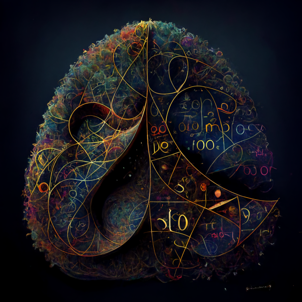

<div class="content-2columns" markdown>
{: .rounded-title-img}

# Un recorrido peso a peso por el transformer: guía para aprender cómo funcionan las redes neuronales que procesan textos y cómo se programan
</div>

## Presentación

Esta guía propone un camino para entender cómo funciona realmente la red neuronal más usada en el campo del procesamiento del lenguaje natural (conocida como *transformer*). Se siguen para ello las explicaciones teóricas de algunos de los capítulos de un buen libro sobre la materia. Se propone ir aprendiendo sobre la marcha (si es necesario) el lenguaje de programación Python, así como los elementos básicos de una librería llamada PyTorch que permite, entre otras cosas, programar redes neuronales que se entrenen y ejecuten sobre GPUs. Como colofón, se estudia una implementación ya existente del transformer programada con PyTorch. El objetivo último es poder modificar este código para experimentar con algún problema sencillo que implique el uso del lenguaje humano. La idea es obtener un buen conocimiento que permita afrontar tareas más complejas más adelante y no tanto desarrollar algo llamativo que enseñar a todo el mundo desde el primer momento.

!!! note "Atención"

    Esta página contiene una pauta para aprender de forma autónoma cómo funcionan los transformers. Para ello, se enlazan documentos contenidos en otras páginas de esta web. Visto así, el conjunto puede considerarse como una guía completa que te ayude en tu camino. Sin embargo, es posible que hayas llegado a estas páginas desde otra fuente (por ejemplo, una asignatura específica) que plantee otra forma diferente de utilizar los diferentes contenidos. En ese caso, usa las recomendaciones y la planificación que te ofrezca esa fuente y no las que se proponen en esta página.

Algunos de los contenidos los puedes ir estudiando en paralelo. A la vez que aprendes sobre modelos neuronales, puedes ir iniciándote en [Python](pytorch.md#python), NumPy e incluso, una vez vistos los dos anteriores, [PyTorch](pytorch.md#pytorch). También puedes repasar en paralelo los [elementos de álgebra, cálculo y probabilidad](#conceptos-matematicos-previos) que hayas olvidado. El estudio del código del transformer no deberías abordarlo hasta tener bien asimilados todos los conceptos anteriores.

## Manual de estudio

Para entender a nivel matemático y conceptual las redes neuronales nos vamos a basar en la tercera edición (todavía inacabada) del libro "[Speech and Language Processing][libroarch]" de Dan Jurafsky y James H. Martin. Los apartados de esta guía van indicando qué capítulos y secciones son relevantes para nuestros propósitos. **Importante**: dado que la versión en línea del libro está inacabada y se actualiza de vez en cuando, no solo con nuevos contenidos, sino también con reestructuraciones de los ya existentes y movimientos de secciones de un capítulo a otro, en esta guía se incluyen enlaces y referencias a una [versión del libro alojada en Internet Archive][libroarch] que probablemente no se corresponde con la más actual (que puedes encontrar [aquí][libro]).

[libro]: https://web.stanford.edu/~jurafsky/slp3/
[libroarch]: https://web.archive.org/web/20221218211150/https://web.stanford.edu/~jurafsky/slp3/

## Justificación de un abordaje profundo 

En principio, escribir un programa que explote modelos basados en aprendizaje automático es muy sencillo. Por ejemplo, las siguientes líneas de código usan un modelo de lengua basado en un transformer para continuar un texto dado:

``` python
from transformers import pipeline
generator = pipeline('text-generation', model = 'gpt2')
generator("Hello, I'm a language model and", max_length = 30, num_return_sequences=3)
```

Aunque la existencia de librerías de alto nivel es sumamente importante en ciertos contextos, si solo usas el código anterior:

- No entenderás cómo funciona realmente el modelo.
- No podrás crear otros modelos para experimentar con otros problemas.
- No sabrás cómo entrenar un modelo propio ni qué elementos influyen en la calidad o el tiempo del entrenamiento.
- No entenderás otros modelos neuronales que se usan en el procesamiento del lenguaje natural.
- Verás tu programa, en definitiva, como una caja negra que hace cosas mágicas. 

Esta guía pretende ayudarte a abrir la caja y ser capaz de observar su interior con conocimiento de causa.

## Secuenciación de contenidos

La siguiente tabla muestra una secuenciación de los contenidos de esta guía con indicación del tiempo orientativo que deberías dedicar a cada parte.

| Paso | Contenido | Tiempo :octicons-stopwatch-24: | Observaciones |
| -------- | ------- | --------------- | ------------- |
| 1 | [Presentación](intro.md) | 10 minutos | ¡Esta página! |
| 2 | [Conceptos matemáticos](intro.md#conceptos-matematicos-previos) | 5 horas | Consulta los enlaces de esta sección solo si necesitas refrescar algunos conceptos matemáticos. |  
| 3 | [Regresores](regresor.md) | 4 horas | Este documento presenta un modelo de aprendizaje automático que no se suele definir como red neuronal, pero que permite introducir la mayoría de ideas relevantes que usaremos al hablar de redes neuronales. |
| 4 | [Aprender PyTorch](pytorch.md) | 5 horas | Ir más allá de las ecuaciones y saber implementar los diferentes modelos que vamos a estudiar es fundamental para llegar a entenderlos completamente. Esta página enlaza a los recursos necesarios para aprender (o repasar) Python, así como la librería PyTorch. Deberías invertir un tiempo en esto antes de avanzar en los contenidos más teóricos para poder ir entendiendo las diferentes implementaciones que se hacen de cada tipo de modelo. |
| 5 | [Implementación de regresores](implementacion.md#codigo-para-un-regresor-logistico-y-uno-multinomial) | 4 horas | Analiza el código de la implementación con Pytorch de un regresor logístico y un regresor softmax. Utiliza las herramientas de depuración como se explican [aquí][debug] para explorar paso a paso el código de los regresores: analiza el valor y tipo de las variables, así como la forma de cada tensor y asegúrate de que entiendes qué representa cada dimensión. | 
| 6 | [Embbedings incontextuales](embeddings.md) | 4 horas | La obtención de embeddings incontextuales es una aplicación inmediata de los regresores logísticos que demuestra todo el potencial del aprendizaje autosupervisado. |
| 7 | [Implementación de skip-grams](implementacion.md#codigo-para-skip-grams) | 2 horas | Analiza el código de la implementación para PyTorch del algoritmo de skip-grams. Utiliza las herramientas de depuración como se explican [aquí][debug] para explorar paso a paso el código.  Llegados a este punto, va siendo recomendable que comiences a familiarizarte con el uso de PyTorch antes de seguir avanzando. | 
| 8 | [Redes hacia delante](ffw.md) | 3 horas | Este bloque contiene pocas novedades, pero nos permite introducir el concepto de red neuronal y crear un primer modelo de lengua extremadamente básico con ellas. |
| 9 | [Implementación de redes hacia delante](implementacion.md#codigo-para-un-modelo-de-lengua-con-redes-feedforward) | 1 hora | Explora el código de la implementación de un modelo de lengua simple basado en redes hacia delante. | 
| 10 | [Transformers y modelos de atención](attention.md) | 6 horas | Todos los conceptos anteriores nos permiten poder abordar en este momento la arquitectura del transformer. Esta página se centra en la parte del transformer conocida como *descodificador*, que es la que se usa en los conocidos modelos de lengua. |
| 11 | [Implementación del código del transformer](implementacion.md#codigo-para-el-transformer) | 6 horas | Analiza el código de la implementación de un transformer general y de un modelo de lengua basado en el descodificador. Este código tiene mayor complejidad que los de otros modelos. | 
| 12 | [Aspectos adicionales del transformer](attention2.md) | 4 horas | Esta página introduce la otra parte del transformer (el *codificador*) y muestra qué puede hacerse con él, tanto en solitario como acoplado a un descodificador. |
| 13 | [Implementación de un reconocedor de entidades nombradas](implementacion.md#codigo-para-el-transformer) | 1 hora | Analiza el código de la implementación de un reconocedor de entidades nombradas basado en el codificador. | 
| 14 | [Implementación de un modelo GPT-2](implementacion.md#codigo-para-un-transformer-del-proyecto-mingpt) | 4 horas | Analiza opcionalmente el código de la implementación de un modelo de lengua que es capaz de cargar y usar GPT-2. |
| 15 | [Voz](speech.md) | 4 horas | Este contenido puede ser opcional, ya que se mueve a un dominio distinto: el del procesamiento del habla. |

[debug]: pytorch.md#depuracion

En cada sección se usa el icono :octicons-book-24: para destacar aquellos enlaces que es más importante que sigas, bien porque dan acceso a capítulos del libro que has de leer, bien porque apuntan a código que has de explorar.


## Conceptos matemáticos previos 

Los elementos básicos de álgebra, cálculo y probabilidad necesarios para manejarte con soltura en el mundo del procesamiento del lenguaje natural los puedes encontrar en las secciones "Linear Algebra", "Calculus" (junto con "Automatic differentiation") y "Probability and Statistics" del [:octicons-book-24:][cap2] [capítulo 2][cap2] del libro "Dive into Deep Learning". Otros como la teoría de la información o el principio de máxima verosimilitud se abordan en las secciones "Information theory" y "Maximum likelihood", respectivamente, en un [:octicons-book-24:][apéndice] [apéndice][apéndice] del mismo libro.

[cap2]: https://d2l.ai/chapter_preliminaries/index.html
[apéndice]: https://d2l.ai/chapter_appendix-mathematics-for-deep-learning/information-theory.html


## Para saber más

Para ampliar conocimientos, puedes consultar estos libros que, en su mayoría, están disponibles en la web:

- "[Speech and Language Processing][jurafskybib]" de Dan Jurafsky y James H. Martin. Sin fecha de publicación aún, pero con un borrador avanzado disponible en la web. Explica detalladamente los conceptos y modelos más relevantes en el procesamiento del lenguaje natural sin entrar en detalles de implementación. Es el libro en el que se basa esta guía.
- "[Dive into Deep Learning][d2l]" de Aston Zhang, Zachary C. Lipton, Mu Li y Alexander J. Smola. Se adentra con mucho detalle en la implementación de los modelos más relevantes del aprendizaje profundo. Hay una versión en [papel][cambridge] publicada en 2023.
- ["Deep learning: foundations and concepts"][bishop] de Chris Bishop y Hugh Bishop. También disponible en papel desde 2024.
- "[Understanding Deep Learning][understanding]" (2023) por Simon J.D. Prince. Libro lleno de imágenes y figuras que ayudan a entender todos los conceptos.
- La serie "[Probabilistic Machine Learning: An Introduction][pml1]" (2022) y "[Probabilistic Machine Learning: Advanced Topics][pml2]" (2023) de Kevin Murphy aborda con más profundidad diversos elementos del aprendizaje automático.
- "[Deep learning for Natural Language Processing: A Gentle Introduction][gentle]" de Mihai Surdeanu y Marco A. Valenzuela-Escárcega. También en elaboración. Contiene código en algunos capítulos.
- "[Deep Learning with PyTorch Step-by-Step: A Beginner's Guide][pytorchstep]" (2022) de Daniel Voigt Godoy. Este es un libro de pago con versión digital o en papel (en tres volúmenes, en este caso). Existe una versión en español para los primeros capítulos. Escrito en un estilo directo y sencillo con multitud de detalles y ejemplos.
- "[The Mathematical Engineering of Deep Learning][mathdl]" (2024) de Benoit Liquet, Sarat Moka y Yoni Nazarathy.
- "[The Little Book of Deep Learning][little]" (2023) de François Fleuret.

[jurafskybib]: https://web.stanford.edu/~jurafsky/slp3/
[gentle]: https://clulab.org/gentlenlp/
[understanding]: https://udlbook.github.io/udlbook/
[pytorchstep]: https://leanpub.com/pytorch
[bishop]: https://www.bishopbook.com/
[d2l]: http://d2l.ai/
[pml1]: https://probml.github.io/pml-book/book1.html
[pml2]: https://probml.github.io/pml-book/book2.html
[cambridge]: https://www.cambridge.org/es/academic/subjects/computer-science/pattern-recognition-and-machine-learning/dive-deep-learning?format=PB
[mathdl]: https://deeplearningmath.org/
[little]: https://fleuret.org/francois/lbdl.html

La siguiente lista contiene enlaces a algunos cursos en vídeo impartidos por investigadores o universidades reconocidos:

- [Stanford CS224n][cs224n] ― Natural Language Processing with Deep Learning; [web][cs224nweb] del curso.
- [Stanforf CS324][cs324] ― Large Language Models; edición de 2022.
- [Stanforf CS324 2023][cs324b] ― Advances in Foundation Models]; edición de 2023.
- [Stanford CS25][cs25]  ― Transformers United; [web][cs25web] del curso.
- [Stanford CS229][cs229] ― Machine Learning; [web][cs229web] del curso.
- [Stanford CS230][cs230] ― Deep Learning; [web][cs230web] del curso.
- [MIT 6.S191][mit191] ― Introduction to Deep Learning; [web][mit191web] del curso.
- Neural Networks: [Zero to Hero][zero2hero]" de Andrew Karpathy.
- [Machine Learning][mlspec] Specialization.


[mlspec]: https://www.youtube.com/playlist?list=PLkDaE6sCZn6FNC6YRfRQc_FbeQrF8BwGI
[cs229]: https://www.youtube.com/playlist?list=PLoROMvodv4rMiGQp3WXShtMGgzqpfVfbU
[cs229web]: https://cs229.stanford.edu/
[cs230]: https://youtube.com/playlist?list=PLoROMvodv4rOABXSygHTsbvUz4G_YQhOb
[cs230web]: https://cs230.stanford.edu/
[cs224n]: https://www.youtube.com/playlist?list=PLoROMvodv4rOSH4v6133s9LFPRHjEmbmJ
[cs224nweb]: http://web.stanford.edu/class/cs224n/
[cs324]: https://stanford-cs324.github.io/winter2022/
[cs324b]: https://stanford-cs324.github.io/winter2023/
[cs25]: https://www.youtube.com/playlist?list=PLoROMvodv4rNiJRchCzutFw5ItR_Z27CM
[cs25web]: https://web.stanford.edu/class/cs25/
[mit191]: https://youtube.com/playlist?list=PLtBw6njQRU-rwp5__7C0oIVt26ZgjG9NI
[mit191web]: http://introtodeeplearning.com
[zero2hero]: https://youtube.com/playlist?list=PLAqhIrjkxbuWI23v9cThsA9GvCAUhRvKZ
