

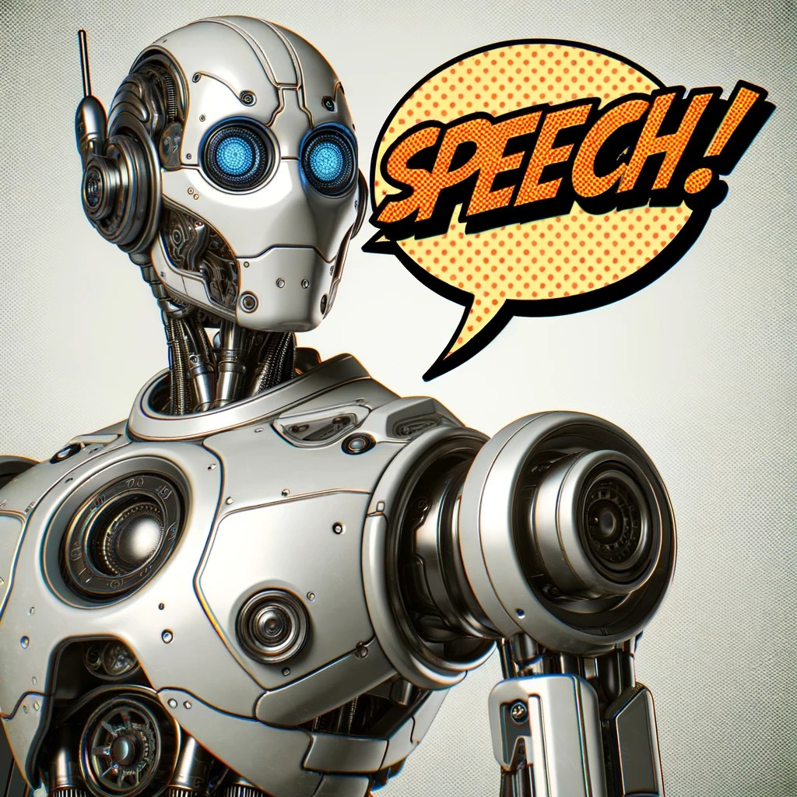{: .rounded-title-img}

# Sistemas neuronales de reconocimiento de voz

Los sistemas de reconocimiento o generación de de voz tienen décadas de historia, pero, una vez más, en los últimos años, los sistemas basados en aprendizaje profundo han superado significativamente a los sistemas tradicionales. Los sistemas clásicos solían estar formados por varias etapas, donde cada etapa se diseñaba por separado. Sin embargo, los sistemas basados en redes neuronales suelen ser sistemas *end-to-end*, donde la entrada es la señal de voz y la salida es el texto, por ejemplo.



## Fundamentos de los sistemas de reconocimiento de voz

Vamos a acometer el estudio de los elementos básicos del procesamiento de voz siguiendo el capítulo [:octicons-book-24:][automaticspeech] "[Automatic Speech Recognition and Text-to-Speech][automaticspeech]". Puedes leer la introducción y los apartados 16.2, 16.3 y 16.4. El apartado 16.6 es opcional y solo has de leerlo si te interesa el tema de la síntesis de voz.

El libro presenta unas arquitecturas *end-to-end* para el reconocimiento de voz muy básicas. Más adelante, se resumen brevemente algunas arquitecturas más avanzadas.

[automaticspeech]: https://web.archive.org/web/20230111103255/https://web.stanford.edu/~jurafsky/slp3/16.pdf

## Anotaciones al libro



Apartado 16.2
{: .section}

Este apartado y los dos siguientes se centran en el reconocimiento de voz (también conocido como *speech-to-text)*, una de las tareas más importantes en el procesamiento de voz. La señal de audio ha de ser preprocesada para extraer las características más relevantes. Una de las maneras más habituales de hacerlo es mediante la obtención de los espectrogramas (o sonogramas) de las diferentes ventanas (*frames*) en las que se subdivide la señal digital resultante de la conversión analógica-digital. El espectrograma muestra la energía del contenido frecuencial de la señal según esta cambia a lo largo del tiempo. En el libro se analiza brevemente cómo obtener el espectrograma a partir de la transformada rápida discreta de Fourier y su posterior ajuste en base a la escala de Mel. 

Apartado 16.3
{: .section}

Los espectrogramas suelen tener demasiada resolución temporal y frecuencial, por lo que se suelen reducir localmente mediante la aplicación, por ejemplo, de capas convolucionales. El resultado es un espectrograma de menor resolución, pero que conserva las características más relevantes de la señal de audio. El resultado ya puede ser utilizado como entrada de un transformer como el del modelo LAS de la figura 16.6.

Apartado 16.4
{: .section}

La clasificación temporal conexionista (*connectionist temporal classification*, CTC) es una técnica muy importante utilizada en el entrenamiento y la inferencia de sistemas de reconocimiento automático de voz. Su función principal es actuar como una función de pérdida que permite al modelo alinear las ventanas de voz de entrada con sus salidas textuales correspondientes en un escenario, el de la voz, donde la entrada y la salida suelen tener longitudes muy diferentes.

CTC opera introduciendo una etiqueta especial de blanco que permite que el modelo no genere nada para una ventana determinada. Durante el entrenamiento, la función de pérdida de CTC calcula la probabilidad de todos los alineamientos posibles entre la entrada de voz y su transcripción textual y guía el modelo hacia el más probable. Esto permite que el modelo aprenda a partir de datos en los que cada fragmento de audio no está alineado con un carácter, datos que son mucho más fáciles de obtener que los datos alineados.

Esta sección introduce una forma avanzada de CTC conocida como RNN-Transducer o RNN-T o simplemente *transducer*.

## Arquitecturas modernas para el procesamiento de voz

Whisper
{: .section}

Whisper fue uno de los sistemas con mejor desempeño durante 2023, pese a no alejarse demasiado de las arquitecturas básicas que se presentan en el libro. El sistema se basa en una arquitectura de transformer con codificador y descodificador similar a la del sistema LAS de la figura 16.6 del libro: la entrada de voz se procesa en el codificador, que obtiene un embedding profundo por cada ventana de voz; el descodificador va generando entonces la salida textual, carácter a carácter, a partir de dichos embeddings. La función de error no es ni RNN-T ni CTC, sino entropía cruzada, que no está pensada específicamente para esta tarea. El buen rendimiento del sistema se obtiene gracias a la utilización de un gran conjunto de datos de entrenamiento y, en menor medida, al entrenamiento del mismo modelo con múltiples tareas además de la transcripción de la entrada, como detección de silencios o ruido. Whisper, además, trabaja con diferentes idiomas (un token especial se usa para determinar el idioma de la salida) siendo entrenado incluso en la transcripción de voz en un idioma a texto en otro idioma.

La siguiente figura está tomada del artículo "[Robust Speech Recognition via Large-Scale Weak Supervision](https://arxiv.org/abs/2212.04356)" y muestra la arquitectura de Whisper. Observa la etiqueta de idioma y la etiqueta de tarea a realizar a la entrada del descodificador. El token `SOT` es el token especial que indica el inicio de la transcripción.

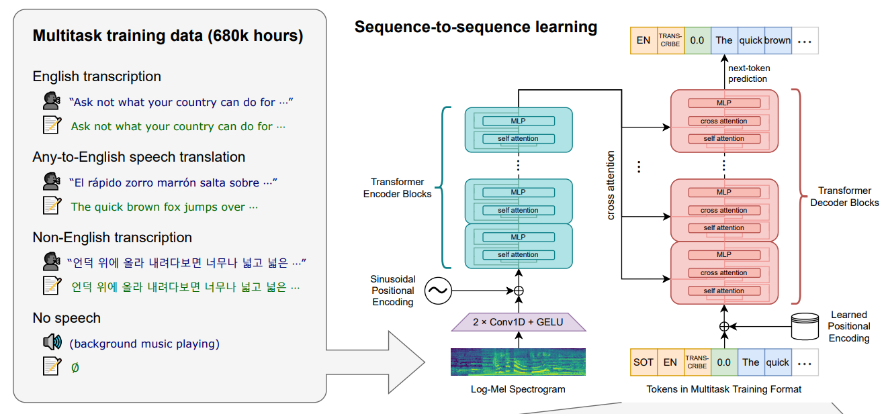

El siguiente texto es también del artículo anterior. Con lo que has estudiado hasta ahora, es muy probable que lo entiendas casi en su totalidad:

> We chose an encoder-decoder Transformer as this architecture has been well validated to scale reliably. All audio is re-sampled to 16,000 Hz, and an 80-channel logmagnitude Mel spectrogram representation is computed on 25-millisecond windows with a stride of 10 milliseconds. For feature normalization, we globally scale the input to be between -1 and 1 with approximately zero mean across the pre-training dataset. The encoder processes this input representation with a small stem consisting of two convolution layers with a filter width of 3 and the GELU activation function where the second convolution layer has a stride of two. [...] The encoder and decoder have the same width and number of transformer blocks. [...] We use the same byte-level BPE text tokenizer used in GPT2 for the English-only models and refit the vocabulary (but keep the same size) for the multilingual models to avoid excessive fragmentation on other languages since the GPT-2 BPE vocabulary is English only.

No es necesario conocer en este momento el funcionamiento de las capas convolucionales. Basta decir que son capas que se utilizan normalmente para procesar imágenes y que, en este caso, se utilizan para procesar los espectrogramas. La capa convolucional realiza una serie de transformaciones que destacan patrones temporales y variaciones locales en el espectro de Mel. La convolución se basa en realizar el producto escalar entre un *filtro* (o *kernel*) de un cierto ancho (en nuestro caso, un vector de parámetros con un cierto tamaño) y su entrada, donde los parámetros del filtro se van aprendiendo durante el entrenamiento. Este filtro se va deslizando sobre la entrada saltando un número de posiciones (conocido como *stride*) entre una aplicación y otra. En el caso de Whisper, el *stride* tiene un ancho de 1 para la primera convolución, lo que mantiene el tamaño de los datos, pero de 2 en la segunda, lo que reduce la dimensionalidad a la mitad.

Wav2vec2
{: .section}

Dado que la obtención de datos etiquetados (señal de audio y su transcripción) es muy costosa, especialmente para ciertos idiomas, el modelo Wav2Vec 2.0 propone un esquema auto-supervisado similar al de los sistemas tipo BERT en procesamiento del lenguaje natural, enmascarando parte de la representación latente y cuantizada de la señal de voz (esto se explica a continuación) y entrenando el modelo para que prediga qué iba en la parte enmascarada. El modelo se entrena, por tanto, con un gran conjunto de datos de audio sin transcripción, pero, tras el entrenamiento, las representaciones aprendidas pueden ser utilizadas para ajustar (*fine-tuning*) el modelo a tareas concretas de reconocimiento de voz con un conjunto de datos etiquetados relativamente pequeño, usando, por ejemplo, CTC como función de pérdida.

La siguiente figura representa la arquitectura de Wav2Vec 2.0 y está tomada del artículo "[wav2vec 2.0: A Framework for Self-Supervised Learning of Speech Representations](https://arxiv.org/abs/2006.11477)":

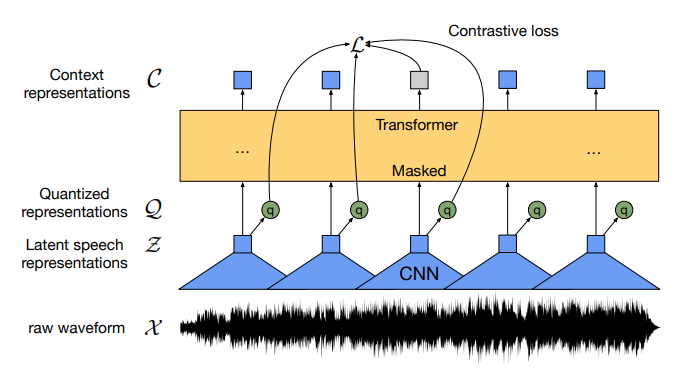

Como puedes ver, el modelo procesa directamente la señal de voz, sin necesidad de obtener una representación en frecuencias. La señal es convenientemente segmentada y cada segmento se pasa por un codificador con múltiples capas convolucionales. La salida de la última capa convolucional se cuantiza en un número determinado de valores, es decir, cada vector se termina clasificando dentro de un conjunto de posibles clases o *códigos*. Estos códigos no tienen por qué coincidir con fonemas concretos, pero ayudan a agrupar los vectores de forma que idealmente, tras el entrenamiento, vectores de código similares corresponden a ventanas de voz que comparten características similares. El código correspondiente se representa en la ilustración mediante un vector $\mathbf{q}$. Las representaciones cuantizadas se pasan a un codificador de un transformer donde se combinan globalmente (observa que las capas convolucionales realizan un procesamiento local y no global) mediante la auto-atención, capturando así de una forma *end-to-end* las posibles dependencias a nivel de secuencia. A su salida, el transformer tiene que predecir la representación latente cuantizada de aquellas partes de la señal de voz cuyas representaciones latentes han sido enmascaradas.

Hidden unit BERT (HuBERT)
{: .section}

HuBERT es un modelo auto-supervisado diseñado para procesar voz transformando los segmentos de audio en representaciones discretas, que pueden considerarse aproximadamente equivalentes a los tokens en el procesamiento de texto. Trabajos posteriores han demostrado que estas representaciones pueden integrarse en modelos de lengua masivos (MLMs) para funcionar como modelos multimodales de texto/voz.

HuBERT se obtiene mediante un método iterativo que alterna dos pasos: **clustering** y predicción. El paso de clustering ($k$-means con 500 pseudo-tokens) asigna cada ventana de audio a uno de varios clústeres. En el primer paso, los segmentos se representan con vectores resultantes del espectrograma de Mel. En los pasos posteriores, las representaciones se obtienen de las capas intermedias del modelo HuBERT preentrenado en la iteración anterior. De manera similar a Wav2vec 2.0, el paso de predicción consiste en predecir las partes enmascaradas de la entrada utilizando los índices de los clústeres como vocabulario de salida. Finalmente, el modelo HuBERT preentrenado (después de eliminar la capa de predicción) puede ajustarse para realizar tareas específicas, como el reconocimiento de habla utilizando la función de pérdida CTC. Como veremos más adelante, las representaciones discretas también son interesantes por sí mismas.

La siguiente figura, tomada del artículo "[HuBERT: Self-Supervised Speech Representation Learning by Masked Prediction of Hidden Units](https://arxiv.org/abs/2106.07447)," muestra la arquitectura del modelo:

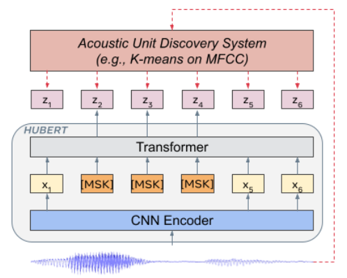

Conformer
{: .section}

Conformer es el primer modelo que se publicó con una arquitectura que combinaba redes convolucionales y codificadores de transformers. La siguiente figura está tomada del artículo "[Conformer: Convolution-augmented Transformer for Speech Recognition](https://arxiv.org/abs/2005.08100)" y muestra cómo la arquitectura original del transformer se modificó ligeramente para incluir capas convolucionales dentro de cada bloque del transformer así como una disposición en *macaron* (por la tradicional galleta francesa) en la que la red *feedfoward* no solo está al final de cada bloque, sino también al principio. Las salidas de las redes *feedfoward* se multiplican por 1/2 antes de combinarse con las capas residuales.

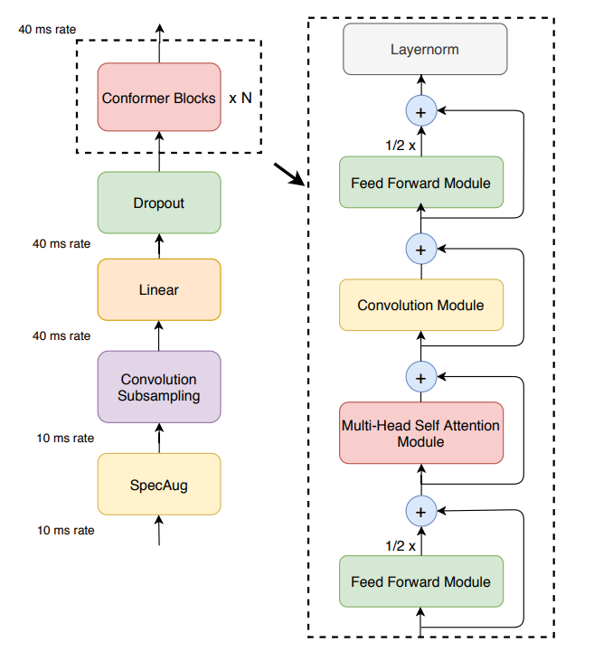

UniSpeech
{: .section}

UniSpeech usa una mezcla de aprendizaje auto-supervisado como el de wav2vec 2.0 y de aprendizaje supervisado en base a la transcripción de la señal de voz para conseguir que las representaciones latentes aprendidas sean más robustas y estén más alineadas con la estructura fonética. La siguiente figura está tomada del artículo "[UniSpeech: Unified Speech Representation Learning with Labeled and Unlabeled Data](https://arxiv.org/abs/2101.07597)" y muestra la arquitectura del modelo:

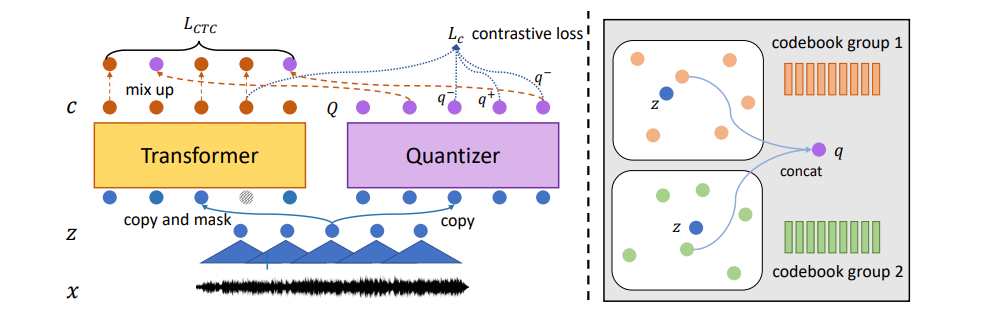

En la parte derecha de la imagen anterior se muestra el cuantizador eligiendo en dos páginas de códigos (*codebook*) el punto más cercano a la representación latente $z$. Normalmente se usan varias páginas de códigos y se concatenan sus propuestas para obtener la representación latente cuantizada.

Massively multilingual speech (MMS)
{: .section}

MMS es en realidad un conjunto de modelos para cientos de idiomas diferentes que nos sirve de buen ejemplo de modelos multilingües a una escala masiva: el proyecto construyó modelos pre-entrenados de tipo wav2vec 2.0 que cubren unos 1400 idiomas, un único modelo de reconocimiento automático de voz multilingüe para unos 1100 idiomas, modelos de síntesis de voz para el mismo número de idiomas, así como un modelo de identificación de idioma para unos 4000 idiomas. De forma similar a UniSpeech, se combina el aprendizaje auto-supervisado con el supervisado basado en CTC, además de considerar adaptadores diferentes para cada idioma. El trabajar con este número tan elevado de idiomas (se estima que la cantidad de idiomas en el mundo es de unos 7000) es posible gracias a la recopilación de un dataset (transcrito o no, dependiendo del idioma) integrado por la lectura de textos religiosos, junto a otros conjuntos multilingües de datos transcritos como FLEURS. La siguiente gráfica tomada del artículo "[Scaling Speech Technology to 1,000+ Languages](https://research.facebook.com/publications/scaling-speech-technology-to-1000-languages/)" muestra los idiomas soportados por MMS:

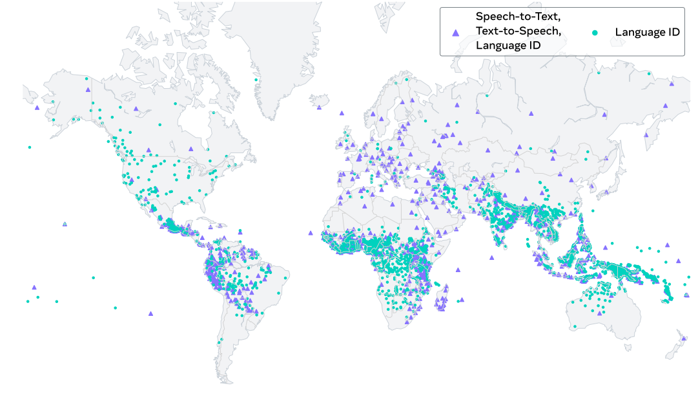

SeamlessM4T
{: .section}

Este modelo puede realizar traducciones de voz a texto, voz a voz, texto a voz y texto a texto para unos 100 idiomas, dependiendo de la tarea. El artículo "[SeamlessM4T—Massively Multilingual & Multimodal Machine Translation](https://ai.meta.com/blog/seamless-m4t/)" describe el modelo y su rendimiento. La siguiente figura es parte del artículo y muestra la arquitectura del modelo para el caso en el que diferentes tipos de entradas se traducen a texto:

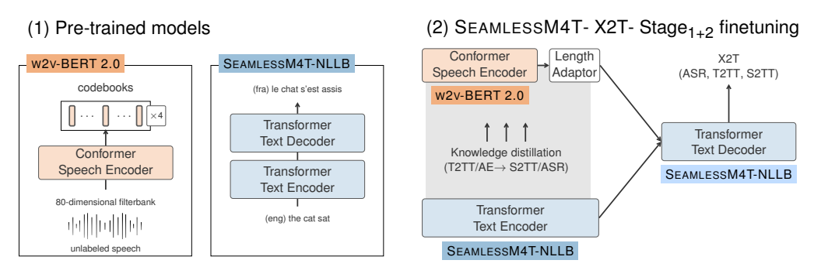

Universal speech model (USM)
{: .section}

Otro modelo multilingue a gran escala es Universal Speech Model (USM) que usa RNN-T y llega a 300 idiomas. La siguiente figura está tomada del artículo "[Google USM: Scaling Automatic Speech Recognition Beyond 100 Languages](https://arxiv.org/abs/2303.01037)" y muestra las diferentes fases de entrenamiento del modelo. Aunque no las veremos con detalle, seguro que puedes encontrar en la figura varios términos que te resultan familiares:

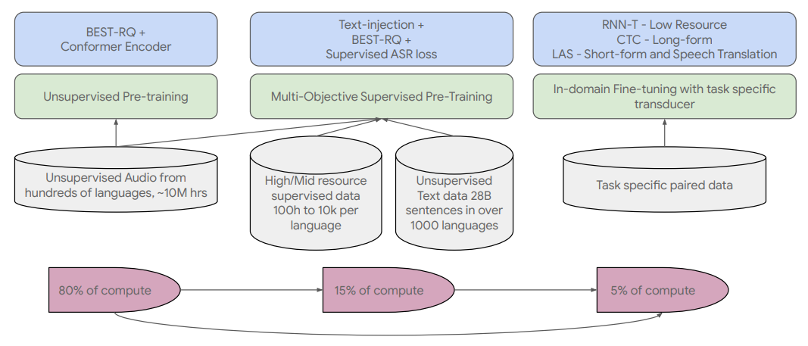

Spirit LM
{: .section}

Las unidades fonéticas discretas de voz, como las generadas por HuBERT, pueden incorporarse en modelos de lengua masivos (MLMs) para crear los modelos denominados SpeechLM, que son modelos de lengua capaces de procesar tanto lenguaje hablado como escrito, tanto en su entrada como en su salida. Spirit LM es un ejemplo de SpeechLM: un modelo Llama-2 ajustado con una mezcla de texto y habla, codificados como los tokens BPE originales o como las unidades fonéticas (deduplicadas) generadas por HuBERT, respectivamente, con un token especial añadido al principio de cada tipo de entrada. El modelo se ajusta mediante la tarea habitual de predicción del siguiente token. Para la generación de voz, se añade un sistema de síntesis de voz condicionado por los tokens de HuBERT. Opcionalmente, se puede incluir información de sentimiento en forma de tokens de tono y estilo en los datos de entrenamiento para evitar que el modelo genere solo habla monotona.

Esta imagen, tomada del artículo "[Spirit LM: Interleaved Spoken and Written Language Model](https://arxiv.org/abs/2402.05755)," ilustra la arquitectura del modelo:

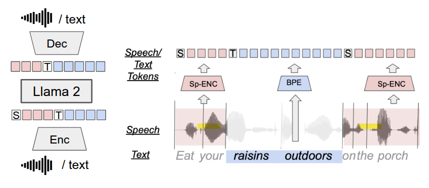

Aunque el uso de los pseudo-tokens de voz es un método interesante, cuando el objetivo no es que el modelo de lengua *hable*, otros investigadores han demostrado que usar directamente las representaciones continuas aprendidas por modelos como Whisper, con una capa de proyección intermedia antes de la entrada del MLM, también puede ser efectivo, como se muestra en esta figura del artículo "[An Embarrassingly Simple Approach for LLM with Strong ASR Capacity](https://arxiv.org/abs/2402.08846)":

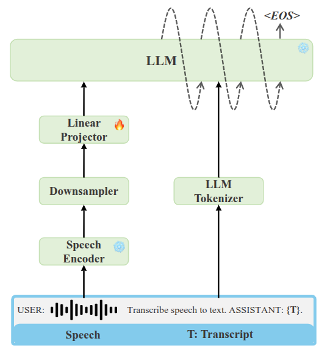

Otros modelos
{: .section}

Estos modelos se salen de la línea de los modelos anteriores, ya que no son modelos de reconocimiento de voz, sino de síntesis de voz y de otro tipo de sonidos. Se han añadido aquí como muestra interesante de modelos que son capaces de generar sonidos realistas o procesar otros tipos de sonidos, pero no entraremos en más detalles por quedar fuera de los objetivos de este bloque. 

- UniAudio puede hacer síntesis de voz, conversión de voz, síntesis de voces cantando, texto a sonido, texto a música, o edición de voz y audio, entre otros. Puedes leer más sobre el modelo y probarlo en su [repositorio de Github](https://github.com/yangdongchao/UniAudio).
- MERT es un modelo general para diversas tareas de lo que se denomina *music understanding*. Está descrito en el artículo "[MERT: Acoustic Music Understanding Model with Large-Scale Self-supervised Training](https://arxiv.org/abs/2306.00107)".
- MaGNET es un sistema de texto a música y de texto a sonidos descrito en "[Masked Audio Generation using a Single Non-Autoregressive Transformer](https://arxiv.org/abs/2401.04577)".

